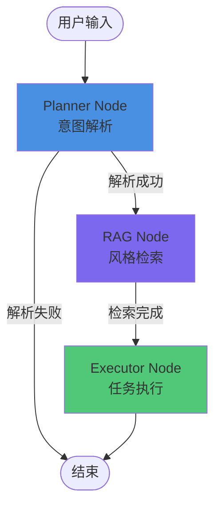

# 里程碑3：记忆与协议 (Memory & Protocol)

## 任务概述

1. **实现 KnowledgeService**：LanceDB 封装和向量检索
2. **实现 EmbeddingService**：向量嵌入生成服务
3. **实现 RAG Node**：风格检索和 Prompt 增强
4. **更新 AgentState**：支持 enhancedPrompt 对象类型
5. **更新状态图**：添加 RAG 节点到工作流
6. **知识库初始化**：启动时自动加载 5 条风格数据
7. **更新文档**：同步实现与设计文档

## 实施步骤

### 1. 更新 AgentState 接口

**文件：** `main/server/src/agent/interfaces/agent-state.interface.ts`

**修改：**

- 将 `enhancedPrompt?: string` 改为对象类型，匹配文档设计：
  ```typescript
  enhancedPrompt?: {
    original: string;
    retrieved: Array<{
      style: string;
      prompt: string;
      similarity: number;
    }>;
    final: string;
  };
  ```


**原因：** 匹配 `AGENT_WORKFLOW_DESIGN.md` 中的设计，支持详细的检索信息。

### 2. 创建 EmbeddingService

**文件：** `main/server/src/knowledge/services/embedding.service.ts`

**职责：**

- 提供文本向量嵌入功能
- 支持 OpenAI 兼容的 Embedding API
- 封装向量生成逻辑

**接口：**

```typescript
interface IEmbeddingService {
  embed(text: string): Promise<number[]>;
  embedBatch(texts: string[]): Promise<number[][]>;
}
```

**实现要点：**

- 使用 OpenAI API 或兼容服务（如阿里云）
- 支持批量嵌入以提高效率
- 错误处理和重试机制

### 3. 创建 KnowledgeService

**文件：** `main/server/src/knowledge/knowledge.service.ts`

**职责：**

- LanceDB 数据库管理
- 风格数据的 CRUD 操作
- 向量检索功能
- 启动时自动初始化数据

**接口：**

```typescript
interface IKnowledgeService {
  initialize(): Promise<void>;
  search(query: string, options?: SearchOptions): Promise<RetrievedStyle[]>;
  addStyle(style: StyleData): Promise<void>;
  count(): Promise<number>;
}
```

**实现要点：**

- 使用 `vectordb` 包（LanceDB Node.js 客户端）
- 实现向量相似度搜索
- 启动时检查并初始化 5 条默认风格数据
- 支持环境变量 `FORCE_INIT_KNOWLEDGE_BASE` 强制重新初始化

### 4. 创建 KnowledgeModule

**文件：** `main/server/src/knowledge/knowledge.module.ts`

**职责：**

- 注册 KnowledgeService 和 EmbeddingService
- 在应用启动时触发初始化

### 5. 实现 RAG Node

**文件：** `main/server/src/agent/nodes/rag.node.ts`

**职责：**

- 从向量数据库检索相关风格
- 增强用户输入的 Prompt
- 处理检索失败的情况（降级到原始 Prompt）

**实现逻辑：**

```typescript
async execute(state: AgentState): Promise<Partial<AgentState>> {
  // 1. 构建检索查询（style + subject + text）
  // 2. 调用 KnowledgeService.search()
  // 3. 构建 enhancedPrompt 对象
  // 4. 推送思考日志
  // 5. 返回状态更新
}
```

**错误处理：**

- 检索失败时使用原始 Prompt，不中断工作流
- 记录错误日志但继续执行

### 6. 更新状态图

**文件：** `main/server/src/agent/graph/agent.graph.ts`

**修改：**

- 添加 enhancedPrompt 通道（对象类型）
- 添加 RAG 节点
- 更新工作流：`START → planner → rag → executor → END`
- 添加条件边：planner → rag（如果意图识别成功）

**工作流变更：**

```typescript


// 之前：planner → executor
// 现在：planner → rag → executor
```

### 7. 更新 Executor Node

**文件：** `main/server/src/agent/nodes/executor.node.ts`

**修改：**

- 使用 `state.enhancedPrompt.final` 替代 `state.enhancedPrompt`（字符串）
- 保持向后兼容（如果 enhancedPrompt 是字符串，直接使用）

### 8. 更新 AgentModule

**文件：** `main/server/src/agent/agent.module.ts`

**修改：**

- 导入 KnowledgeModule
- 注册 RAG Node
- 更新图创建函数，注入 RAG Node

### 9. 知识库初始化数据

**文件：** `main/server/src/knowledge/data/initial-styles.ts`

**内容：**

- 定义 5 条默认风格数据（参考 `KNOWLEDGE_BASE_INIT.md`）
- Cyberpunk, Watercolor, Minimalist, Oil Painting, Anime

### 10. 更新文档

**文件：** `main/server/docs/AGENT_WORKFLOW_DESIGN.md`

**更新内容：**

- 确认 RAG Node 设计与实现一致
- 更新状态图可视化（包含 RAG 节点）
- 确认 enhancedPrompt 数据结构

**文件：** `main/server/docs/PROMPT_README.md`

**更新内容：**

- 标记里程碑3任务为进行中/已完成
- 更新项目结构说明（添加 knowledge 模块）
- 更新环境变量说明（向量数据库相关）

## 技术细节

### LanceDB 集成

- **包：** `vectordb` (LanceDB Node.js 客户端)
- **数据路径：** 环境变量 `VECTOR_DB_PATH`（默认：`./data/lancedb`）
- **向量维度：** 1536（OpenAI embedding-ada-002）

### 向量检索流程

1. 用户输入："生成一只赛博朋克风格的猫"
2. Planner 提取：`style: "赛博朋克"`, `subject: "猫"`
3. RAG 检索：查询 "赛博朋克 猫"，返回相似风格
4. Prompt 增强：`"生成一只猫, neon lights, high tech, low life, dark city background"`
5. Executor 使用增强后的 Prompt

### 错误降级策略

- **检索失败：** 使用原始 Prompt，记录警告日志
- **嵌入生成失败：** 跳过该条数据，继续处理其他数据
- **数据库初始化失败：** 阻止应用启动（关键功能）

## 文件清单

**新建文件：**

- `main/server/src/knowledge/knowledge.module.ts` - 知识库模块
- `main/server/src/knowledge/knowledge.service.ts` - LanceDB 封装服务
- `main/server/src/knowledge/services/embedding.service.ts` - 向量嵌入服务
- `main/server/src/knowledge/data/initial-styles.ts` - 初始化数据
- `main/server/src/agent/nodes/rag.node.ts` - RAG 节点实现

**修改文件：**

- `main/server/src/agent/interfaces/agent-state.interface.ts` - 更新 enhancedPrompt 类型
- `main/server/src/agent/graph/agent.graph.ts` - 添加 RAG 节点和 enhancedPrompt 通道
- `main/server/src/agent/agent.module.ts` - 导入 KnowledgeModule，注册 RAG Node
- `main/server/src/agent/nodes/executor.node.ts` - 使用 enhancedPrompt.final
- `main/server/src/app.module.ts` - 导入 KnowledgeModule
- `main/server/docs/AGENT_WORKFLOW_DESIGN.md` - 更新设计文档
- `main/server/docs/PROMPT_README.md` - 更新实施文档

## 验证标准

1. **知识库初始化：** 应用启动时自动创建并加载 5 条风格数据
2. **RAG 检索：** 输入"赛博朋克"能检索到相关风格
3. **Prompt 增强：** Executor 使用增强后的 Prompt
4. **工作流执行：** Planner → RAG → Executor 完整流程
5. **错误处理：** 检索失败时降级到原始 Prompt，不中断工作流

## 工作流可视化

