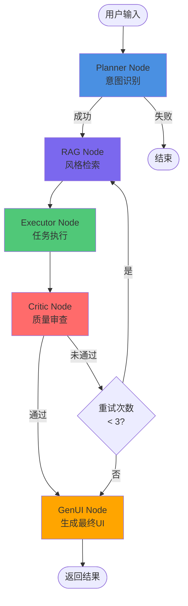

# Milestone 4: Critic Node 和循环机制实现计划

## 一、目标

实现完整的 Agent 工作流，包括质量审查节点（Critic Node）和循环重试机制，完成 Milestone 4 的所有功能。

**核心目标：**

- 实现 Critic Node，对执行结果进行质量审查
- 实现循环机制，质量不达标时自动重试（最多 3 次）
- 更新工作流图：Planner → RAG → Executor → Critic → (GenUI 或 重试)
- 完善状态管理和错误处理

## 二、工作流变更

### 2.1 当前工作流（Milestone 3）

```
Planner → RAG → Executor → END
```

### 2.2 目标工作流（Milestone 4）

```
Planner → RAG → Executor → Critic → (GenUI 或 重试到 RAG)
```

**流程图：**



## 三、实施任务清单

### 任务 1: 更新 AgentState 接口

**文件**: `main/server/src/agent/interfaces/agent-state.interface.ts`

**变更内容**:

1. 添加 `qualityCheck` 字段（质量审查结果）
2. 添加 `metadata` 字段（包含 `retryCount`、`currentNode` 等）

**代码示例**:

```typescript
export interface QualityCheck {
  passed: boolean;
  score: number; // 0-1
  feedback?: string;
  suggestions?: string[];
}

export interface AgentState {
  // ... 现有字段
  
  // Critic 节点输出
  qualityCheck?: QualityCheck;
  
  // 元数据（扩展）
  metadata?: {
    currentNode?: string;
    retryCount?: number;
    startTime?: number;
  };
}
```

**预计工作量**: 30 分钟

---

### 任务 2: 实现 Critic Node

**文件**: `main/server/src/agent/nodes/critic.node.ts`（新建）

**功能要求**:

1. 接收 Executor 的执行结果（`generatedImageUrl`）
2. 调用 LLM 服务进行质量审查（或使用简化版本）
3. 返回 `qualityCheck` 结果（passed、score、feedback、suggestions）
4. 推送思考日志

**实现策略**:

- **方案 A（推荐）**: 使用 LLM 进行真实审查（调用 `llmService.chatWithJson<QualityCheckResult>()`）
- **方案 B（简化）**: 基于 `intent.confidence` 和随机因素计算分数（MVP 版本）

**代码结构**:

```typescript
@Injectable()
export class CriticNode {
  constructor(
    @Inject('LLM_SERVICE') private readonly llmService: ILlmService,
  ) {}

  async execute(state: AgentState): Promise<Partial<AgentState>> {
    // 1. 验证输入
    if (!state.generatedImageUrl || !state.intent) {
      throw new Error('Critic Node: generatedImageUrl and intent are required');
    }

    // 2. 推送思考日志
    // 3. 调用 LLM 进行质量审查（或使用简化逻辑）
    // 4. 返回 qualityCheck 结果
  }
}
```

**LLM Prompt 模板**:

```
你是一个图像质量审查助手。请评估生成的图片是否满足用户需求。

评估维度：
1. 是否符合用户意图（action: {action}）
2. 是否包含用户要求的主体（subject: {subject}）
3. 风格是否匹配（style: {style}）

请以 JSON 格式返回评估结果：
{
  "passed": true/false,
  "score": 0.0-1.0,
  "feedback": "评估反馈",
  "suggestions": ["改进建议1", "改进建议2"]
}
```

**预计工作量**: 2-3 小时

---

### 任务 3: 实现 GenUI Node（可选，或调整 Executor）

**决策点**:

- **选项 A**: 创建独立的 GenUI Node，在 Critic 通过后生成最终 UI 组件
- **选项 B**: 保持当前实现，Executor 直接生成 UI 组件，GenUI Node 仅做最终整理

**推荐**: 选项 B（保持当前实现，简化架构）

**如果选择选项 A**:

- 文件: `main/server/src/agent/nodes/genui.node.ts`（新建）
- 功能: 根据 `qualityCheck` 结果和 `executionResult` 生成最终 UI 组件

**如果选择选项 B**:

- 无需新建文件
- 在 `agent.service.ts` 中处理 GenUI 组件的最终推送

**预计工作量**: 1-2 小时（选项 A）或 30 分钟（选项 B）

---

### 任务 4: 更新工作流图

**文件**: `main/server/src/agent/graph/agent.graph.ts`

**变更内容**:

1. 添加 Critic 节点
2. 添加条件边：`executor → critic`
3. 添加条件边：`critic → (genui 或 rag)`
4. 实现重试逻辑判断函数

**代码示例**:

```typescript
export function createAgentGraph(
  plannerNode: PlannerNode,
  ragNode: RagNode,
  executorNode: ExecutorNode,
  criticNode: CriticNode, // 新增
) {
  const graph = new StateGraph(AgentStateAnnotation);

  // 添加节点
  graph.addNode('planner', ...);
  graph.addNode('rag', ...);
  graph.addNode('executor', ...);
  graph.addNode('critic', async (state) => {
    return await criticNode.execute(state as AgentState);
  }); // 新增

  // 设置入口点
  graph.addEdge(START, 'planner');

  // Planner → RAG
  graph.addConditionalEdges('planner', (state) => {
    if (state.error || state.intent?.action === 'unknown') {
      return END;
    }
    return 'rag';
  });

  // RAG → Executor
  graph.addEdge('rag', 'executor');

  // Executor → Critic（新增）
  graph.addConditionalEdges('executor', (state) => {
    if (state.error) return END;
    if (state.generatedImageUrl) return 'critic';
    return END;
  });

  // Critic → (GenUI 或 重试到 RAG)（新增）
  graph.addConditionalEdges('critic', (state) => {
    if (state.error) return END;
    
    const qualityCheck = state.qualityCheck;
    const retryCount = state.metadata?.retryCount || 0;
    
    // 如果通过，进入 GenUI（或直接结束）
    if (qualityCheck?.passed) {
      return END; // 或 'genui'（如果实现了 GenUI Node）
    }
    
    // 如果未通过且可重试，返回 RAG
    if (retryCount < 3) {
      return 'rag';
    }
    
    // 即使未通过也返回结果（达到最大重试次数）
    return END; // 或 'genui'
  });

  return graph.compile();
}
```

**预计工作量**: 1-2 小时

---

### 任务 5: 更新 AgentService

**文件**: `main/server/src/agent/agent.service.ts`

**变更内容**:

1. 处理 Critic 节点的状态更新
2. 处理重试逻辑（更新 `retryCount`）
3. 推送 `qualityCheck` 相关的 SSE 事件（可选）

**代码示例**:

```typescript
async *executeWorkflow(initialState: AgentState): AsyncGenerator<any> {
  // ... 现有代码

  for await (const chunk of stream) {
    for (const [nodeName, stateUpdate] of Object.entries(chunk)) {
      const update = stateUpdate as Partial<AgentState>;

      // 处理重试计数
      if (nodeName === 'rag' && update.metadata?.retryCount !== undefined) {
        // 重试时更新 retryCount
        currentState.metadata = {
          ...currentState.metadata,
          retryCount: (currentState.metadata?.retryCount || 0) + 1,
        };
      }

      // 推送 qualityCheck 信息（可选）
      if (nodeName === 'critic' && update.qualityCheck) {
        yield {
          type: 'quality_check',
          timestamp: Date.now(),
          data: update.qualityCheck,
        };
      }

      // ... 其他现有逻辑
    }
  }
}
```

**预计工作量**: 1 小时

---

### 任务 6: 更新 AgentModule

**文件**: `main/server/src/agent/agent.module.ts`

**变更内容**:

1. 导入 `CriticNode`
2. 在 `createAgentGraph` 中注入 `CriticNode`

**代码示例**:

```typescript
@Module({
  imports: [LlmModule, KnowledgeModule],
  controllers: [AgentController],
  providers: [
    AgentService,
    PlannerNode,
    RagNode,
    ExecutorNode,
    CriticNode, // 新增
    {
      provide: 'AGENT_GRAPH',
      useFactory: (
        plannerNode: PlannerNode,
        ragNode: RagNode,
        executorNode: ExecutorNode,
        criticNode: CriticNode, // 新增
      ) => {
        return createAgentGraph(plannerNode, ragNode, executorNode, criticNode);
      },
      inject: [PlannerNode, RagNode, ExecutorNode, CriticNode],
    },
  ],
})
export class AgentModule {}
```

**预计工作量**: 30 分钟

---

### 任务 7: 更新 Executor Node（调整 UI 组件生成时机）

**决策点**:

- 如果选择"GenUI Node 选项 B"（保持当前实现），则 Executor 继续生成 UI 组件
- 如果选择"GenUI Node 选项 A"，则 Executor 只生成图片 URL，不生成 UI 组件

**推荐**: 保持当前实现（Executor 继续生成 UI 组件）

**预计工作量**: 0 小时（如果保持当前实现）

---

### 任务 8: 添加配置项

**文件**: `main/server/.env.example` 和 `main/server/src/config/configuration.ts`

**变更内容**:

1. 添加 `CRITIC_TIMEOUT` 配置（默认 8 秒）
2. 添加 `CRITIC_PASS_THRESHOLD` 配置（默认 0.7）
3. 添加 `MAX_RETRY_COUNT` 配置（默认 3）

**预计工作量**: 30 分钟

---

### 任务 9: 更新文档

**文件**:

- `main/server/docs/workflow/AGENT_WORKFLOW_DESIGN.md`
- `main/server/docs/workflow/WORKFLOW_GUIDE.md`
- `main/server/docs/development/DEVELOPMENT_ROADMAP.md`

**变更内容**:

1. 更新工作流程图（添加 Critic Node）
2. 添加 Critic Node 的详细说明
3. 添加循环机制的说明
4. 更新 Milestone 4 完成状态

**预计工作量**: 1 小时

---

### 任务 10: 测试验证

**测试场景**:

1. **正常流程**: 质量审查通过，直接返回结果
2. **重试流程**: 质量审查未通过，自动重试（最多 3 次）
3. **达到最大重试次数**: 即使未通过也返回结果
4. **错误处理**: Critic Node 执行失败时的降级策略

**测试方法**:

- 使用 curl 或 Apifox 测试 SSE 流
- 检查日志输出
- 验证状态流转

**预计工作量**: 1-2 小时

---

## 四、实施顺序

### 第一阶段：基础实现（2-3 小时）

1. ✅ 任务 1: 更新 AgentState 接口
2. ✅ 任务 2: 实现 Critic Node（使用简化版本）
3. ✅ 任务 4: 更新工作流图（添加 Critic 节点和条件边）
4. ✅ 任务 6: 更新 AgentModule

### 第二阶段：完善功能（1-2 小时）

5. ✅ 任务 5: 更新 AgentService（处理重试逻辑）
6. ✅ 任务 8: 添加配置项
7. ✅ 任务 3: 决定 GenUI Node 实现方案（推荐选项 B）

### 第三阶段：测试和文档（2-3 小时）

8. ✅ 任务 10: 测试验证
9. ✅ 任务 9: 更新文档

**总预计工作量**: 5-8 小时

---

## 五、技术决策

### 5.1 Critic Node 实现策略

**推荐方案**: 先实现简化版本（基于 `intent.confidence` 和随机因素），后续可升级为 LLM 真实审查

**理由**:

- 快速验证工作流逻辑
- 降低 LLM 调用成本
- 后续可无缝升级为真实审查

### 5.2 GenUI Node 实现策略

**推荐方案**: 选项 B（保持当前实现，Executor 继续生成 UI 组件）

**理由**:

- 简化架构，减少节点数量
- 当前实现已满足需求
- 减少代码变更

### 5.3 重试机制实现

**策略**: 在 `critic` 节点的条件边中判断 `retryCount`，如果未通过且 `retryCount < 3`，则返回 `rag` 节点

**注意**: 需要在返回 `rag` 节点前更新 `metadata.retryCount`

---

## 六、风险与注意事项

### 6.1 状态管理

- 重试时需要确保状态正确更新（特别是 `retryCount`）
- 避免状态污染（重试时清理不需要的字段）

### 6.2 性能影响

- 重试会增加工作流执行时间
- 需要设置合理的超时时间

### 6.3 用户体验

- 重试时应该推送思考日志，告知用户正在重新生成
- 避免无限循环（确保 `retryCount` 正确更新）

---

## 七、验收标准

### 7.1 功能验收

- ✅ Critic Node 能够正确审查执行结果
- ✅ 质量不达标时能够自动重试（最多 3 次）
- ✅ 达到最大重试次数后能够返回结果
- ✅ 工作流图正确执行：Planner → RAG → Executor → Critic → (GenUI 或 重试)

### 7.2 代码质量

- ✅ 代码符合现有代码风格
- ✅ 添加必要的注释和文档
- ✅ 错误处理完善

### 7.3 文档完整性

- ✅ 更新工作流设计文档
- ✅ 更新工作流指南
- ✅ 更新开发路线图

---

## 八、后续优化（可选）

1. **真实质量审查**: 将 Critic Node 升级为使用 LLM 进行真实审查
2. **智能重试策略**: 根据质量分数动态调整重试策略
3. **重试原因记录**: 记录每次重试的原因，便于分析
4. **性能监控**: 添加重试次数和执行时间的监控指标