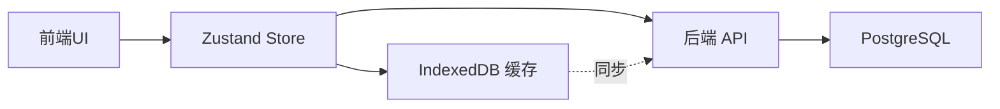

# AiVista 多轮对话重构实施计划

## 当前状态评估

### 后端现状（70% 完成）

- ✅ 数据库配置完成（支持 PostgreSQL/SQLite）
- ✅ 实体定义完整（Conversation, Message, GenUIComponent, RAGContext）
- ✅ 基础 Service 已实现（ConversationService, MessageService, GenUIComponentService）
- ✅ REST API 完整（ConversationController）
- ⚠️ Agent Controller 部分集成
- ❌ Conversation Entity 缺少关系映射
- ❌ RAGContextService 需要补充

### 前端现状（20% 完成）

- ✅ Zustand 已安装
- ✅ GenUI 系统完整
- ✅ SSE 客户端已实现
- ❌ 无状态管理 Store
- ❌ 无 IndexedDB 实现
- ❌ 无侧边栏组件
- ❌ 需要重构 chat-interface.tsx

---

## 实施策略

### 阶段划分

1. **后端完善**（2-3天）- 修复现有问题，完成数据层
2. **前端重构**（3-4天）- 状态管理、UI组件、集成

### 数据存储架构（混合模式）



---

## 后端实施（Phase B1-B4）

### Phase B1: 修复实体关系（30分钟）

**问题**：[`Conversation.entity.ts`](main/server/src/conversation/entities/conversation.entity.ts) 缺少 OneToMany 关系映射

**修复**：添加关系装饰器

```typescript
// src/conversation/entities/conversation.entity.ts

import { OneToMany } from 'typeorm';
import { Message } from './message.entity';

@Entity('conversations')
export class Conversation {
  // ... 现有字段 ...

  // 新增：关系映射
  @OneToMany(() => Message, message => message.conversation)
  messages: Message[];
}
```

**验证**：运行应用，检查数据库表关系是否正确创建

---

### Phase B2: 补充 RAGContextService（30分钟）

**文件**：[`main/server/src/conversation/rag-context.service.ts`](main/server/src/conversation/rag-context.service.ts)

**实现**：

```typescript
import { Injectable } from '@nestjs/common';
import { InjectRepository } from '@nestjs/typeorm';
import { Repository } from 'typeorm';
import { RAGContext } from './entities/rag-context.entity';
import { CreateRAGContextDto } from './dto/create-rag-context.dto';

@Injectable()
export class RAGContextService {
  constructor(
    @InjectRepository(RAGContext)
    private readonly ragContextRepo: Repository<RAGContext>,
  ) {}

  async create(dto: CreateRAGContextDto): Promise<RAGContext> {
    const context = this.ragContextRepo.create({
      id: `rag_${Date.now()}_${Math.random().toString(36).substr(2, 9)}`,
      ...dto,
    });
    return await this.ragContextRepo.save(context);
  }

  async findByConversationId(conversationId: string): Promise<RAGContext[]> {
    return await this.ragContextRepo.find({
      where: { conversationId },
      order: { timestamp: 'ASC' },
    });
  }
}
```

**更新 Module**：在 [`conversation.module.ts`](main/server/src/conversation/conversation.module.ts) 中添加 RAGContext 到 `TypeOrmModule.forFeature()`

---

### Phase B3: 完善 Agent Controller SSE 集成（1-2小时）

**文件**：[`main/server/src/agent/agent.controller.ts`](main/server/src/agent/agent.controller.ts)

**关键修改点**：

1. **接收 conversationId 参数**（已完成，需验证）
2. **保存所有事件到数据库**：

   - `thought_log` → GenUIComponent
   - `enhanced_prompt` → RAGContext + GenUIComponent
   - `gen_ui_component` → GenUIComponent

3. **更新会话时间戳**
4. **返回 conversationId 给前端**

**需要检查的逻辑**（已在 git diff 中看到，需验证是否完整）：

- ✅ 会话获取/创建逻辑
- ✅ 用户消息保存
- ✅ GenUI 组件保存
- ⚠️ 需要补充 RAG 上下文保存
- ✅ 会话时间戳更新

---

### Phase B4: 配置 PostgreSQL 数据库（30分钟）

**环境变量配置**（`.env` 文件）：

```bash
# 数据库类型
DB_TYPE=postgres

# PostgreSQL 配置（本地开发）
DB_HOST=localhost
DB_PORT=5432
DB_USER=postgres
DB_PASSWORD=your_password
DB_NAME=aivista_dev

# 数据库行为
DB_SYNCHRONIZE=true  # 开发环境自动同步表结构
DB_LOGGING=true      # 开发环境启用SQL日志
```

**验证步骤**：

1. 确保 PostgreSQL 已安装并运行
2. 创建数据库：`createdb aivista_dev`
3. 启动应用：`pnpm run start:dev`
4. 检查日志中的数据库连接信息
5. 验证表是否自动创建（conversations, messages, genui_components, rag_contexts）

---

## 前端实施（Phase F1-F5）

### Phase F1: 状态管理架构（1-2天）

#### 任务 1.1：安装依赖

```bash
cd main/web
pnpm add dexie date-fns
pnpm add -D @types/dexie
```

#### 任务 1.2：创建类型定义

**文件**：`main/web/lib/types/conversation.ts`

```typescript
export type MessageRole = 'user' | 'assistant' | 'system';
export type ConversationStatus = 'active' | 'completed' | 'failed';

export interface Message {
  id: string;
  role: MessageRole;
  content: string;
  timestamp: number;
  metadata?: Record<string, any>;
}

export interface GenUIComponent {
  id: string;
  widgetType: string;
  props: Record<string, any>;
  updateMode?: 'append' | 'replace' | 'update';
  targetId?: string;
  timestamp?: number;
}

export interface Conversation {
  id: string;
  title: string;
  status: ConversationStatus;
  createdAt: number;
  updatedAt: number;
  messages: Message[];
  genUIComponents: GenUIComponent[];
  metadata?: Record<string, any>;
}
```

#### 任务 1.3：实现 IndexedDB

**文件**：`main/web/lib/db/conversation-db.ts`

```typescript
import Dexie, { Table } from 'dexie';
import { Conversation } from '@/lib/types/conversation';

export class ConversationDatabase extends Dexie {
  conversations!: Table<Conversation, string>;

  constructor() {
    super('AiVistaConversationsDB');
    this.version(1).stores({
      conversations: 'id, title, createdAt, updatedAt, status',
    });
  }
}

export const db = new ConversationDatabase();

export class ConversationDB {
  static async addConversation(conversation: Conversation): Promise<void> {
    await db.conversations.add(conversation);
  }

  static async getConversation(id: string): Promise<Conversation | undefined> {
    return await db.conversations.get(id);
  }

  static async getAllConversations(): Promise<Conversation[]> {
    return await db.conversations.orderBy('updatedAt').reverse().toArray();
  }

  static async updateConversation(id: string, updates: Partial<Conversation>): Promise<void> {
    await db.conversations.update(id, updates);
  }

  static async deleteConversation(id: string): Promise<void> {
    await db.conversations.delete(id);
  }
}
```

#### 任务 1.4：创建 Zustand Store

**文件**：`main/web/stores/conversation-store.ts`

核心功能：

- 创建/选择/删除对话
- 添加消息和 GenUI 组件
- 自动同步到 IndexedDB
- 可选：同步到后端 API

参考 [`docs/v0.0.2/frontend_implementation.md`](docs/v0.0.2/frontend_implementation.md:267-542)

---

### Phase F2: 侧边栏 UI（2天）

#### 任务 2.1：创建侧边栏组件

**文件结构**：

```
components/
└── sidebar/
    ├── Sidebar.tsx          # PC端侧边栏
    ├── ConversationList.tsx # 对话列表
    ├── ConversationItem.tsx # 对话项
    └── MobileDrawer.tsx     # 移动端抽屉
```

**核心功能**：

- 对话列表展示（按时间倒序）
- 搜索过滤
- 新建对话按钮
- 删除对话（带确认）
- 展开/收缩动画
- 移动端适配

#### 任务 2.2：创建布局组件

**文件**：`main/web/components/layout/MainLayout.tsx`

```typescript
export function MainLayout() {
  const { ui } = useConversationStore();
  const isMobile = useMediaQuery('(max-width: 768px)');

  return (
    <div className="flex h-screen">
      {!isMobile && <Sidebar />}
      {isMobile && <MobileDrawer />}
      
      <main className={cn(
        'flex-1 overflow-hidden transition-all',
        !isMobile && ui.sidebar.state === 'expanded' && 'ml-[280px]'
      )}>
        <ChatInterface />
      </main>
    </div>
  );
}
```

#### 任务 2.3：更新路由

**文件**：[`main/web/app/(main)/page.tsx`](main/web/app/\\\\(main)/page.tsx)

将 `<ChatInterface />` 替换为 `<MainLayout />`

---

### Phase F3: 集成聊天功能（1-2天）

#### 任务 3.1：修改 chat-interface.tsx

**文件**：[`main/web/components/chat/chat-interface.tsx`](main/web/components/chat/chat-interface.tsx)

**关键修改**：

1. 导入 Store：`import { useConversationStore } from '@/stores/conversation-store'`
2. 使用 Store 数据：
   ```typescript
   const {
     getActiveConversation,
     activeConversationId,
     addMessage,
     addGenUIComponent,
   } = useConversationStore();
   
   const activeConversation = getActiveConversation();
   const messages = activeConversation?.messages || [];
   const genUIComponents = activeConversation?.genUIComponents || [];
   ```

3. 修改 `handleSend`：保存消息到 Store
4. 修改回调函数：保存 GenUI 组件到 Store

#### 任务 3.2：修改 use-sse.ts

**文件**：[`main/web/hooks/use-sse.ts`](main/web/hooks/use-sse.ts)

**修改 sendMessage 签名**：

```typescript
sendMessage(text: string, options?: {
  conversationId?: string;
  maskData?: any;
})
```

在请求体中传递 `conversationId` 给后端

---

### Phase F4: 功能按钮（1天）

#### 任务 4.1：创建 ActionButtons 组件

**文件**：`main/web/components/chat/ActionButtons.tsx`

```typescript
export function ActionButtons({
  onRegenerate,
  onPreview,
  onDownload,
  onCopy,
}: ActionButtonsProps) {
  return (
    <div className="flex items-center gap-2">
      <Button variant="ghost" size="sm" onClick={onRegenerate}>
        <RefreshCw className="h-4 w-4 mr-2" />
        重新生成
      </Button>
      {/* 其他按钮 */}
    </div>
  );
}
```

#### 任务 4.2：实现功能逻辑

- **预览**：新窗口打开图片 URL
- **下载**：fetch 图片并触发下载
- **复制**：复制到剪贴板
- **重新生成**：调用后端 `/api/agent/regenerate` 接口（需要后端支持）

---

### Phase F5: 优化和完善（1天）

#### 任务 5.1：多轮对话展示优化

按消息分组展示用户提问和 AI 响应，参考 [`docs/v0.0.2/frontend_implementation.md:1468-1530`](docs/v0.0.2/frontend_implementation.md:1468-1530)

#### 任务 5.2：加载状态和错误处理

- 创建 `ChatLoading.tsx`
- 创建 `ChatError.tsx`
- 添加 SSE 断线重连逻辑

#### 任务 5.3：性能优化

- 虚拟滚动长列表（如果对话超过 50 个）
- 图片懒加载
- 防抖搜索

---

## 数据同步策略

### 前端 → 后端同步（可选）

```typescript
// 在 conversation-store.ts 中
const syncToBackend = async (conversationId: string) => {
  const conversation = await ConversationDB.getConversation(conversationId);
  
  try {
    await fetch('/api/conversations', {
      method: 'POST',
      body: JSON.stringify(conversation),
    });
  } catch (error) {
    console.warn('Backend sync failed, data only saved locally');
  }
};
```

### 后端 → 前端同步

1. 页面加载时：从后端获取对话列表，更新 IndexedDB
2. 切换对话时：从后端获取完整数据
3. 新消息时：实时更新 IndexedDB

---

## 验收标准

### 后端验收

- [ ] 数据库表正确创建（4张表）
- [ ] REST API 正常工作（GET/POST/PATCH/DELETE）
- [ ] SSE 流式推送正常，数据正确保存
- [ ] conversationId 正确返回给前端

### 前端验收

- [ ] 侧边栏正常显示和操作
- [ ] 对话列表按时间排序
- [ ] 页面刷新数据不丢失
- [ ] 多轮对话正确展示
- [ ] 功能按钮正常工作

---

## 风险和注意事项

### 数据库相关

- ⚠️ 确保 PostgreSQL 已安装并运行
- ⚠️ 开发环境使用 `DB_SYNCHRONIZE=true`，生产环境必须使用 migration
- ⚠️ JSONB 字段在 SQLite 中的兼容性问题

### IndexedDB 相关

- ⚠️ 无痕模式下 IndexedDB 可能不可用
- ⚠️ 配额限制（通常 50MB-1GB）
- ⚠️ 需要处理数据库版本升级

### SSE 相关

- ⚠️ 连接断开时的数据一致性
- ⚠️ 并发请求限制
- ⚠️ 重连机制

---

## 参考文档

- 后端实施指南：[`docs/v0.0.2/backend_implementation.md`](docs/v0.0.2/backend_implementation.md)
- 后端边界情况：[`docs/v0.0.2/backend_boundary_cases.md`](docs/v0.0.2/backend_boundary_cases.md)
- 前端实施指南：[`docs/v0.0.2/frontend_implementation.md`](docs/v0.0.2/frontend_implementation.md)
- 前端边界情况：[`docs/v0.0.2/frontend_boundary_cases.md`](docs/v0.0.2/frontend_boundary_cases.md)

---

## 时间估算

| 阶段 | 预估时间 | 优先级 |

|------|---------|--------|

| Phase B1: 修复实体关系 | 30分钟 | P0 |

| Phase B2: 补充 RAGContextService | 30分钟 | P0 |

| Phase B3: 完善 Agent Controller | 1-2小时 | P0 |

| Phase B4: 配置数据库 | 30分钟 | P0 |

| Phase F1: 状态管理架构 | 1-2天 | P0 |

| Phase F2: 侧边栏 UI | 2天 | P1 |

| Phase F3: 集成聊天功能 | 1-2天 | P0 |

| Phase F4: 功能按钮 | 1天 | P1 |

| Phase F5: 优化和完善 | 1天 | P2 |

| **总计** | **5-7天** | |

---

**制定者**：AI Assistant

**日期**：2025-01-21

**版本**：v1.0