# Agent 状态机可视化文档 (Agent State Machine)

## 1. 目标

本文档使用 Mermaid 图表可视化 AiVista Agent 的完整状态流转过程，帮助理解工作流的执行逻辑和条件分支。

**核心目标：**
- 可视化完整的状态流转图
- 明确每个节点的输入/输出定义
- 说明条件分支和错误回退机制

## 2. 完整状态流转图

### 2.1 主流程图

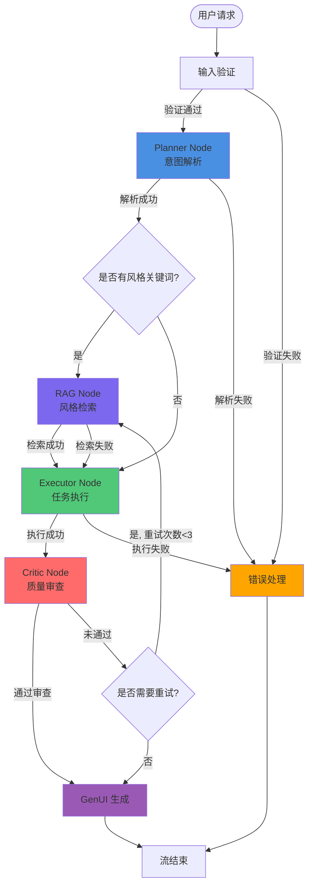

### 2.2 节点详细流程图

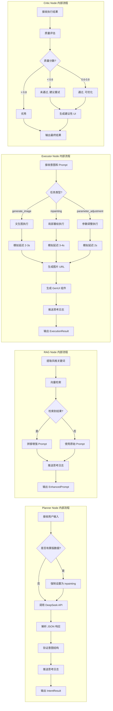

## 3. 状态定义

### 3.1 AgentState 状态字段

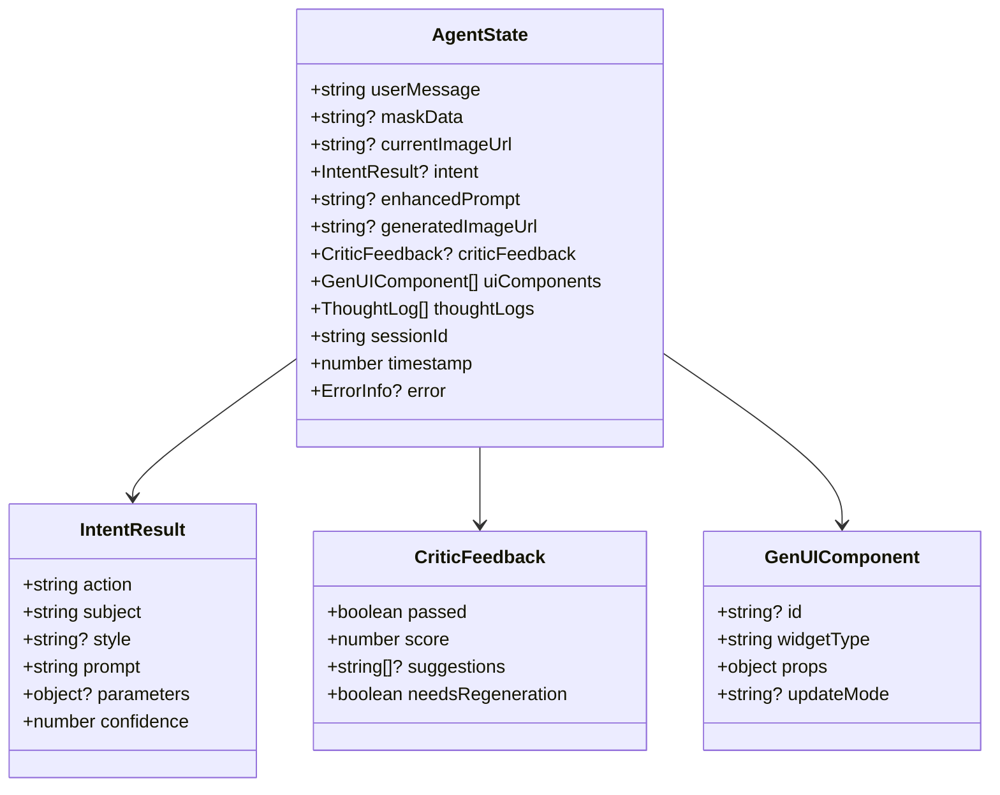

## 4. 节点输入/输出定义

### 4.1 Planner Node

**输入：**
- `userMessage: string` - 用户文本输入
- `maskData?: string` - 可选的蒙版数据（Base64）
- `currentImageUrl?: string` - 当前画布图片 URL

**输出：**
- `intent: IntentResult` - 结构化的意图结果
- `thoughtLog: ThoughtLog` - 思考日志

**条件分支：**
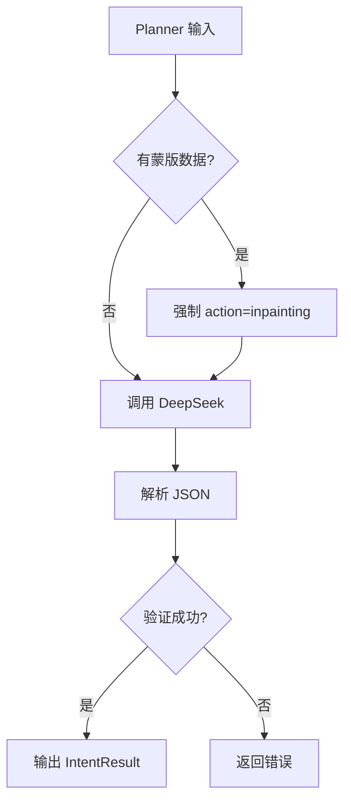

### 4.2 RAG Node

**输入：**
- `intent: IntentResult` - Planner 节点的输出
- `intent.style?: string` - 风格关键词

**输出：**
- `enhancedPrompt: string` - 增强后的完整 Prompt
- `thoughtLog?: ThoughtLog` - 思考日志（如果有检索结果）

**条件分支：**
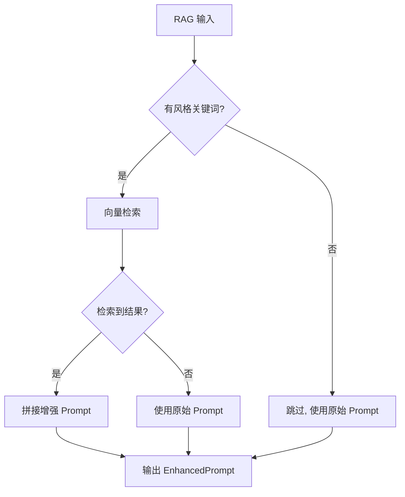

### 4.3 Executor Node

**输入：**
- `intent: IntentResult` - 用户意图
- `enhancedPrompt: string` - 增强后的 Prompt
- `maskData?: string` - 蒙版数据（inpainting 时使用）
- `currentImageUrl?: string` - 当前图片 URL（编辑任务时使用）

**输出：**
- `generatedImageUrl: string` - 生成的图片 URL
- `uiComponents: GenUIComponent[]` - GenUI 组件数组
- `thoughtLog: ThoughtLog` - 思考日志

**任务分发：**
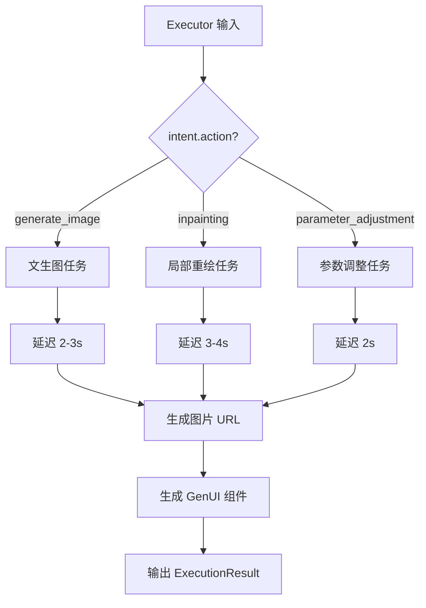

### 4.4 Critic Node

**输入：**
- `generatedImageUrl: string` - 生成的图片 URL
- `intent: IntentResult` - 原始意图
- `enhancedPrompt: string` - 使用的 Prompt

**输出：**
- `criticFeedback: CriticFeedback` - 审查反馈
- `uiComponents: GenUIComponent[]` - 更新的 UI 组件（包含建议）

**质量评估流程：**
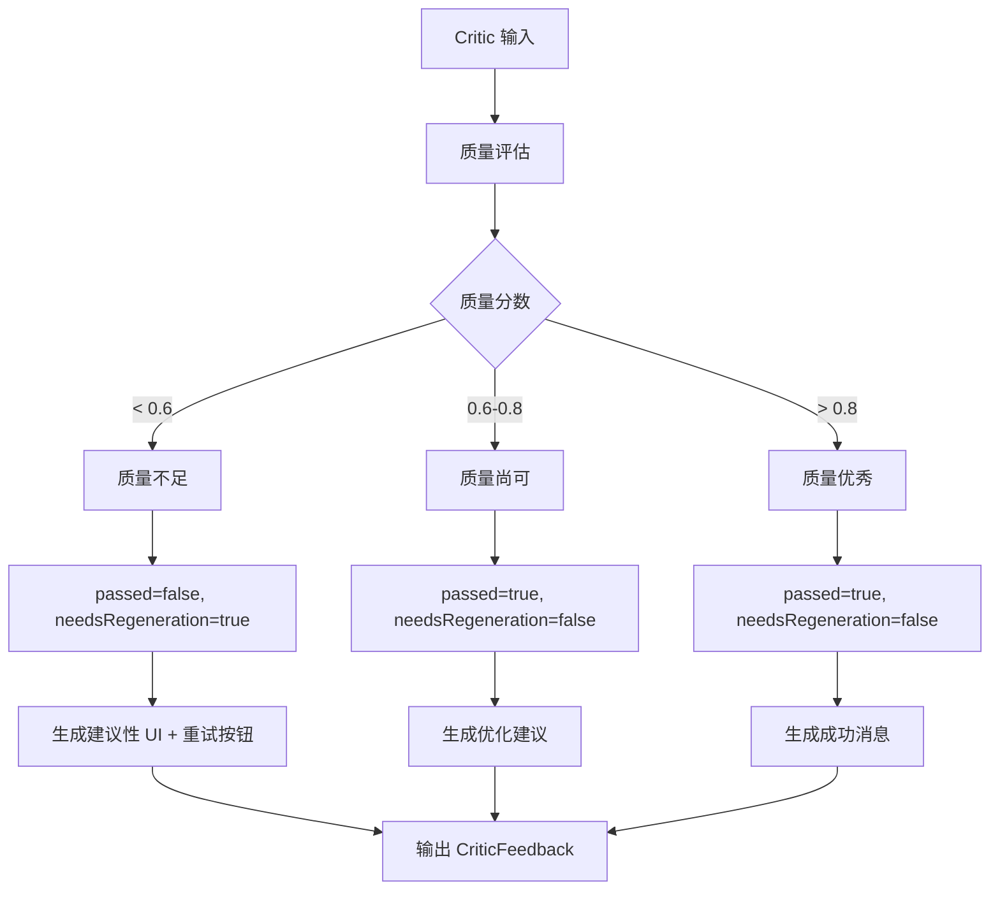

## 5. 条件分支详细说明

### 5.1 风格检索分支

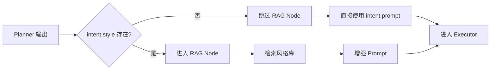

### 5.2 质量审查重试分支

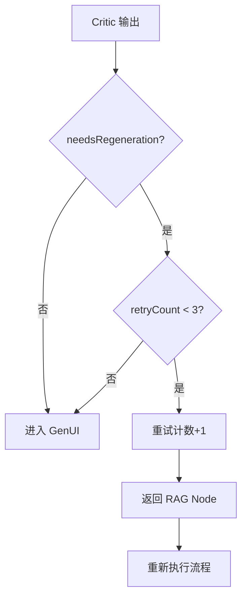

### 5.3 错误回退分支

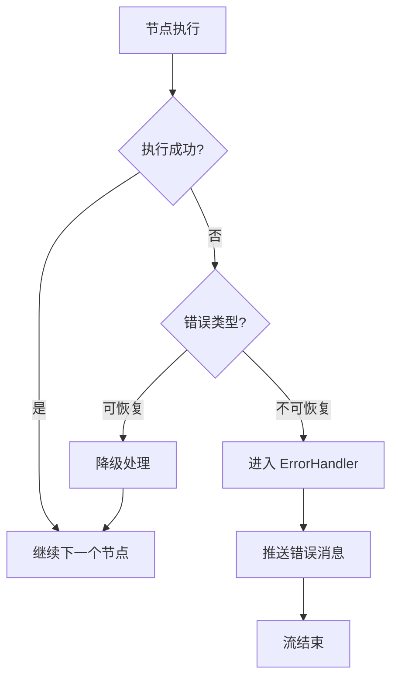

## 6. 多模态输入处理流程

### 6.1 文本 + 蒙版协调

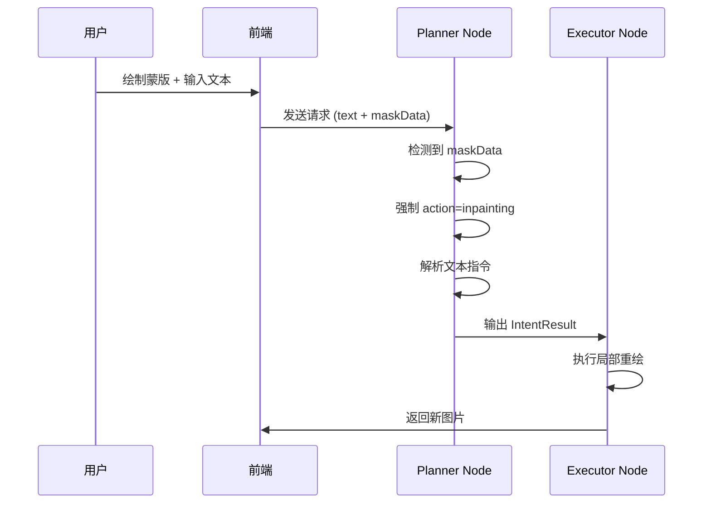

## 7. SSE 事件推送时机

### 7.1 事件推送流程图

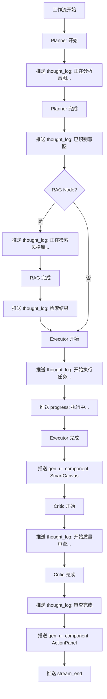

## 8. 状态转换表

| 当前状态 | 事件/条件 | 下一状态 | 说明 |
|---------|----------|---------|------|
| START | 用户请求 | ValidateInput | 开始工作流 |
| ValidateInput | 验证通过 | Planner | 进入意图解析 |
| ValidateInput | 验证失败 | ErrorHandler | 输入无效 |
| Planner | 解析成功 | RAG/Executor | 根据是否有风格关键词决定 |
| Planner | 解析失败 | ErrorHandler | API 调用失败或解析错误 |
| RAG | 检索完成 | Executor | 无论是否检索到结果都继续 |
| Executor | 执行成功 | Critic | 进入质量审查 |
| Executor | 执行失败 | ErrorHandler | 任务执行异常 |
| Critic | 通过审查 | GenUI | 生成最终 UI |
| Critic | 未通过且可重试 | RAG | 重新执行（最多 3 次） |
| Critic | 未通过且不可重试 | GenUI | 返回结果但提示优化 |
| GenUI | 组件生成完成 | StreamEnd | 工作流结束 |
| ErrorHandler | 错误处理完成 | StreamEnd | 推送错误消息后结束 |

## 9. 错误处理流程

### 9.1 错误类型与处理策略

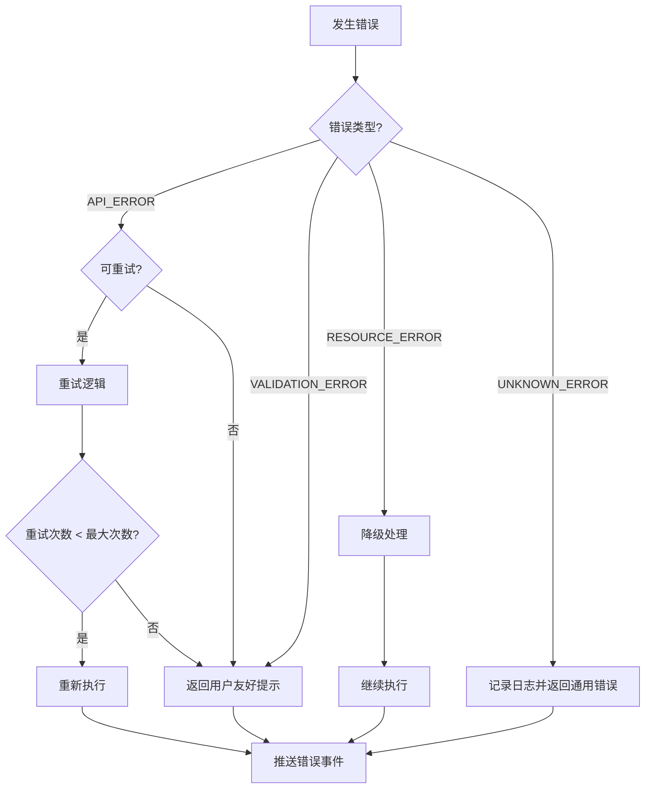

## 10. 性能优化点

### 10.1 并发控制

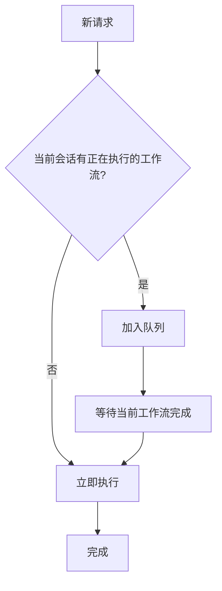

### 10.2 缓存策略

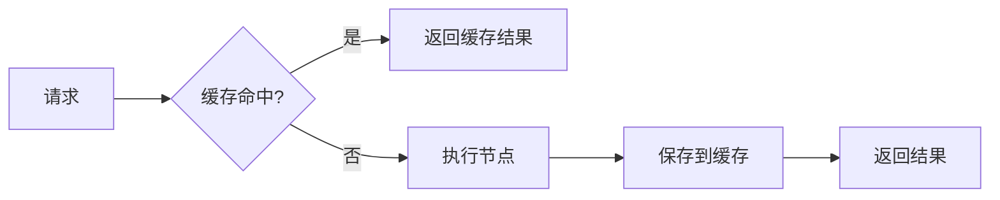

## 11. 完整工作流示例

### 11.1 文生图流程

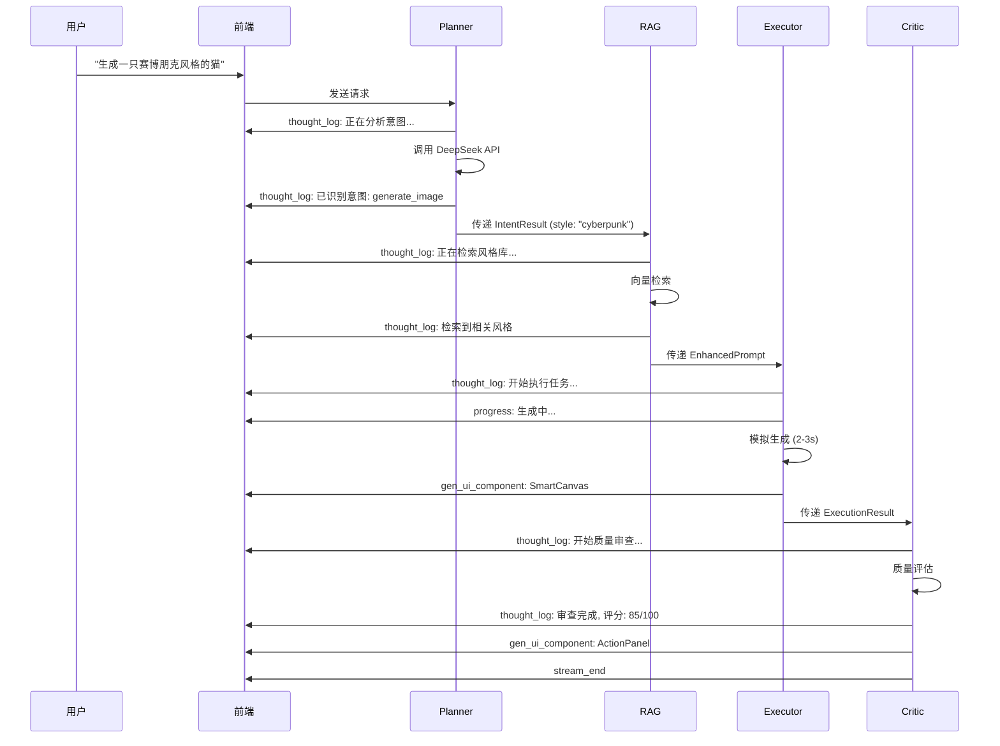

### 11.2 局部重绘流程

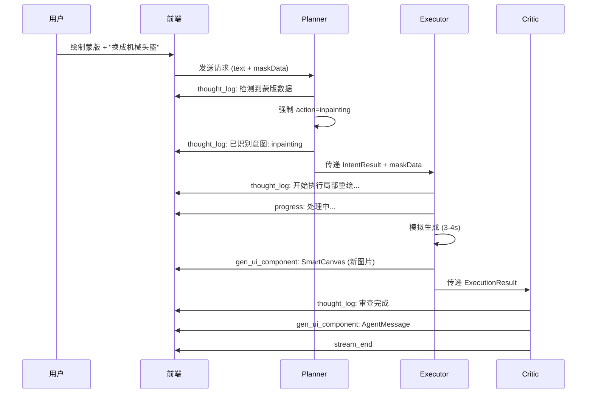

## 12. 状态机实现要点

### 12.1 LangGraph 图构建

```typescript
// 伪代码示例
const workflow = new StateGraph<AgentState>({
  channels: {
    userMessage: { reducer: (x, y) => y ?? x },
    intent: { reducer: (x, y) => y ?? x },
    enhancedPrompt: { reducer: (x, y) => y ?? x },
    // ... 其他字段
  }
});

// 添加节点
workflow.addNode('planner', plannerNode);
workflow.addNode('rag', ragNode);
workflow.addNode('executor', executorNode);
workflow.addNode('critic', criticNode);
workflow.addNode('genui', genUINode);
workflow.addNode('error_handler', errorHandlerNode);

// 设置入口
workflow.setEntryPoint('planner');

// 添加条件边
workflow.addConditionalEdges('planner', shouldContinueToRAG);
workflow.addConditionalEdges('rag', shouldContinueToExecutor);
workflow.addConditionalEdges('executor', shouldContinueToCritic);
workflow.addConditionalEdges('critic', shouldContinueToGenUI);
```

### 12.2 条件函数示例

```typescript
function shouldContinueToRAG(state: AgentState): string {
  if (state.error) return 'error_handler';
  if (state.intent?.style && state.intent.style.trim() !== '') {
    return 'rag';
  }
  return 'executor'; // 跳过 RAG
}

function shouldContinueToGenUI(state: AgentState): string {
  if (state.error) return 'error_handler';
  if (state.criticFeedback?.needsRegeneration && state.metadata.retryCount < 3) {
    return 'rag'; // 重试
  }
  return 'genui';
}
```

