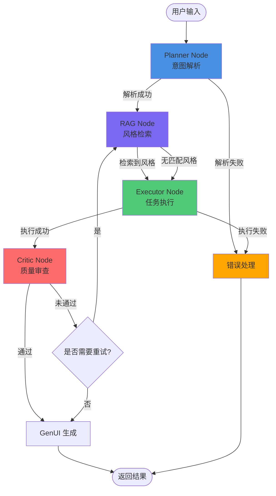

# Agent 工作流详细设计文档 (Agent Workflow Design) 第二版

## 1. 目标

本文档详细定义 AiVista 后端 Agent 的完整工作流设计，基于 LangGraph 实现多模态 Agent 编排，确保能够复刻即梦 AI 的核心编辑工作流逻辑。

**核心目标：**
- 实现完整的 Agent 状态机（Planner → RAG → Executor → Critic）
- 支持多模态输入处理（文本 + 蒙版数据）
- 确保工作流的可扩展性和错误恢复能力

## 2. LangGraph 状态图架构

### 2.1 AgentState 数据结构

```typescript
interface AgentState {
  // 消息历史
  messages: Array<{
    role: 'user' | 'assistant' | 'system';
    content: string;
    timestamp: number;
  }>;
  
  // 当前处理的用户输入
  userInput: {
    text: string;
    maskData?: {
      base64: string;
      imageUrl: string; // 原图 URL
      coordinates?: Array<{ x: number; y: number }>; // 蒙版路径点
    };
  };
  
  // Planner 节点输出
  intent: {
    action: 'generate_image' | 'inpainting' | 'adjust_parameters' | 'unknown';
    subject?: string;
    style?: string;
    confidence: number; // 0-1
    rawResponse: string; // DeepSeek 原始响应
  } | null;
  
  // RAG 节点输出
  enhancedPrompt: {
    original: string;
    retrieved: Array<{
      style: string;
      prompt: string;
      similarity: number;
    }>;
    final: string; // 增强后的完整 Prompt
  } | null;
  
  // Executor 节点输出
  executionResult: {
    imageUrl: string;
    taskType: 'text_to_image' | 'inpainting' | 'parameter_adjustment';
    metadata?: Record<string, any>;
  } | null;
  
  // Critic 节点输出
  qualityCheck: {
    passed: boolean;
    score: number; // 0-1
    feedback?: string;
    suggestions?: Array<string>;
  } | null;
  
  // GenUI 组件列表（用于前端渲染）
  uiComponents: Array<GenUIComponent>;
  
  // 错误信息
  error: {
    code: string;
    message: string;
    node: string; // 出错节点名称
  } | null;
  
  // 工作流元数据
  metadata: {
    sessionId: string;
    currentNode: string;
    startTime: number;
    retryCount: number;
  };
}
```

### 2.2 状态图可视化



## 3. 节点详细设计

### 3.1 Planner Node（规划节点）

**职责：** 分析用户输入，识别用户意图，提取关键信息。

#### 输入
- `AgentState.userInput.text`: 用户文本输入
- `AgentState.userInput.maskData`: 可选的蒙版数据

#### 处理逻辑

```typescript
async function plannerNode(state: AgentState): Promise<Partial<AgentState>> {
  // 1. 构建系统提示词
  const systemPrompt = `
你是一个专业的 AI 图像生成助手。请分析用户的输入，识别用户的意图。

可能的意图类型：
- generate_image: 用户想要生成新图片
- inpainting: 用户想要修改图片的某个区域（通常伴随蒙版数据）
- adjust_parameters: 用户想要调整生成参数（如风格强度、尺寸等）

请以 JSON 格式返回分析结果，格式如下：
{
  "action": "generate_image" | "inpainting" | "adjust_parameters" | "unknown",
  "subject": "主要对象（如：猫、城市、人物）",
  "style": "风格关键词（如：赛博朋克、水彩）",
  "confidence": 0.0-1.0,
  "reasoning": "分析理由"
}

如果检测到蒙版数据（maskData 存在），则 action 必须为 "inpainting"。
`;

  // 2. 调用 DeepSeek API
  const response = await deepSeekService.chat({
    messages: [
      { role: 'system', content: systemPrompt },
      { role: 'user', content: state.userInput.text }
    ],
    temperature: 0.3, // 降低随机性，提高一致性
    response_format: { type: 'json_object' }
  });

  // 3. 解析 JSON 响应
  const intent = JSON.parse(response.content);
  
  // 4. 如果有蒙版数据，强制设置为 inpainting
  if (state.userInput.maskData && intent.action !== 'inpainting') {
    intent.action = 'inpainting';
    intent.confidence = 0.9;
  }

  // 5. 推送思考日志
  await pushThoughtLog('planner', `已识别意图：${intent.action}，置信度：${intent.confidence}`);

  return {
    intent,
    metadata: { ...state.metadata, currentNode: 'planner' }
  };
}
```

#### 输出
- `AgentState.intent`: 结构化的意图信息

#### 错误处理
- 如果 DeepSeek API 调用失败，返回 `intent.action = 'unknown'`，并设置 `error`
- 如果 JSON 解析失败，使用 LLM 的原始响应作为 fallback

#### 流转条件
- **成功：** `intent.action !== 'unknown' && intent.confidence > 0.5`
- **失败：** 进入 ErrorHandler 节点

---

### 3.2 RAG Node（检索增强生成节点）

**职责：** 从向量数据库中检索相关风格提示词，增强用户输入的 Prompt。

#### 输入
- `AgentState.intent`: Planner 节点的输出
- `AgentState.userInput.text`: 原始用户输入

#### 处理逻辑

```typescript
async function ragNode(state: AgentState): Promise<Partial<AgentState>> {
  if (!state.intent) {
    throw new Error('RAG Node: intent is required');
  }

  // 1. 构建检索查询
  const queryText = [
    state.intent.style,
    state.intent.subject,
    state.userInput.text
  ].filter(Boolean).join(' ');

  // 2. 向量检索（使用 LanceDB）
  const results = await knowledgeService.search(queryText, {
    limit: 3, // 最多返回 3 条相关风格
    minSimilarity: 0.6 // 最小相似度阈值
  });

  // 3. 构建增强后的 Prompt
  const originalPrompt = state.userInput.text;
  const retrievedPrompts = results.map(r => r.prompt).join(', ');
  const finalPrompt = retrievedPrompts 
    ? `${originalPrompt}, ${retrievedPrompts}`
    : originalPrompt;

  // 4. 推送思考日志
  if (results.length > 0) {
    await pushThoughtLog('rag', `检索到 ${results.length} 条相关风格：${results.map(r => r.style).join(', ')}`);
  } else {
    await pushThoughtLog('rag', '未检索到匹配的风格，使用原始 Prompt');
  }

  return {
    enhancedPrompt: {
      original: originalPrompt,
      retrieved: results,
      final: finalPrompt
    },
    metadata: { ...state.metadata, currentNode: 'rag' }
  };
}
```

#### 输出
- `AgentState.enhancedPrompt`: 增强后的 Prompt 信息

#### 错误处理
- 如果向量数据库查询失败，使用原始 Prompt 继续执行
- 记录错误但不中断工作流

#### 流转条件
- **总是继续：** RAG 节点失败不影响后续执行，使用原始 Prompt

---

### 3.3 Executor Node（执行节点）

**职责：** 根据意图执行具体的任务（文生图、局部重绘、参数调整）。

#### 输入
- `AgentState.intent`: 用户意图
- `AgentState.enhancedPrompt`: 增强后的 Prompt
- `AgentState.userInput.maskData`: 蒙版数据（如果存在）

#### 处理逻辑

```typescript
async function executorNode(state: AgentState): Promise<Partial<AgentState>> {
  if (!state.intent || !state.enhancedPrompt) {
    throw new Error('Executor Node: intent and enhancedPrompt are required');
  }

  const { action } = state.intent;
  const prompt = state.enhancedPrompt.final;

  // 推送思考日志
  await pushThoughtLog('executor', `开始执行任务：${action}`);

  let executionResult;

  switch (action) {
    case 'generate_image':
      executionResult = await executeTextToImage(prompt);
      break;
    
    case 'inpainting':
      if (!state.userInput.maskData) {
        throw new Error('Inpainting requires maskData');
      }
      executionResult = await executeInpainting(
        prompt,
        state.userInput.maskData,
        state.userInput.maskData.imageUrl
      );
      break;
    
    case 'adjust_parameters':
      executionResult = await executeParameterAdjustment(
        prompt,
        state.intent
      );
      break;
    
    default:
      throw new Error(`Unknown action: ${action}`);
  }

  await pushThoughtLog('executor', '任务执行完成');

  return {
    executionResult,
    metadata: { ...state.metadata, currentNode: 'executor' }
  };
}

// 文生图执行函数
async function executeTextToImage(prompt: string) {
  // 模拟延迟（2-3 秒）
  await new Promise(resolve => setTimeout(resolve, 2000 + Math.random() * 1000));
  
  // 生成随机种子（基于 Prompt 的哈希值，确保相同 Prompt 返回相同图片）
  const seed = hashString(prompt);
  const imageUrl = `https://picsum.photos/seed/${seed}/800/600`;
  
  return {
    imageUrl,
    taskType: 'text_to_image' as const,
    metadata: { prompt, seed }
  };
}

// 局部重绘执行函数
async function executeInpainting(
  prompt: string,
  maskData: MaskData,
  baseImageUrl: string
) {
  // 模拟延迟
  await new Promise(resolve => setTimeout(resolve, 2000 + Math.random() * 1000));
  
  // 生成新的随机图片（实际应该是基于 baseImageUrl 和 maskData 的处理结果）
  const seed = hashString(`${prompt}_${maskData.base64.substring(0, 20)}`);
  const imageUrl = `https://picsum.photos/seed/${seed}/800/600`;
  
  return {
    imageUrl,
    taskType: 'inpainting' as const,
    metadata: { prompt, baseImageUrl, maskSize: maskData.base64.length }
  };
}

// 参数调整执行函数
async function executeParameterAdjustment(
  prompt: string,
  intent: Intent
) {
  // 参数调整通常需要重新生成，但使用调整后的参数
  await new Promise(resolve => setTimeout(resolve, 1500));
  
  const seed = hashString(`${prompt}_adjusted`);
  const imageUrl = `https://picsum.photos/seed/${seed}/800/600`;
  
  return {
    imageUrl,
    taskType: 'parameter_adjustment' as const,
    metadata: { prompt, adjustedParams: intent }
  };
}
```

#### 输出
- `AgentState.executionResult`: 执行结果（包含图片 URL）

#### 错误处理
- 如果执行失败，设置 `error` 字段，并尝试重试（最多 3 次）
- 重试次数记录在 `metadata.retryCount`

#### 流转条件
- **成功：** `executionResult.imageUrl` 存在
- **失败：** 进入 ErrorHandler 节点

---

### 3.4 Critic Node（审查节点）

**职责：** 对执行结果进行质量审查，判断是否需要重新生成或调整。

#### 输入
- `AgentState.executionResult`: 执行结果
- `AgentState.intent`: 用户意图
- `AgentState.enhancedPrompt`: 增强后的 Prompt

#### 处理逻辑

```typescript
async function criticNode(state: AgentState): Promise<Partial<AgentState>> {
  if (!state.executionResult || !state.intent) {
    throw new Error('Critic Node: executionResult and intent are required');
  }

  // 推送思考日志
  await pushThoughtLog('critic', '开始质量审查...');

  // 1. 构建审查提示词
  const systemPrompt = `
你是一个图像质量审查助手。请评估生成的图片是否满足用户需求。

评估维度：
1. 是否符合用户意图（action: ${state.intent.action}）
2. 是否包含用户要求的主体（subject: ${state.intent.subject}）
3. 风格是否匹配（style: ${state.intent.style}）

请以 JSON 格式返回评估结果：
{
  "passed": true/false,
  "score": 0.0-1.0,
  "feedback": "评估反馈",
  "suggestions": ["改进建议1", "改进建议2"]
}
`;

  // 2. 调用 DeepSeek 进行审查（注意：这里审查的是"模拟结果"，实际应该审查真实图片）
  // 为了 MVP，我们简化处理：基于 intent.confidence 和随机因素决定
  const baseScore = state.intent.confidence;
  const randomFactor = Math.random() * 0.2; // 添加一些随机性
  const finalScore = Math.min(1.0, baseScore + randomFactor);
  
  const passed = finalScore > 0.7; // 阈值：0.7

  // 3. 生成反馈
  const feedback = passed
    ? '图片质量符合要求'
    : '图片可能需要调整，建议重新生成或调整参数';

  const suggestions = passed
    ? []
    : ['尝试调整风格强度', '重新生成', '修改 Prompt'];

  await pushThoughtLog('critic', `审查完成，得分：${finalScore.toFixed(2)}，${passed ? '通过' : '未通过'}`);

  return {
    qualityCheck: {
      passed,
      score: finalScore,
      feedback,
      suggestions
    },
    metadata: { ...state.metadata, currentNode: 'critic' }
  };
}
```

#### 输出
- `AgentState.qualityCheck`: 质量审查结果

#### 错误处理
- 如果审查过程失败，默认 `passed = true`，继续执行

#### 流转条件
- **通过：** `qualityCheck.passed === true` → 进入 GenUI 生成
- **未通过：** `qualityCheck.passed === false` → 根据 `suggestions` 决定是否重试

---

## 4. 节点流转条件

### 4.1 条件边（Conditional Edges）

```typescript
// 定义条件函数
function shouldContinueToRAG(state: AgentState): string {
  if (state.error) return 'error_handler';
  if (state.intent && state.intent.action !== 'unknown' && state.intent.confidence > 0.5) {
    return 'rag';
  }
  return 'error_handler';
}

function shouldContinueToExecutor(state: AgentState): string {
  if (state.error) return 'error_handler';
  // RAG 节点总是继续，即使检索失败
  return 'executor';
}

function shouldContinueToCritic(state: AgentState): string {
  if (state.error) return 'error_handler';
  if (state.executionResult) return 'critic';
  return 'error_handler';
}

function shouldContinueToGenUI(state: AgentState): string {
  if (state.error) return 'error_handler';
  if (state.qualityCheck?.passed) return 'genui';
  // 如果未通过，检查是否需要重试
  if (state.metadata.retryCount < 3) {
    return 'rag'; // 重新检索和执行
  }
  return 'genui'; // 即使未通过也返回结果
}
```

### 4.2 错误回退机制

```typescript
async function errorHandlerNode(state: AgentState): Promise<Partial<AgentState>> {
  const error = state.error || {
    code: 'UNKNOWN_ERROR',
    message: '未知错误',
    node: 'unknown'
  };

  // 生成友好的错误消息
  const errorMessage = generateErrorMessage(error);

  // 推送错误事件
  await pushErrorEvent(error);

  // 生成错误提示的 GenUI 组件
  const errorComponent: GenUIComponent = {
    widgetType: 'AgentMessage',
    props: {
      state: 'failed',
      text: errorMessage,
      isThinking: false
    }
  };

  return {
    uiComponents: [errorComponent],
    metadata: { ...state.metadata, currentNode: 'error_handler' }
  };
}
```

## 5. 多模态输入处理

### 5.1 文本 + 蒙版数据协调

当用户同时发送文本指令和蒙版数据时：

```typescript
// 在 AgentController 中处理请求
@Post('chat')
async chat(@Body() request: ChatRequest) {
  const { text, maskData } = request;
  
  // 构建 AgentState
  const initialState: AgentState = {
    messages: [],
    userInput: {
      text: text || '',
      maskData: maskData ? {
        base64: maskData.base64,
        imageUrl: maskData.imageUrl,
        coordinates: maskData.coordinates
      } : undefined
    },
    // ... 其他字段
  };

  // 如果存在蒙版数据，在 Planner 节点中会强制设置为 inpainting
  // 如果只有文本，Planner 会正常解析意图
}
```

### 5.2 多轮对话上下文

```typescript
// 在 Planner Node 中，携带历史消息
async function plannerNode(state: AgentState): Promise<Partial<AgentState>> {
  // 构建包含历史的消息列表
  const messages = [
    ...state.messages.slice(-5), // 只保留最近 5 条消息
    { role: 'user', content: state.userInput.text }
  ];

  // 如果用户说"再调整一下"，需要从历史中提取上下文
  if (state.userInput.text.includes('再') || state.userInput.text.includes('调整')) {
    // 查找最近一次的执行结果
    const lastResult = findLastExecutionResult(state.messages);
    if (lastResult) {
      // 将上次的结果作为上下文
      messages.unshift({
        role: 'assistant',
        content: `上一次生成的结果：${lastResult.imageUrl}`
      });
    }
  }

  // ... 调用 DeepSeek
}
```

## 6. 工作流初始化与执行

### 6.1 LangGraph 图构建

```typescript
import { StateGraph, END } from '@langchain/langgraph';

function createAgentGraph(): StateGraph<AgentState> {
  const workflow = new StateGraph<AgentState>({
    channels: {
      // 定义状态通道（对应 AgentState 的字段）
      messages: { reducer: (x, y) => [...x, ...y] },
      userInput: { reducer: (x, y) => y ?? x },
      intent: { reducer: (x, y) => y ?? x },
      // ... 其他字段
    }
  });

  // 添加节点
  workflow.addNode('planner', plannerNode);
  workflow.addNode('rag', ragNode);
  workflow.addNode('executor', executorNode);
  workflow.addNode('critic', criticNode);
  workflow.addNode('genui', genUINode);
  workflow.addNode('error_handler', errorHandlerNode);

  // 设置入口点
  workflow.setEntryPoint('planner');

  // 添加条件边
  workflow.addConditionalEdges('planner', shouldContinueToRAG);
  workflow.addConditionalEdges('rag', shouldContinueToExecutor);
  workflow.addConditionalEdges('executor', shouldContinueToCritic);
  workflow.addConditionalEdges('critic', shouldContinueToGenUI);
  workflow.addConditionalEdges('genui', () => END);
  workflow.addConditionalEdges('error_handler', () => END);

  return workflow.compile();
}
```

### 6.2 流式执行

```typescript
async function* executeWorkflowStream(
  initialState: AgentState
): AsyncGenerator<SSEEvent> {
  const graph = createAgentGraph();
  
  // 流式执行
  for await (const event of graph.stream(initialState, {
    streamMode: 'values' // 返回每个节点的状态更新
  })) {
    // 推送思考日志
    if (event.metadata?.currentNode) {
      yield {
        type: 'thought_log',
        data: {
          node: event.metadata.currentNode,
          message: getNodeMessage(event.metadata.currentNode)
        }
      };
    }

    // 推送 GenUI 组件
    if (event.uiComponents && event.uiComponents.length > 0) {
      for (const component of event.uiComponents) {
        yield {
          type: 'gen_ui_component',
          data: component
        };
      }
    }

    // 推送错误
    if (event.error) {
      yield {
        type: 'error',
        data: event.error
      };
    }
  }
}
```

## 7. 边界情况处理

### 7.1 空消息处理
- 如果 `userInput.text` 为空且无 `maskData`，返回错误提示

### 7.2 纯表情/无效输入
- Planner 节点识别为 `action: 'unknown'`，返回友好提示

### 7.3 无蒙版的局部重绘指令
- 如果用户说"修改这里"但没有蒙版，返回提示要求先绘制蒙版

### 7.4 历史栈溢出
- 限制 `messages` 数组最大长度为 50，超出时删除最旧的消息

### 7.5 并发请求处理
- 每个会话使用独立的 `sessionId`，确保状态隔离
- 同一会话的并发请求需要排队处理

## 8. 性能优化

### 8.1 节点并行化
- RAG 检索可以与其他轻量级操作并行（未来优化）

### 8.2 缓存策略
- 相同 Prompt 的检索结果可以缓存
- 相同 seed 的图片 URL 可以复用

### 8.3 超时控制
- 每个节点设置超时时间（Planner: 10s, Executor: 5s, Critic: 8s）
- 超时后进入错误处理流程


# Agent 工作流详细设计文档 (Agent Workflow Design) 第一版

## 1. 目标

本文档详细设计基于 LangGraph 的 Agent 工作流，实现多模态 AI 创作任务的编排。核心目标是复刻即梦 AI 的复杂编辑工作流逻辑，包括意图识别、知识检索、任务执行和质量审查的完整流程。

## 2. LangGraph 状态机架构

### 2.1 AgentState 数据结构

AgentState 是 LangGraph 状态图的核心数据结构，贯穿整个工作流：

```typescript
interface AgentState {
  // 用户输入
  userMessage: string;              // 用户文本指令
  maskData?: string;                 // Base64 编码的蒙版图片（可选）
  currentImageUrl?: string;          // 当前画布上的图片 URL（用于局部重绘）
  
  // Agent 处理结果
  intent?: IntentResult;             // Planner 节点解析的意图
  enhancedPrompt?: string;           // RAG 节点增强后的完整 Prompt
  generatedImageUrl?: string;        // Executor 节点生成的图片 URL
  criticFeedback?: CriticFeedback;   // Critic 节点的审查反馈
  
  // UI 组件生成
  uiComponents: GenUIComponent[];    // 已生成的 UI 组件列表
  thoughtLogs: ThoughtLog[];         // 思考日志（用于流式推送）
  
  // 元数据
  sessionId: string;                 // 会话 ID
  timestamp: number;                  // 当前时间戳
  error?: ErrorInfo;                  // 错误信息（如果有）
}
```

### 2.2 节点定义

工作流由以下四个核心节点组成，按顺序执行：

```
[START] → [Planner] → [RAG] → [Executor] → [Critic] → [END]
           ↓           ↓         ↓            ↓
       意图解析    知识检索   任务执行    质量审查
```

## 3. 节点详细设计

### 3.1 Planner Node（规划节点）

**职责：** 解析用户意图，将自然语言转换为结构化的任务描述。

#### 输入
- `userMessage`: 用户文本输入
- `maskData`: 可选的蒙版数据（Base64）
- `currentImageUrl`: 当前画布图片（用于判断是否为编辑任务）

#### 处理逻辑

1. **多模态输入判断**
   ```typescript
   if (maskData && currentImageUrl) {
     // 用户提供了蒙版 + 当前有图片 = 局部重绘任务
     taskType = "inpainting";
   } else if (currentImageUrl && userMessage.includes("调整") || "修改") {
     // 有图片 + 调整类指令 = 参数调整任务
     taskType = "parameter_adjustment";
   } else {
     // 纯文本 = 文生图任务
     taskType = "generate_image";
   }
   ```

2. **调用 DeepSeek API 进行意图解析**
   ```typescript
   const systemPrompt = `
   你是一个 AI 创作助手，负责解析用户的创作意图。
   请将用户输入解析为以下 JSON 格式：
   {
     "action": "generate_image" | "inpainting" | "parameter_adjustment",
     "subject": "主要对象（如：cat, city, person）",
     "style": "风格关键词（如：cyberpunk, watercolor）",
     "prompt": "完整的英文提示词",
     "parameters": {
       "style_strength": 0-100,
       "resolution": "800x600"
     }
   }
   `;
   
   const response = await deepSeek.chat.completions.create({
     model: "deepseek-chat",
     messages: [
       { role: "system", content: systemPrompt },
       { role: "user", content: userMessage }
     ],
     response_format: { type: "json_object" }
   });
   ```

3. **结构化输出验证**
   - 验证 JSON 格式
   - 验证 action 字段的有效性
   - 提取关键信息（subject, style, prompt）

#### 输出
- `intent`: IntentResult 对象
  ```typescript
  interface IntentResult {
    action: "generate_image" | "inpainting" | "parameter_adjustment";
    subject: string;
    style?: string;
    prompt: string;
    parameters?: Record<string, any>;
    confidence: number;  // 0-1，意图识别的置信度
  }
  ```

#### 思考日志推送
```typescript
{
  type: "thought_log",
  node: "planner",
  message: `已识别意图：${intent.action}。主题：${intent.subject}，风格：${intent.style || "未指定"}`
}
```

#### 错误处理
- DeepSeek API 调用失败：重试 2 次，失败后返回错误状态
- JSON 解析失败：使用 LLM 重新解析或返回默认意图（generate_image）
- 无效输入（空消息、纯表情）：返回友好的错误提示

### 3.2 RAG Node（检索增强生成节点）

**职责：** 从向量数据库中检索风格相关的 Prompt 增强词，提升生成质量。

#### 输入
- `intent`: Planner 节点解析的意图结果
- `intent.style`: 风格关键词（如 "cyberpunk"）

#### 处理逻辑

1. **风格关键词提取**
   ```typescript
   const styleKeywords = extractStyleKeywords(intent.style, intent.prompt);
   // 示例：["cyberpunk", "neon", "futuristic"]
   ```

2. **向量检索**
   ```typescript
   const knowledgeService = new KnowledgeService(); // LanceDB 封装
   const results = await knowledgeService.search({
     query: styleKeywords.join(" "),
     limit: 3,  // 返回最相关的 3 条
     threshold: 0.7  // 相似度阈值
   });
   ```

3. **Prompt 增强**
   ```typescript
   if (results.length > 0) {
     const enhancedParts = results.map(r => r.promptEnhancement).join(", ");
     enhancedPrompt = `${intent.prompt}, ${enhancedParts}`;
   } else {
     enhancedPrompt = intent.prompt;  // 无匹配时使用原始 Prompt
   }
   ```

#### 输出
- `enhancedPrompt`: 增强后的完整 Prompt 字符串

#### 思考日志推送
```typescript
if (results.length > 0) {
  {
    type: "thought_log",
    node: "rag",
    message: `正在检索风格库... 找到 ${results.length} 条相关风格提示词。`
  }
}
```

#### 错误处理
- LanceDB 查询失败：降级为使用原始 Prompt，记录警告日志
- 无匹配结果：正常流程，使用原始 Prompt

### 3.3 Executor Node（执行节点）

**职责：** 根据意图执行具体的创作任务（文生图、局部重绘、参数调整）。

#### 输入
- `intent`: 意图结果
- `enhancedPrompt`: RAG 增强后的 Prompt
- `maskData`: 蒙版数据（如果是 inpainting 任务）
- `currentImageUrl`: 当前图片 URL（如果是编辑任务）

#### 处理逻辑

根据 `intent.action` 分发到不同的执行器：

##### 3.3.1 文生图任务 (generate_image)

```typescript
async function executeGenerateImage(enhancedPrompt: string): Promise<string> {
  // 模拟延迟（2-3 秒）
  await sleep(2000 + Math.random() * 1000);
  
  // 生成随机种子（基于 Prompt 的哈希值，保证相同 Prompt 返回相同图片）
  const seed = hashString(enhancedPrompt);
  
  // 返回 Mock 图片 URL
  return `https://picsum.photos/seed/${seed}/800/600`;
}
```

##### 3.3.2 局部重绘任务 (inpainting)

```typescript
async function executeInpainting(
  enhancedPrompt: string,
  maskData: string,
  baseImageUrl: string
): Promise<string> {
  // 验证输入
  if (!maskData || !baseImageUrl) {
    throw new Error("局部重绘需要提供蒙版和底图");
  }
  
  // 模拟延迟（3-4 秒，比文生图稍长）
  await sleep(3000 + Math.random() * 1000);
  
  // 生成新的随机图片（实际应用中这里会调用真实的 Inpainting API）
  const seed = hashString(`${enhancedPrompt}-${maskData}-${Date.now()}`);
  return `https://picsum.photos/seed/${seed}/800/600`;
}
```

##### 3.3.3 参数调整任务 (parameter_adjustment)

```typescript
async function executeParameterAdjustment(
  enhancedPrompt: string,
  parameters: Record<string, any>,
  baseImageUrl: string
): Promise<string> {
  // 根据参数调整重新生成（Mock）
  await sleep(2000 + Math.random() * 1000);
  
  const seed = hashString(`${enhancedPrompt}-${JSON.stringify(parameters)}`);
  return `https://picsum.photos/seed/${seed}/800/600`;
}
```

#### 输出
- `generatedImageUrl`: 生成的图片 URL
- `uiComponents`: 生成的 GenUI 组件数组
  ```typescript
  [
    {
      widgetType: "SmartCanvas",
      props: {
        imageUrl: generatedImageUrl,
        mode: intent.action === "inpainting" ? "view" : "view"
      }
    },
    {
      widgetType: "ActionPanel",
      props: {
        actions: [
          {
            id: "regenerate_btn",
            label: "重新生成",
            type: "button"
          }
        ]
      }
    }
  ]
  ```

#### 思考日志推送
```typescript
{
  type: "thought_log",
  node: "executor",
  message: `正在${getActionLabel(intent.action)}... 预计需要 ${getEstimatedTime(intent.action)} 秒。`
}
```

#### 错误处理
- 任务类型不支持：返回错误状态，提示用户
- 蒙版数据无效：返回友好的错误提示，引导用户重新绘制

### 3.4 Critic Node（审查节点）

**职责：** 对生成结果进行质量审查，决定是否需要调整或重新生成。

#### 输入
- `generatedImageUrl`: Executor 生成的图片 URL
- `intent`: 原始意图
- `enhancedPrompt`: 使用的 Prompt

#### 处理逻辑

1. **质量评估**
   ```typescript
   // MVP 版本：基于 Prompt 关键词的简单检查
   const qualityScore = evaluateQuality(enhancedPrompt, intent);
   
   // 评估维度：
   // - Prompt 完整性（是否包含 subject + style）
   // - 风格一致性（RAG 检索的风格是否被使用）
   // - 参数合理性（style_strength 等参数是否在合理范围）
   ```

2. **决策逻辑**
   ```typescript
   interface CriticFeedback {
     passed: boolean;           // 是否通过审查
     score: number;              // 质量分数 0-1
     suggestions?: string[];     // 改进建议
     needsRegeneration: boolean; // 是否需要重新生成
   }
   
   if (qualityScore < 0.6) {
     // 质量不足，建议重新生成
     feedback = {
       passed: false,
       score: qualityScore,
       suggestions: ["建议增加更具体的风格描述", "可以尝试调整风格强度"],
       needsRegeneration: true
     };
   } else if (qualityScore < 0.8) {
     // 质量尚可，但可以优化
     feedback = {
       passed: true,
       score: qualityScore,
       suggestions: ["可以尝试调整参数以获得更好效果"],
       needsRegeneration: false
     };
   } else {
     // 质量优秀
     feedback = {
       passed: true,
       score: qualityScore,
       needsRegeneration: false
     };
   }
   ```

3. **动态 UI 组件生成**
   ```typescript
   if (feedback.suggestions && feedback.suggestions.length > 0) {
     // 添加建议性的 ActionPanel
     uiComponents.push({
       widgetType: "AgentMessage",
       props: {
         text: `生成完成！质量评分：${(feedback.score * 100).toFixed(0)}/100。${feedback.suggestions.join(" ")}`,
         state: "success"
       }
     });
     
     if (feedback.needsRegeneration) {
       uiComponents.push({
         widgetType: "ActionPanel",
         props: {
           actions: [
             {
               id: "regenerate_btn",
               label: "重新生成",
               type: "button"
             }
           ]
         }
       });
     }
   }
   ```

#### 输出
- `criticFeedback`: CriticFeedback 对象
- 更新 `uiComponents`（添加建议性组件）

#### 思考日志推送
```typescript
{
  type: "thought_log",
  node: "critic",
  message: `质量审查完成。评分：${(feedback.score * 100).toFixed(0)}/100。${feedback.passed ? "已通过" : "建议优化"}。`
}
```

#### 错误处理
- 评估过程异常：默认通过审查，记录警告日志

## 4. 节点流转条件

### 4.1 正常流转

```
Planner → RAG → Executor → Critic → END
```

每个节点执行成功后，自动流转到下一个节点。

### 4.2 条件分支

#### 分支 1：RAG 节点跳过条件
```typescript
if (!intent.style || intent.style.trim() === "") {
  // 无风格关键词，跳过 RAG 节点
  enhancedPrompt = intent.prompt;
  // 直接流转到 Executor
}
```

#### 分支 2：Critic 节点反馈循环
```typescript
if (criticFeedback.needsRegeneration && retryCount < 2) {
  // 需要重新生成，且重试次数未超限
  // 流转回 Executor 节点（带重试标记）
  retryCount++;
  // 重新执行 Executor
}
```

### 4.3 错误回退

- **Planner 失败**：返回错误状态，推送错误消息给前端
- **RAG 失败**：降级为使用原始 Prompt，继续执行
- **Executor 失败**：返回错误状态，允许用户重试
- **Critic 失败**：默认通过审查，继续流程

## 5. 多模态输入处理

### 5.1 文本 + 蒙版协调

当用户同时提供文本指令和蒙版数据时：

1. **Planner 节点**：优先根据蒙版数据判断为 `inpainting` 任务
2. **文本指令解析**：提取局部重绘的具体要求（如 "换成机械头盔"）
3. **Prompt 构建**：
   ```typescript
   const inpaintingPrompt = `${intent.prompt} in the masked area, ${userMessage}`;
   ```

### 5.2 上下文理解

支持多轮对话上下文：

```typescript
interface AgentState {
  // ... 其他字段
  conversationHistory: Array<{
    role: "user" | "assistant";
    content: string;
    timestamp: number;
  }>;
}

// Planner 节点使用历史上下文
const contextMessages = [
  ...state.conversationHistory.slice(-3),  // 最近 3 轮对话
  { role: "user", content: userMessage }
];
```

## 6. 状态持久化

### 6.1 会话状态管理

- 每个 SSE 连接对应一个会话（sessionId）
- 会话状态存储在内存中（Map<sessionId, AgentState>）
- 会话超时：30 分钟无活动自动清理

### 6.2 历史记录

- 每次工作流执行完成后，保存关键状态到数据库（可选）
- 支持用户查看历史创作记录

## 7. 性能优化

### 7.1 并发控制

- 每个会话同时只能执行一个工作流
- 新请求到达时，如果当前工作流未完成，返回 "处理中" 状态

### 7.2 缓存策略

- RAG 检索结果缓存（相同关键词 5 分钟内复用）
- DeepSeek API 响应缓存（相同 Prompt 缓存 1 小时）

## 8. 测试验证标准

### 8.1 单元测试

- 每个节点的输入/输出验证
- 错误处理逻辑测试
- 边界情况测试（空输入、超长输入等）

### 8.2 集成测试

- 完整工作流端到端测试
- 多模态输入处理测试
- SSE 流式推送测试

### 8.3 性能测试

- 单次工作流执行时间 < 5 秒（Mock 延迟除外）
- 并发 10 个会话的稳定性测试

