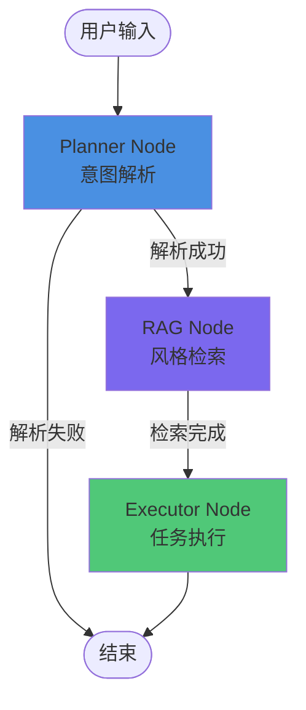
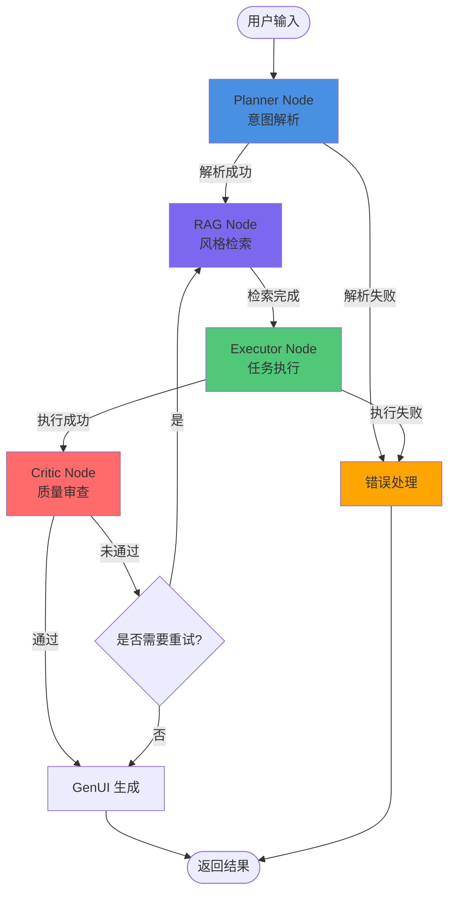

# Agent 工作流详细设计文档 (Agent Workflow Design) 

## 1. 目标

本文档详细定义 AiVista 后端 Agent 的完整工作流设计，基于 LangGraph 实现多模态 Agent 编排，确保能够复刻即梦 AI 的核心编辑工作流逻辑。

**核心目标：**
- 实现完整的 Agent 状态机（Planner → RAG → Executor → Critic）
- 支持多模态输入处理（文本 + 蒙版数据）
- 确保工作流的可扩展性和错误恢复能力

## 2. LangGraph 状态图架构

### 2.1 AgentState 数据结构

```typescript
interface AgentState {
  // 消息历史
  messages: Array<{
    role: 'user' | 'assistant' | 'system';
    content: string;
    timestamp: number;
  }>;
  
  // 当前处理的用户输入
  userInput: {
    text: string;
    maskData?: {
      base64: string;
      imageUrl: string; // 原图 URL
      coordinates?: Array<{ x: number; y: number }>; // 蒙版路径点
    };
    preferredModel?: 'qwen-image' | 'qwen-image-max' | 'qwen-image-plus' | 'z-image-turbo'; // 首选图片生成模型
  };
  
  // Planner 节点输出
  intent: {
    action: 'generate_image' | 'inpainting' | 'adjust_parameters' | 'unknown';
    subject?: string;
    style?: string;
    confidence: number; // 0-1
    rawResponse: string; // LLM 原始响应
  } | null;
  
  // RAG 节点输出
  enhancedPrompt: {
    original: string;
    retrieved: Array<{
      style: string;
      prompt: string;
      similarity: number;
    }>;
    final: string; // 增强后的完整 Prompt
  } | null;
  
  // Executor 节点输出
  executionResult: {
    imageUrl: string;
    taskType: 'text_to_image' | 'inpainting' | 'parameter_adjustment';
    metadata?: Record<string, any>;
  } | null;
  
  // Critic 节点输出
  qualityCheck: {
    passed: boolean;
    score: number; // 0-1
    feedback?: string;
    suggestions?: Array<string>;
  } | null;
  
  // GenUI 组件列表（用于前端渲染）
  uiComponents: Array<GenUIComponent>;
  
  // 错误信息
  error: {
    code: string;
    message: string;
    node: string; // 出错节点名称
  } | null;
  
  // 工作流元数据
  metadata: {
    sessionId: string;
    currentNode: string;
    startTime: number;
    retryCount: number;
  };
}
```

### 2.2 状态图可视化

**当前实现（里程碑3）：**



**完整设计（包含 Critic，里程碑4）：**



## 3. 节点详细设计

### 3.1 Planner Node（规划节点）

**职责：** 分析用户输入，识别用户意图，提取关键信息。

#### 输入
- `AgentState.userInput.text`: 用户文本输入
- `AgentState.userInput.maskData`: 可选的蒙版数据

#### 处理逻辑

```typescript
async function plannerNode(state: AgentState): Promise<Partial<AgentState>> {
  // 1. 构建系统提示词
  const systemPrompt = `
你是一个专业的 AI 图像生成助手。请分析用户的输入，识别用户的意图。

可能的意图类型：
- generate_image: 用户想要生成新图片
- inpainting: 用户想要修改图片的某个区域（通常伴随蒙版数据）
- adjust_parameters: 用户想要调整生成参数（如风格强度、尺寸等）

请以 JSON 格式返回分析结果，格式如下：
{
  "action": "generate_image" | "inpainting" | "adjust_parameters" | "unknown",
  "subject": "主要对象（如：猫、城市、人物）",
  "style": "风格关键词（如：赛博朋克、水彩）",
  "confidence": 0.0-1.0,
  "reasoning": "分析理由"
}

如果检测到蒙版数据（maskData 存在），则 action 必须为 "inpainting"。
`;

  // 2. 调用 LLM 服务（通过 ILlmService 接口，支持多模型切换）
  const response = await llmService.chatWithJson<IntentResult>(
    [
      { role: 'system', content: systemPrompt },
      { role: 'user', content: state.userInput.text }
    ],
    {
      temperature: 0.3, // 降低随机性，提高一致性
      jsonMode: true // 强制 JSON 输出
    }
  );

  // 3. 直接使用结构化响应（chatWithJson 已处理 JSON 解析）
  const intent = response;
  
  // 4. 如果有蒙版数据，强制设置为 inpainting
  if (state.userInput.maskData && intent.action !== 'inpainting') {
    intent.action = 'inpainting';
    intent.confidence = 0.9;
  }

  // 5. 推送思考日志
  await pushThoughtLog('planner', `已识别意图：${intent.action}，置信度：${intent.confidence}`);

  return {
    intent,
    metadata: { ...state.metadata, currentNode: 'planner' }
  };
}
```

#### 输出
- `AgentState.intent`: 结构化的意图信息

#### 错误处理
- 如果 LLM API 调用失败，返回 `intent.action = 'unknown'`，并设置 `error`
- 如果 JSON 解析失败（chatWithJson 内部处理），使用降级策略返回默认意图

#### 流转条件
- **成功：** `intent.action !== 'unknown' && intent.confidence > 0.5`
- **失败：** 进入 ErrorHandler 节点

---

### 3.2 RAG Node（检索增强生成节点）

**职责：** 从向量数据库中检索相关风格提示词，增强用户输入的 Prompt。

#### 输入
- `AgentState.intent`: Planner 节点的输出
- `AgentState.userInput.text`: 原始用户输入

#### 处理逻辑

```typescript
async function ragNode(state: AgentState): Promise<Partial<AgentState>> {
  if (!state.intent) {
    throw new Error('RAG Node: intent is required');
  }

  // 1. 构建检索查询
  const queryText = [
    state.intent.style,
    state.intent.subject,
    state.userInput.text
  ].filter(Boolean).join(' ');

  // 2. 向量检索（使用 LanceDB）
  const results = await knowledgeService.search(queryText, {
    limit: 3, // 最多返回 3 条相关风格
    minSimilarity: 0.6 // 最小相似度阈值
  });

  // 3. 构建增强后的 Prompt
  const originalPrompt = state.userInput.text;
  const retrievedPrompts = results.map(r => r.prompt).join(', ');
  const finalPrompt = retrievedPrompts 
    ? `${originalPrompt}, ${retrievedPrompts}`
    : originalPrompt;

  // 4. 推送思考日志
  if (results.length > 0) {
    await pushThoughtLog('rag', `检索到 ${results.length} 条相关风格：${results.map(r => r.style).join(', ')}`);
  } else {
    await pushThoughtLog('rag', '未检索到匹配的风格，使用原始 Prompt');
  }

  return {
    enhancedPrompt: {
      original: originalPrompt,
      retrieved: results,
      final: finalPrompt
    },
    metadata: { ...state.metadata, currentNode: 'rag' }
  };
}
```

#### 输出
- `AgentState.enhancedPrompt`: 增强后的 Prompt 信息

#### 错误处理
- 如果向量数据库查询失败，使用原始 Prompt 继续执行
- 记录错误但不中断工作流

#### 流转条件
- **总是继续：** RAG 节点失败不影响后续执行，使用原始 Prompt

---

### 3.3 Executor Node（执行节点）

**职责：** 根据意图执行具体的任务（文生图、局部重绘、参数调整）。

#### 输入
- `AgentState.intent`: 用户意图
- `AgentState.enhancedPrompt`: 增强后的 Prompt
- `AgentState.userInput.maskData`: 蒙版数据（如果存在）

#### 处理逻辑

```typescript
async function executorNode(state: AgentState): Promise<Partial<AgentState>> {
  if (!state.intent || !state.enhancedPrompt) {
    throw new Error('Executor Node: intent and enhancedPrompt are required');
  }

  const { action } = state.intent;
  const prompt = state.enhancedPrompt.final;

  // 推送思考日志
  await pushThoughtLog('executor', `开始执行任务：${action}`);

  let executionResult;

  switch (action) {
    case 'generate_image':
      executionResult = await executeTextToImage(prompt);
      break;
    
    case 'inpainting':
      if (!state.userInput.maskData) {
        throw new Error('Inpainting requires maskData');
      }
      executionResult = await executeInpainting(
        prompt,
        state.userInput.maskData,
        state.userInput.maskData.imageUrl
      );
      break;
    
    case 'adjust_parameters':
      executionResult = await executeParameterAdjustment(
        prompt,
        state.intent
      );
      break;
    
    default:
      throw new Error(`Unknown action: ${action}`);
  }

  await pushThoughtLog('executor', '任务执行完成');

  return {
    executionResult,
    metadata: { ...state.metadata, currentNode: 'executor' }
  };
}

// 文生图执行函数
async function executeTextToImage(prompt: string) {
  // 模拟延迟（2-3 秒）
  await new Promise(resolve => setTimeout(resolve, 2000 + Math.random() * 1000));
  
  // 生成随机种子（基于 Prompt 的哈希值，确保相同 Prompt 返回相同图片）
  const seed = hashString(prompt);
  const imageUrl = `https://picsum.photos/seed/${seed}/800/600`;
  
  return {
    imageUrl,
    taskType: 'text_to_image' as const,
    metadata: { prompt, seed }
  };
}

// 局部重绘执行函数
async function executeInpainting(
  prompt: string,
  maskData: MaskData,
  baseImageUrl: string
) {
  // 模拟延迟
  await new Promise(resolve => setTimeout(resolve, 2000 + Math.random() * 1000));
  
  // 生成新的随机图片（实际应该是基于 baseImageUrl 和 maskData 的处理结果）
  const seed = hashString(`${prompt}_${maskData.base64.substring(0, 20)}`);
  const imageUrl = `https://picsum.photos/seed/${seed}/800/600`;
  
  return {
    imageUrl,
    taskType: 'inpainting' as const,
    metadata: { prompt, baseImageUrl, maskSize: maskData.base64.length }
  };
}

// 参数调整执行函数
async function executeParameterAdjustment(
  prompt: string,
  intent: Intent
) {
  // 参数调整通常需要重新生成，但使用调整后的参数
  await new Promise(resolve => setTimeout(resolve, 1500));
  
  const seed = hashString(`${prompt}_adjusted`);
  const imageUrl = `https://picsum.photos/seed/${seed}/800/600`;
  
  return {
    imageUrl,
    taskType: 'parameter_adjustment' as const,
    metadata: { prompt, adjustedParams: intent }
  };
}
```

#### 输出
- `AgentState.executionResult`: 执行结果（包含图片 URL）

#### 错误处理
- 如果执行失败，设置 `error` 字段，并尝试重试（最多 3 次）
- 重试次数记录在 `metadata.retryCount`

#### 流转条件
- **成功：** `executionResult.imageUrl` 存在
- **失败：** 进入 ErrorHandler 节点

---

### 3.4 Critic Node（审查节点）

**职责：** 对执行结果进行质量审查，判断是否需要重新生成或调整。

#### 输入
- `AgentState.executionResult`: 执行结果
- `AgentState.intent`: 用户意图
- `AgentState.enhancedPrompt`: 增强后的 Prompt

#### 处理逻辑

```typescript
async function criticNode(state: AgentState): Promise<Partial<AgentState>> {
  if (!state.executionResult || !state.intent) {
    throw new Error('Critic Node: executionResult and intent are required');
  }

  // 推送思考日志
  await pushThoughtLog('critic', '开始质量审查...');

  // 1. 构建审查提示词
  const systemPrompt = `
你是一个图像质量审查助手。请评估生成的图片是否满足用户需求。

评估维度：
1. 是否符合用户意图（action: ${state.intent.action}）
2. 是否包含用户要求的主体（subject: ${state.intent.subject}）
3. 风格是否匹配（style: ${state.intent.style}）

请以 JSON 格式返回评估结果：
{
  "passed": true/false,
  "score": 0.0-1.0,
  "feedback": "评估反馈",
  "suggestions": ["改进建议1", "改进建议2"]
}
`;

  // 2. 调用 LLM 进行审查（注意：这里审查的是"模拟结果"，实际应该审查真实图片）
  // 为了 MVP，我们简化处理：基于 intent.confidence 和随机因素决定
  // 可选：使用 llmService.chatWithJson<CriticFeedback>(...) 进行真实审查
  const baseScore = state.intent.confidence;
  const randomFactor = Math.random() * 0.2; // 添加一些随机性
  const finalScore = Math.min(1.0, baseScore + randomFactor);
  
  const passed = finalScore > 0.7; // 阈值：0.7

  // 3. 生成反馈
  const feedback = passed
    ? '图片质量符合要求'
    : '图片可能需要调整，建议重新生成或调整参数';

  const suggestions = passed
    ? []
    : ['尝试调整风格强度', '重新生成', '修改 Prompt'];

  await pushThoughtLog('critic', `审查完成，得分：${finalScore.toFixed(2)}，${passed ? '通过' : '未通过'}`);

  return {
    qualityCheck: {
      passed,
      score: finalScore,
      feedback,
      suggestions
    },
    metadata: { ...state.metadata, currentNode: 'critic' }
  };
}
```

#### 输出
- `AgentState.qualityCheck`: 质量审查结果

#### 错误处理
- 如果审查过程失败，默认 `passed = true`，继续执行

#### 流转条件
- **通过：** `qualityCheck.passed === true` → 进入 GenUI 生成
- **未通过：** `qualityCheck.passed === false` → 根据 `suggestions` 决定是否重试

---

## 4. 节点流转条件

### 4.1 条件边（Conditional Edges）

```typescript
// 定义条件函数
function shouldContinueToRAG(state: AgentState): string {
  if (state.error) return 'error_handler';
  if (state.intent && state.intent.action !== 'unknown' && state.intent.confidence > 0.5) {
    return 'rag';
  }
  return 'error_handler';
}

function shouldContinueToExecutor(state: AgentState): string {
  if (state.error) return 'error_handler';
  // RAG 节点总是继续，即使检索失败
  return 'executor';
}

function shouldContinueToCritic(state: AgentState): string {
  if (state.error) return 'error_handler';
  if (state.executionResult) return 'critic';
  return 'error_handler';
}

function shouldContinueToGenUI(state: AgentState): string {
  if (state.error) return 'error_handler';
  if (state.qualityCheck?.passed) return 'genui';
  // 如果未通过，检查是否需要重试
  if (state.metadata.retryCount < 3) {
    return 'rag'; // 重新检索和执行
  }
  return 'genui'; // 即使未通过也返回结果
}
```

### 4.2 错误回退机制

```typescript
async function errorHandlerNode(state: AgentState): Promise<Partial<AgentState>> {
  const error = state.error || {
    code: 'UNKNOWN_ERROR',
    message: '未知错误',
    node: 'unknown'
  };

  // 生成友好的错误消息
  const errorMessage = generateErrorMessage(error);

  // 推送错误事件
  await pushErrorEvent(error);

  // 生成错误提示的 GenUI 组件
  const errorComponent: GenUIComponent = {
    widgetType: 'AgentMessage',
    props: {
      state: 'failed',
      text: errorMessage,
      isThinking: false
    }
  };

  return {
    uiComponents: [errorComponent],
    metadata: { ...state.metadata, currentNode: 'error_handler' }
  };
}
```

## 5. 多模态输入处理

### 5.1 文本 + 蒙版数据协调

当用户同时发送文本指令和蒙版数据时：

```typescript
// 在 AgentController 中处理请求
@Post('chat')
async chat(@Body() request: ChatRequest) {
  const { text, maskData } = request;
  
  // 构建 AgentState
  const initialState: AgentState = {
    messages: [],
    userInput: {
      text: text || '',
      maskData: maskData ? {
        base64: maskData.base64,
        imageUrl: maskData.imageUrl,
        coordinates: maskData.coordinates
      } : undefined
    },
    // ... 其他字段
  };

  // 如果存在蒙版数据，在 Planner 节点中会强制设置为 inpainting
  // 如果只有文本，Planner 会正常解析意图
}
```

### 5.2 多轮对话上下文

```typescript
// 在 Planner Node 中，携带历史消息
async function plannerNode(state: AgentState): Promise<Partial<AgentState>> {
  // 构建包含历史的消息列表
  const messages = [
    ...state.messages.slice(-5), // 只保留最近 5 条消息
    { role: 'user', content: state.userInput.text }
  ];

  // 如果用户说"再调整一下"，需要从历史中提取上下文
  if (state.userInput.text.includes('再') || state.userInput.text.includes('调整')) {
    // 查找最近一次的执行结果
    const lastResult = findLastExecutionResult(state.messages);
    if (lastResult) {
      // 将上次的结果作为上下文
      messages.unshift({
        role: 'assistant',
        content: `上一次生成的结果：${lastResult.imageUrl}`
      });
    }
  }

  // ... 调用 LLM 服务
  const intent = await llmService.chatWithJson<IntentResult>(messages, {
    temperature: 0.3,
    jsonMode: true
  });
}
```

## 6. 工作流初始化与执行

### 6.1 LangGraph 图构建

**当前实现（里程碑3）：**

```typescript
import { StateGraph, Annotation, START, END } from '@langchain/langgraph';

// 使用 Annotation.Root 定义状态通道
const AgentStateAnnotation = Annotation.Root({
  userInput: Annotation<AgentState['userInput']>({
    reducer: (current, update) => update ?? current,
    default: () => ({ text: '' }),
  }),
  intent: Annotation<IntentResult | undefined>({
    reducer: (current, update) => update ?? current,
    default: () => undefined,
  }),
  enhancedPrompt: Annotation<AgentState['enhancedPrompt']>({
    reducer: (current, update) => update ?? current,
    default: () => undefined,
  }),
  // ... 其他字段
});

export function createAgentGraph(
  plannerNode: PlannerNode,
  ragNode: RagNode,
  executorNode: ExecutorNode,
) {
  const graph = new StateGraph(AgentStateAnnotation);

  // 添加节点
  graph.addNode('planner', plannerNode);
  graph.addNode('rag', ragNode);
  graph.addNode('executor', executorNode);

  // 设置入口点
  graph.addEdge(START, 'planner');

  // 添加条件边
  graph.addConditionalEdges('planner', (state) => {
    if (state.error || state.intent?.action === 'unknown') {
      return END;
    }
    return 'rag';
  });

  graph.addEdge('rag', 'executor');
  graph.addEdge('executor', END);

  return graph.compile();
}
```

**完整设计（包含 Critic，里程碑4）：**

```typescript
// 添加 Critic 节点和 GenUI 节点
graph.addNode('critic', criticNode);
graph.addNode('genui', genUINode);

// 更新条件边
graph.addConditionalEdges('executor', shouldContinueToCritic);
graph.addConditionalEdges('critic', shouldContinueToGenUI);
graph.addConditionalEdges('genui', () => END);
```

### 6.2 流式执行

```typescript
async function* executeWorkflowStream(
  initialState: AgentState
): AsyncGenerator<SSEEvent> {
  const graph = createAgentGraph();
  
  // 流式执行
  for await (const event of graph.stream(initialState, {
    streamMode: 'values' // 返回每个节点的状态更新
  })) {
    // 推送思考日志
    if (event.metadata?.currentNode) {
      yield {
        type: 'thought_log',
        data: {
          node: event.metadata.currentNode,
          message: getNodeMessage(event.metadata.currentNode)
        }
      };
    }

    // 推送 GenUI 组件
    if (event.uiComponents && event.uiComponents.length > 0) {
      for (const component of event.uiComponents) {
        yield {
          type: 'gen_ui_component',
          data: component
        };
      }
    }

    // 推送错误
    if (event.error) {
      yield {
        type: 'error',
        data: event.error
      };
    }
  }
}
```

## 7. 边界情况处理

### 7.1 空消息处理
- 如果 `userInput.text` 为空且无 `maskData`，返回错误提示

### 7.2 纯表情/无效输入
- Planner 节点识别为 `action: 'unknown'`，返回友好提示

### 7.3 无蒙版的局部重绘指令
- 如果用户说"修改这里"但没有蒙版，返回提示要求先绘制蒙版

### 7.4 历史栈溢出
- 限制 `messages` 数组最大长度为 50，超出时删除最旧的消息

### 7.5 并发请求处理
- 每个会话使用独立的 `sessionId`，确保状态隔离
- 同一会话的并发请求需要排队处理

## 8. 边界条件约束

### 8.1 输入验证边界

#### 文本输入
- **最小长度:** 1 字符
- **最大长度:** 1000 字符（超出部分截断）
- **空输入处理:** 返回 `INVALID_INPUT_EMPTY` 错误
- **纯表情/符号:** 识别为 `INTENT_UNKNOWN`，返回友好提示

#### 蒙版数据
- **Base64 大小限制:** 最大 10MB
- **坐标点数量限制:** 单条路径最多 10000 个点
- **路径数量限制:** 单次请求最多 100 条路径
- **格式验证:** 必须是有效的 Base64 编码的 PNG/JPG 图片

#### 图片 URL
- **协议限制:** 仅支持 `http://` 和 `https://`
- **大小限制:** 建议图片尺寸不超过 4096x4096
- **格式支持:** PNG, JPG, JPEG, WebP

### 8.2 性能边界

#### 节点超时时间
- **Planner Node:** 10 秒（LLM API 调用）
- **RAG Node:** 5 秒（向量检索）
- **Executor Node:** 5 秒（Mock 延迟除外）
- **Critic Node:** 8 秒（质量审查）

#### 重试机制
- **最大重试次数:** 3 次
- **重试间隔:** 指数退避（5s, 10s, 20s）
- **总超时时间:** 单个工作流最长 60 秒

#### 并发控制
- **单会话并发:** 同一会话同时只能执行一个工作流
- **全局并发:** 最多支持 50 个并发会话
- **队列长度:** 超出并发限制的请求进入队列，最多排队 100 个

### 8.3 资源边界

#### 内存限制
- **AgentState 大小:** 单个状态对象不超过 5MB
- **消息历史:** 最多保留最近 50 条消息
- **UI 组件列表:** 最多 100 个组件

#### 存储限制
- **会话状态:** 内存存储，30 分钟无活动自动清理
- **向量数据库:** LanceDB 数据文件大小建议不超过 100MB

#### API 调用限制
- **LLM API:** 遵循各提供商的速率限制（DeepSeek: 100 req/min, 阿里云: 根据配置）
- **缓存策略:** 相同 Prompt 缓存 1 小时

### 8.4 业务逻辑边界

#### 意图识别
- **置信度阈值:** 最低 0.5，低于此值视为 `unknown`
- **降级策略:** LLM 调用失败时使用关键词匹配降级

#### 质量审查
- **通过阈值:** 质量分数 ≥ 0.7
- **重试条件:** 分数 < 0.6 且重试次数 < 3
- **最大重试次数:** 3 次

#### 历史记录
- **消息历史:** 最多 50 条
- **操作历史:** 前端画布历史最多 50 条（前端控制）

## 9. 性能优化

### 9.1 节点并行化
- RAG 检索可以与其他轻量级操作并行（未来优化）

### 9.2 缓存策略
- 相同 Prompt 的检索结果可以缓存
- 相同 seed 的图片 URL 可以复用

### 9.3 超时控制
- 每个节点设置超时时间（Planner: 10s, Executor: 5s, Critic: 8s）
- 超时后进入错误处理流程
