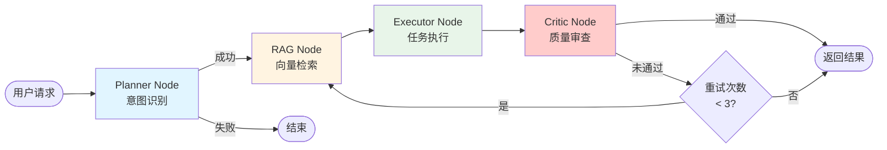

# Agent 工作流程指南 (Workflow Guide)

## 1. 概述

本文档详细说明 AiVista Agent 系统的完整工作流程，从用户输入到最终生成图片的每一步过程。当前系统实现了 **Milestone 4**，包含四个核心节点：Planner → RAG → Executor → Critic。

### 1.1 整体架构

```
用户输入 → Planner Node (意图识别) → RAG Node (风格检索) → Executor Node (任务执行) → Critic Node (质量审查) → 生成结果（或重试）
```

### 1.2 工作流程图



## 2. 知识库内容

系统启动时会自动初始化 5 条默认风格数据到向量数据库（LanceDB）。以下是完整的知识库内容：

| ID | 风格名称 | 中文名称 | Prompt | 描述 | 标签 | 分类 | 流行度 |
|----|---------|---------|--------|------|------|------|--------|
| style_001 | Cyberpunk | 赛博朋克 | neon lights, high tech, low life, dark city background, futuristic, cyberpunk aesthetic, vibrant colors, urban decay | 赛博朋克风格：霓虹灯、高科技、低生活、未来主义城市背景 | cyberpunk, futuristic, neon, urban, sci-fi | digital | 85 |
| style_002 | Watercolor | 水彩 | soft pastel colors, artistic fluidity, paper texture, watercolor painting, gentle brushstrokes, translucent layers, artistic expression | 水彩画风格：柔和的 pastel 色彩、艺术流动性、纸张纹理 | watercolor, artistic, pastel, painting, traditional | traditional | 75 |
| style_003 | Minimalist | 极简 | minimalist design, clean lines, simple composition, negative space, monochromatic, geometric shapes, modern aesthetic | 极简主义风格：简洁线条、简单构图、留白、单色调 | minimalist, clean, simple, modern, geometric | digital | 70 |
| style_004 | Oil Painting | 油画 | oil painting, rich textures, bold brushstrokes, classical art, vibrant colors, canvas texture, artistic masterpiece | 油画风格：丰富纹理、大胆笔触、古典艺术、鲜艳色彩 | oil, painting, classical, texture, traditional | traditional | 80 |
| style_005 | Anime | 动漫 | anime style, manga art, vibrant colors, expressive characters, detailed backgrounds, Japanese animation, cel-shading | 动漫风格：日式动画、鲜艳色彩、表情丰富的人物、详细背景 | anime, manga, japanese, cartoon, colorful | digital | 90 |

**数据来源**: `main/server/src/knowledge/data/initial-styles.ts`

**数据库位置**: `main/server/data/lancedb/styles.lance/`

**详细说明**: 查看 [知识库初始化文档](../knowledge/KNOWLEDGE_BASE_INIT.md) 了解数据库查看方法、初始化流程和详细配置。

## 3. 节点详解

### 3.1 Planner Node（意图识别节点）

**职责**: 分析用户输入，识别用户的真实意图。

**输入**: 
- `AgentState.userInput.text` - 用户输入的文本

**处理流程**:
1. 检查是否有蒙版数据（`maskData`），如果有则直接识别为 `inpainting` 任务
2. 调用 LLM 服务解析用户意图
3. 返回结构化的 `IntentResult`

**输出**: 
```typescript
{
  intent: {
    action: 'generate_image' | 'inpainting' | 'adjust_parameters' | 'unknown',
    subject: string,        // 主要对象（如："猫"）
    style: string,          // 风格关键词（如："赛博朋克"）
    prompt: string,         // 完整的英文提示词
    confidence: number,     // 置信度 (0-1)
    rawResponse: string,    // LLM 原始响应
    reasoning?: string      // 分析理由
  },
  thoughtLogs: [{
    node: 'planner',
    message: '已识别意图：generate_image。主题：猫，风格：赛博朋克',
    timestamp: number
  }]
}
```

**示例**:
- 输入: `"生成一只赛博朋克风格的猫"`
- 输出: `{ action: 'generate_image', subject: '猫', style: '赛博朋克', prompt: '...', confidence: 0.9 }`

**LLM Prompt 模板**:
```
你是一个专业的 AI 图像生成助手。请分析用户的输入，识别用户的意图。

可能的意图类型：
- generate_image: 用户想要生成新图片
- inpainting: 用户想要修改图片的某个区域（通常伴随蒙版数据）
- adjust_parameters: 用户想要调整生成参数（如风格强度、尺寸等）

请以 JSON 格式返回分析结果...
```

### 3.2 RAG Node（检索增强生成节点）

**职责**: 从向量数据库检索相关风格，增强用户输入的 Prompt。

**输入**: 
- `AgentState.intent` - Planner 节点识别的意图结果

**处理流程**:
1. 构建检索查询文本（优先使用 `intent.style`，其次 `intent.subject`，最后 `userInput.text`）
2. 如果检测到中文风格名称，尝试映射为英文（如："赛博朋克" → "Cyberpunk"）
3. 调用 `KnowledgeService.search()` 进行向量检索
4. 根据相似度阈值过滤结果（默认 0.4，可通过环境变量 `RAG_MIN_SIMILARITY` 配置）
5. 构建增强后的 Prompt：`原始Prompt + 检索到的风格Prompt关键词`
6. 返回 `enhancedPrompt` 对象

**输出**: 
```typescript
{
  enhancedPrompt: {
    original: string,              // 原始用户输入
    retrieved: [{                  // 检索到的风格列表
      style: string,
      prompt: string,
      similarity: number
    }],
    final: string                  // 增强后的完整 Prompt
  },
  thoughtLogs: [{
    node: 'rag',
    message: '检索到 2 条相关风格：Cyberpunk、Minimalist',
    timestamp: number
  }]
}
```

**相似度计算**: 
- 使用余弦相似度（Cosine Similarity）
- 默认最小相似度阈值: `0.4`（可配置）
- 默认检索数量: `3` 条（可配置）

**查询文本构建策略**:
1. 优先使用 `intent.style`（如果存在）
2. 如果有中文风格名称，映射为英文（如："赛博朋克" → "Cyberpunk"）
3. 优化策略：风格关键词重复以增加权重，减少通用词干扰
4. 如果第一次检索失败，尝试仅使用英文风格名称再次检索
5. 如果用户指定了特定风格，优先匹配该风格并过滤不相关结果

**示例**:
- 输入: `{ intent: { style: '赛博朋克', subject: '猫', prompt: '...' } }`
- 查询文本: `"赛博朋克 Cyberpunk Cyberpunk 猫"`（风格关键词重复增加权重）
- 检索结果: 匹配到 `style_001 (Cyberpunk)`，相似度 `0.48`
- 输出: `{ enhancedPrompt: { original: '...', retrieved: [...], final: '... + neon lights, high tech, ...' } }`

**检索失败处理**:
- 如果未检索到匹配的风格（相似度低于阈值或无结果），使用原始 Prompt
- 记录日志：`"未检索到匹配的风格，使用原始 Prompt"`
- 不会中断工作流，继续执行 Executor 节点

### 3.3 Executor Node（任务执行节点）

**职责**: 执行具体的任务（如生成图片）。

**输入**: 
- `AgentState.intent` - 意图识别结果
- `AgentState.enhancedPrompt?.final` - 增强后的 Prompt（如果存在）

**处理流程**:
1. 获取执行 Prompt：优先使用 `enhancedPrompt.final`，否则使用 `intent.prompt`，最后使用 `userInput.text`
2. 根据 `action` 执行相应任务
3. 当前实现为 Mock 生图：使用 `picsum.photos` 生成随机图片（基于 Prompt 的哈希值作为 seed，确保相同 Prompt 返回相同图片）
4. 模拟 2-3 秒延迟（增加真实感）
5. 生成 GenUI 组件（ImageView、AgentMessage、ActionPanel）
6. 返回执行结果

**输出**: 
```typescript
{
  generatedImageUrl: string,
  uiComponents: [
    {
      widgetType: 'AgentMessage',
      props: {
        state: 'success',
        text: '已为您生成图片完成！',
        isThinking: false
      }
    },
    {
      widgetType: 'ImageView',
      props: {
        imageUrl: 'https://picsum.photos/seed/666531825/800/600',
        width: 800,
        height: 600,
        fit: 'contain'
      }
    },
    {
      widgetType: 'ActionPanel',
      props: {
        actions: [{
          id: 'regenerate_btn',
          label: '重新生成',
          type: 'button',
          buttonType: 'primary'
        }]
      }
    }
  ],
  thoughtLogs: [{
    node: 'executor',
    message: '开始执行任务：生成图片...',
    timestamp: number
  }, {
    node: 'executor',
    message: '任务执行完成：生成图片',
    timestamp: number
  }]
}
```

**图片生成逻辑**:
- 使用 Prompt 的哈希值作为 seed
- 格式: `https://picsum.photos/seed/{hash}/800/600`
- 相同 Prompt 会生成相同的图片（Mock 实现）

### 3.4 Critic Node（质量审查节点）

**职责**: 对 Executor 的执行结果进行质量审查，判断是否满足用户需求。

**输入**: 
- `AgentState.generatedImageUrl` - 生成的图片 URL
- `AgentState.intent` - 用户意图
- `AgentState.enhancedPrompt` - 增强后的 Prompt

**处理流程**:
1. 验证输入（`generatedImageUrl` 和 `intent` 必须存在）
2. 执行质量审查：
   - **方案 A（可选）**: 调用 LLM 进行真实审查（需要设置 `CRITIC_USE_LLM=true`）
   - **方案 B（默认）**: 基于 `intent.confidence` 和随机因素计算分数（MVP 版本）
3. 判断是否通过（分数 >= `CRITIC_PASS_THRESHOLD`，默认 0.7）
4. 如果未通过且未达到最大重试次数，更新 `retryCount`
5. 返回 `qualityCheck` 结果（passed、score、feedback、suggestions）

**输出**: 
```typescript
{
  qualityCheck: {
    passed: boolean,        // 是否通过审查
    score: number,          // 质量分数 (0-1)
    feedback?: string,      // 评估反馈
    suggestions?: string[]  // 改进建议（如果未通过）
  },
  thoughtLogs: [{
    node: 'critic',
    message: '开始质量审查...',
    timestamp: number
  }, {
    node: 'critic',
    message: '审查完成，得分：0.85，通过',
    timestamp: number
  }],
  metadata: {
    retryCount: number      // 当前重试次数（如果需要重试）
  }
}
```

**质量审查逻辑**:
- **简化版本（默认）**: 基于 `intent.confidence` 和随机因素（-0.1 到 +0.2）
- **LLM 版本（可选）**: 调用 LLM 进行真实审查，评估是否符合用户意图、是否包含主体、风格是否匹配

**重试机制**:
- 如果 `qualityCheck.passed === false` 且 `retryCount < MAX_RETRY_COUNT`（默认 3），则返回 RAG 节点重新执行
- 每次重试时，`retryCount` 会增加 1
- 达到最大重试次数后，即使未通过也会返回结果

## 4. 数据流转

### 4.1 AgentState 状态变化

```typescript
// 初始状态（AgentController 构建）
{
  userInput: { text: "生成一只赛博朋克风格的猫" },
  uiComponents: [],
  thoughtLogs: [],
  sessionId: "session_1234567890",
  timestamp: 1234567890
}

// Planner Node 执行后
{
  ...initialState,
  intent: {
    action: 'generate_image',
    subject: '猫',
    style: '赛博朋克',
    prompt: '...',
    confidence: 0.9
  },
  thoughtLogs: [{
    node: 'planner',
    message: '已识别意图：generate_image。主题：猫，风格：赛博朋克',
    timestamp: 1234567891
  }]
}

// RAG Node 执行后
{
  ...previousState,
  enhancedPrompt: {
    original: "生成一只赛博朋克风格的猫",
    retrieved: [{
      style: 'Cyberpunk',
      prompt: 'neon lights, high tech, ...',
      similarity: 0.48
    }],
    final: "生成一只赛博朋克风格的猫, neon lights, high tech, low life, dark city background, ..."
  },
  thoughtLogs: [
    ...previousThoughtLogs,
    {
      node: 'rag',
      message: '检索到 1 条相关风格：Cyberpunk',
      timestamp: 1234567892
    }
  ]
}

// Executor Node 执行后
{
  ...previousState,
  generatedImageUrl: "https://picsum.photos/seed/666531825/800/600",
  uiComponents: [
    { widgetType: 'AgentMessage', props: {...} },
    { widgetType: 'ImageView', props: {...} },
    { widgetType: 'ActionPanel', props: {...} }
  ],
  thoughtLogs: [
    ...previousThoughtLogs,
    {
      node: 'executor',
      message: '开始执行任务：生成图片...',
      timestamp: 1234567893
    },
    {
      node: 'executor',
      message: '任务执行完成：生成图片',
      timestamp: 1234567895
    }
  ]
}

// Critic Node 执行后（通过情况）
{
  ...previousState,
  qualityCheck: {
    passed: true,
    score: 0.85,
    feedback: '图片质量符合要求'
  },
  metadata: {
    retryCount: 0,
    currentNode: 'critic'
  },
  thoughtLogs: [
    ...previousThoughtLogs,
    {
      node: 'critic',
      message: '开始质量审查...',
      timestamp: 1234567896
    },
    {
      node: 'critic',
      message: '审查完成，得分：0.85，通过',
      timestamp: 1234567897
    }
  ]
}

// Critic Node 执行后（未通过，需要重试）
{
  ...previousState,
  qualityCheck: {
    passed: false,
    score: 0.65,
    feedback: '图片可能需要调整，建议重新生成或调整参数',
    suggestions: ['尝试调整风格强度', '重新生成', '修改 Prompt']
  },
  metadata: {
    retryCount: 1,  // 重试次数增加
    currentNode: 'critic'
  },
  thoughtLogs: [
    ...previousThoughtLogs,
    {
      node: 'critic',
      message: '开始质量审查...',
      timestamp: 1234567896
    },
    {
      node: 'critic',
      message: '审查完成，得分：0.65，未通过，将进行第 1 次重试',
      timestamp: 1234567897
    }
  ]
}
// 然后返回 RAG 节点重新执行
```

## 5. SSE 事件流

系统通过 Server-Sent Events (SSE) 实时推送工作流执行过程。

### 5.1 事件类型

| 事件类型 | 说明 | 数据结构 |
|---------|------|---------|
| `connection` | 连接确认 | `{ status: 'connected', sessionId: string }` |
| `thought_log` | 思考日志（节点执行过程） | `{ type: 'thought_log', timestamp: number, data: { node: string, message: string, progress?: number } }` |
| `enhanced_prompt` | 增强后的 Prompt 信息 | `{ type: 'enhanced_prompt', timestamp: number, data: { original: string, retrieved: Array, final: string } }` |
| `gen_ui_component` | GenUI 组件（前端渲染指令） | `{ type: 'gen_ui_component', timestamp: number, data: GenUIComponent }` |
| `error` | 错误信息 | `{ type: 'error', timestamp: number, data: { code: string, message: string, node?: string } }` |
| `stream_end` | 流结束 | `{ type: 'stream_end', timestamp: number, data: { sessionId: string, summary: string } }` |

### 5.2 事件时序

```
1. connection
   ↓
2. thought_log (planner: "已识别意图：generate_image...")
   ↓
3. thought_log (rag: "检索到 3 条相关风格：Cyberpunk、Anime、Minimalist")
   ↓
4. enhanced_prompt (包含检索到的风格和相似度)
   ↓
5. thought_log (executor: "开始执行任务：生成图片...")
   ↓
6. gen_ui_component (AgentMessage)
   ↓
7. gen_ui_component (ImageView)
   ↓
8. gen_ui_component (ActionPanel)
   ↓
9. thought_log (executor: "任务执行完成：生成图片")
   ↓
10. thought_log (critic: "开始质量审查...")
   ↓
11. thought_log (critic: "审查完成，得分：0.85，通过")
   或
11. thought_log (critic: "审查完成，得分：0.65，未通过，将进行第 1 次重试")
   ↓ (如果需要重试，返回步骤 3)
12. stream_end
```

### 5.3 完整 SSE 响应示例

**请求**:
```bash
POST /api/agent/chat
Content-Type: application/json

{
  "text": "生成一只赛博朋克风格的猫"
}
```

**SSE 响应**（按顺序）:
```
event: connection
data: {"status":"connected","sessionId":"session_1768030682914"}

event: thought_log
data: {"type":"thought_log","timestamp":1768030684337,"data":{"node":"planner","message":"已识别意图：generate_image。主题：猫，风格：赛博朋克"}}

event: thought_log
data: {"type":"thought_log","timestamp":1768030684429,"data":{"node":"rag","message":"检索到 3 条相关风格：Cyberpunk、Anime、Minimalist"}}

event: enhanced_prompt
data: {"type":"enhanced_prompt","timestamp":1768030684429,"data":{"original":"生成一只赛博朋克风格的猫","retrieved":[{"style":"Cyberpunk","prompt":"neon lights, high tech...","similarity":0.48},{"style":"Anime","prompt":"anime style...","similarity":0.41},{"style":"Minimalist","prompt":"minimalist design...","similarity":0.41}],"final":"生成一只赛博朋克风格的猫, neon lights, high tech, low life, dark city background..."}}

event: thought_log
data: {"type":"thought_log","timestamp":1768030687029,"data":{"node":"executor","message":"开始执行任务：生成图片...","progress":50}}

event: gen_ui_component
data: {"type":"gen_ui_component","timestamp":1768030687029,"data":{"widgetType":"AgentMessage","props":{"state":"success","text":"已为您生成图片完成！","isThinking":false}}}

event: gen_ui_component
data: {"type":"gen_ui_component","timestamp":1768030687029,"data":{"widgetType":"ImageView","props":{"imageUrl":"https://picsum.photos/seed/1489457742/800/600","width":800,"height":600,"fit":"contain"}}}

event: gen_ui_component
data: {"type":"gen_ui_component","timestamp":1768030687029,"data":{"widgetType":"ActionPanel","props":{"actions":[{"id":"regenerate_btn","label":"重新生成","type":"button","buttonType":"primary"}]}}}

event: thought_log
data: {"type":"thought_log","timestamp":1768030687029,"data":{"node":"executor","message":"任务执行完成：生成图片"}}

event: stream_end
data: {"type":"stream_end","timestamp":1768030687039,"data":{"sessionId":"session_1768030682914","summary":"任务完成"}}
```

**详细说明**: 查看 [SSE 流式设计文档](./SSE_STREAMING_DESIGN.md) 了解 SSE 协议的详细设计和实现。

## 6. 配置说明

### 6.1 RAG 检索配置

**环境变量**:
```bash
# RAG 最小相似度阈值（默认: 0.4）
RAG_MIN_SIMILARITY=0.4

# RAG 检索数量限制（默认: 3）
RAG_SEARCH_LIMIT=3
```

**配置位置**: `main/server/.env`

### 6.2 向量数据库配置

```bash
# 向量数据库路径
VECTOR_DB_PATH=./data/lancedb

# 向量维度（默认: 1536，与 embedding 模型相关）
VECTOR_DIMENSION=1536
```

### 6.3 Critic 节点配置

**环境变量**:
```bash
# Critic 节点超时时间（默认: 8 秒）
CRITIC_TIMEOUT=8

# 质量通过阈值（默认: 0.7，分数 >= 0.7 视为通过）
CRITIC_PASS_THRESHOLD=0.7

# 最大重试次数（默认: 3）
MAX_RETRY_COUNT=3

# 是否使用 LLM 进行真实审查（默认: false，使用简化版本）
CRITIC_USE_LLM=false
```

**配置位置**: `main/server/.env`

### 6.4 Embedding 服务配置

```bash
# Embedding 提供商（可选，默认使用 LLM_PROVIDER）
EMBEDDING_PROVIDER=aliyun

# 阿里云 Embedding 模型
ALIYUN_EMBEDDING_MODEL=text-embedding-v1

# OpenAI Embedding 模型（如果使用 OpenAI）
EMBEDDING_MODEL=text-embedding-ada-002
```

## 7. 实际运行效果

### 7.1 RAG 检索效果分析

**检索结果示例**（查询: "赛博朋克"）:
- ✅ **Cyberpunk** (相似度: 0.48) - 完全匹配用户意图
- ⚠️ **Anime** (相似度: 0.41) - 相关性较低，可能是因为查询文本中包含"猫"等通用词
- ⚠️ **Minimalist** (相似度: 0.41) - 相关性较低

**已实施的优化**:
1. **改进查询文本构建**: 优先使用风格关键词（重复以增加权重），减少通用词（如"生成"、"一只"）的干扰
2. **添加结果过滤**: 如果用户指定了特定风格，优先匹配该风格，并过滤掉相似度明显低于匹配风格的结果
3. **优化重试机制**: 如果第一次检索失败，尝试仅使用英文风格名称进行检索

### 7.2 工作流符合性验证

**符合 Milestone 3 设计**:
- ✅ Planner → RAG → Executor 节点顺序正确
- ✅ RAG 检索功能正常工作
- ✅ SSE 事件流推送完整
- ✅ 数据流转符合设计

**已修复的问题**:
- ✅ Executor 节点日志顺序已修复（先推送"开始执行任务"，后推送"任务执行完成"）
- ✅ 添加了 `enhanced_prompt` 事件，前端可以查看检索到的风格详情

**已完成的优化**:
- ✅ Critic Node 已实现（Milestone 4 完成）
- ✅ 循环重试机制已实现（最多 3 次重试）

**待优化**:
- ⚠️ RAG 检索结果相关性可以进一步提升（已添加过滤逻辑，需要测试验证效果）
- ⚠️ 可以启用真实 LLM 质量审查（设置 `CRITIC_USE_LLM=true`）

## 8. 故障排查

### 8.1 RAG 检索失败

**症状**: 日志显示 `"未检索到匹配的风格，使用原始 Prompt"`

**可能原因**:
1. 相似度阈值过高（默认 0.4，可降低到 0.3）
2. 查询文本与知识库内容不匹配（检查中英文映射）
3. Embedding 模型不支持中文（检查 EMBEDDING_PROVIDER 配置）
4. 知识库未正确初始化（检查启动日志和数据库文件）

**解决方法**:
1. 降低 `RAG_MIN_SIMILARITY` 到 0.3
2. 检查知识库内容（使用管理 API）
3. 测试检索功能：`GET /api/knowledge/search?query=赛博朋克`
4. 检查 Embedding 服务配置

### 8.2 知识库初始化失败

**症状**: 启动时日志显示 `"Failed to initialize knowledge base"`

**可能原因**:
1. Embedding 服务配置错误（API Key 缺失）
2. 数据库路径无写权限
3. Embedding API 调用失败

**解决方法**:
1. 检查 `EMBEDDING_PROVIDER` 和对应的 API Key
2. 检查数据库路径权限
3. 查看详细错误日志

### 8.3 意图识别失败

**症状**: `intent.action === 'unknown'`

**可能原因**:
1. LLM 服务配置错误
2. 用户输入过于模糊
3. LLM API 调用失败

**解决方法**:
1. 检查 LLM 服务配置和 API Key
2. 查看 Planner Node 的详细日志
3. 尝试更明确的用户输入

## 9. 相关文档

- **工作流设计**: [AGENT_WORKFLOW_DESIGN.md](./AGENT_WORKFLOW_DESIGN.md)
- **SSE 流式设计**: [SSE_STREAMING_DESIGN.md](./SSE_STREAMING_DESIGN.md)
- **知识库初始化**: [../knowledge/KNOWLEDGE_BASE_INIT.md](../knowledge/KNOWLEDGE_BASE_INIT.md)
- **后端实施文档**: [../design/PROMPT_README.md](../design/PROMPT_README.md)
- **数据模型设计**: [../design/DATA_MODELS_DESIGN.md](../design/DATA_MODELS_DESIGN.md)

## 10. Milestone 4 完成状态

✅ **Milestone 4 已完成**：
- ✅ **Critic Node**: 质量审查节点，检查生成结果质量
- ✅ **循环机制**: 如果质量不达标，自动重试（最多 3 次）
- ✅ **工作流图更新**: Planner → RAG → Executor → Critic → (GenUI 或 重试)

**配置项**:
- `CRITIC_PASS_THRESHOLD`: 质量通过阈值（默认 0.7）
- `MAX_RETRY_COUNT`: 最大重试次数（默认 3）
- `CRITIC_USE_LLM`: 是否使用 LLM 进行真实审查（默认 false，使用简化版本）
- `CRITIC_TIMEOUT`: Critic 节点超时时间（默认 8 秒）

## 11. 未来计划（Milestone 5）

- **更多风格**: 支持动态添加和管理风格数据
- **真实生图**: 集成真实的 AI 图像生成服务（Midjourney、Stable Diffusion 等）
- **工作流元数据**: 推送节点执行时间、总耗时等性能指标
- **智能过滤**: 进一步优化 RAG 检索结果，根据用户意图动态调整过滤策略
- **真实质量审查**: 将 Critic Node 升级为使用 LLM 进行真实审查（已支持，通过 `CRITIC_USE_LLM=true` 启用）
