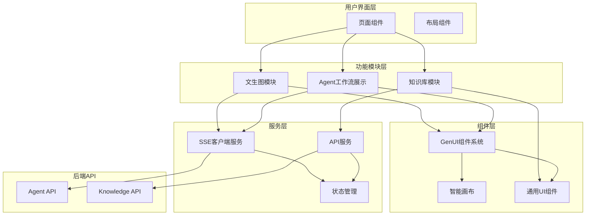
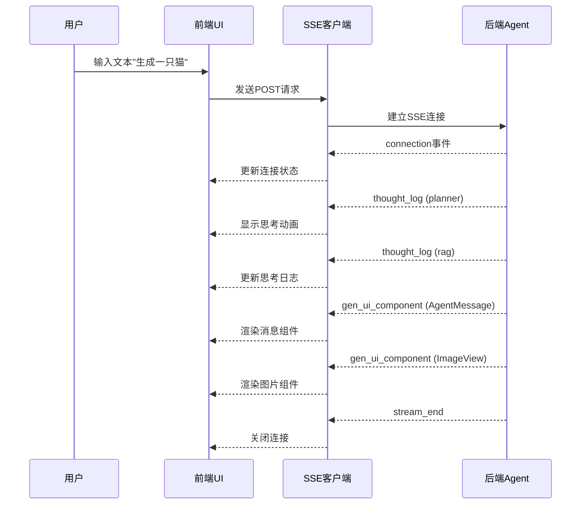
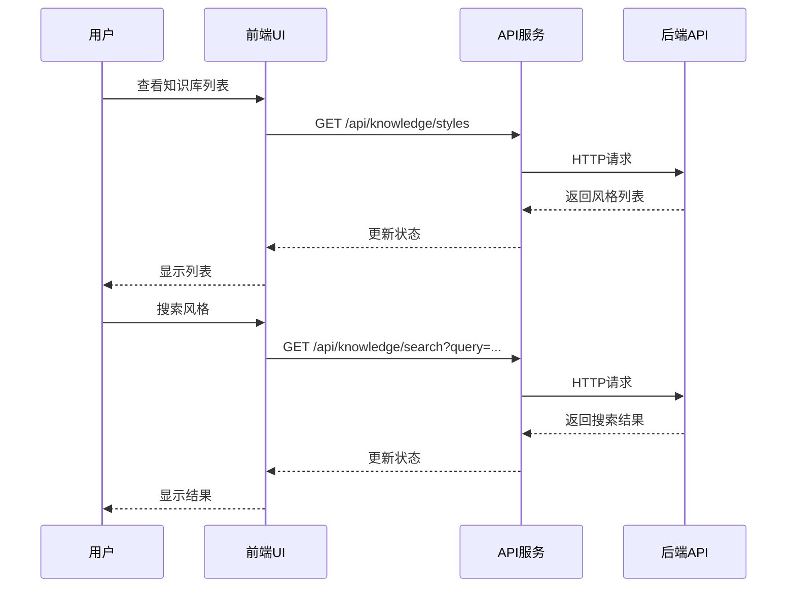

# 前端架构设计文档 (Frontend Architecture)

## 1. 概述

本文档定义 AiVista Web 前端的整体架构设计，基于 React + Next.js 技术栈，实现与后端 Agent 系统的完整集成。

**核心目标：**
- 实现响应式 Web 应用（PC 端 + 移动端）
- 集成 SSE 流式通信，实时展示 Agent 工作流
- 实现 GenUI 组件系统，动态渲染后端下发的 UI 组件
- 优化性能，支持虚拟滚动和代码分割

## 2. 技术栈

### 2.1 核心框架

- **React 18+**: UI 框架，使用函数组件和 Hooks
- **Next.js 14+**: 全栈框架，支持 SSR/SSG，App Router
- **TypeScript**: 类型安全，与后端类型定义保持一致

### 2.2 UI 与样式

- **TailwindCSS**: 原子化 CSS 框架，实现响应式设计
- **shadcn/ui**: 基于 Radix UI 和 TailwindCSS 的组件库，风格大方简洁
- **主题系统**: 支持深色/浅色模式切换，配色以黑色、白色为主，灰色系辅助，绿色/蓝色系作为修饰色

### 2.3 状态管理

- **Zustand**: 轻量级状态管理库
  - SSE 连接状态
  - 会话状态（sessionId、消息历史）
  - UI 状态（侧边栏、主题等）

### 2.4 数据获取

- **原生 Fetch API**: HTTP 请求
- **EventSource API**: SSE 流式连接
- **SWR** 或 **React Query**（可选）: 数据缓存和同步

### 2.5 性能优化

- **react-window** 或 **react-virtuoso**: 虚拟滚动
- **next/image**: 图片优化
- **动态导入**: 代码分割和懒加载

## 3. 架构图



## 4. 目录结构

```
main/web/
├── app/                          # Next.js App Router
│   ├── layout.tsx               # 根布局
│   ├── page.tsx                 # 首页
│   ├── chat/                    # 聊天页面
│   │   └── page.tsx
│   └── knowledge/               # 知识库页面
│       └── page.tsx
├── components/                  # 组件目录
│   ├── genui/                   # GenUI组件系统
│   │   ├── SmartCanvas.tsx
│   │   ├── AgentMessage.tsx
│   │   ├── ActionPanel.tsx
│   │   ├── ImageView.tsx
│   │   └── GenUIRenderer.tsx   # 动态渲染器
│   ├── ui/                      # 通用UI组件
│   │   ├── Button.tsx
│   │   ├── Input.tsx
│   │   ├── Card.tsx
│   │   └── Loading.tsx
│   └── layout/                  # 布局组件
│       ├── Header.tsx
│       ├── Sidebar.tsx
│       └── ChatContainer.tsx
├── lib/                         # 工具库
│   ├── api/                     # API客户端
│   │   ├── agent.ts            # Agent API
│   │   ├── knowledge.ts        # Knowledge API
│   │   └── client.ts           # 基础HTTP客户端
│   ├── sse/                     # SSE客户端
│   │   ├── sse-client.ts       # SSE连接管理
│   │   └── event-handler.ts    # 事件处理
│   ├── types/                   # TypeScript类型
│   │   ├── agent.ts            # Agent相关类型
│   │   ├── knowledge.ts        # Knowledge相关类型
│   │   └── genui.ts            # GenUI组件类型
│   └── utils/                   # 工具函数
│       ├── format.ts
│       └── validation.ts
├── hooks/                       # 自定义Hooks
│   ├── useSSE.ts               # SSE连接Hook
│   ├── useAgentChat.ts         # Agent聊天Hook
│   └── useKnowledge.ts         # 知识库Hook
├── stores/                      # 状态管理
│   ├── session-store.ts        # 会话状态
│   ├── ui-store.ts             # UI状态
│   └── index.ts
├── styles/                      # 样式文件
│   └── globals.css             # 全局样式（TailwindCSS）
├── public/                      # 静态资源
└── docs/                        # 文档目录
```

## 5. 核心模块设计

### 5.1 SSE 客户端架构

**职责：**
- 管理与后端的 SSE 长连接
- 处理流式事件（thought_log、gen_ui_component、error 等）
- 实现自动重连机制
- 维护连接状态

**设计要点：**
- 使用 EventSource API（或 polyfill）
- 支持 POST 请求（使用 fetch + ReadableStream）
- 事件分类处理（不同事件类型分发到不同处理器）
- 错误处理和重连策略（指数退避）

### 5.2 GenUI 组件系统

**职责：**
- 动态渲染后端下发的 UI 组件
- 支持组件更新模式（append、replace、update）
- 处理组件交互事件

**组件类型：**
- `SmartCanvas`: 智能画布（图片展示、蒙版绘制）
- `AgentMessage`: Agent 消息气泡
- `ActionPanel`: 操作面板（按钮、滑块、选择器）
- `ImageView`: 图片展示组件

### 5.3 状态管理架构

**全局状态：**
- 会话状态：sessionId、消息历史、当前图片
- SSE 连接状态：连接状态、错误信息
- UI 状态：侧边栏展开/收起、主题、加载状态

**状态管理方案：**
- 使用 Zustand 作为唯一状态管理方案
- 轻量级、API 简单、TypeScript 支持良好

### 5.4 路由设计

**页面路由：**
- `/`: 首页（文生图主界面）
- `/chat`: 聊天界面（Agent 对话）
- `/knowledge`: 知识库管理

**路由特性：**
- 使用 Next.js App Router
- 支持客户端路由（SPA 体验）
- 支持 SSR（可选，用于 SEO）

## 6. 数据流设计

### 6.1 文生图流程



### 6.2 知识库操作流程



## 7. 性能优化策略

### 7.1 代码分割

- 路由级别的代码分割（Next.js 自动）
- 组件级别的懒加载（动态导入）
- 第三方库的按需加载

### 7.2 虚拟滚动

- 聊天消息列表使用虚拟滚动
- 知识库列表使用虚拟滚动
- 使用 react-window 或 react-virtuoso

### 7.3 图片优化

- 使用 Next.js Image 组件
- 图片懒加载
- 响应式图片尺寸

### 7.4 缓存策略

- API 响应缓存（SWR/React Query）
- 静态资源缓存
- 浏览器缓存策略

## 8. 响应式设计

### 8.1 断点系统

使用 TailwindCSS 默认断点：
- `sm`: 640px（小屏设备）
- `md`: 768px（平板）
- `lg`: 1024px（桌面）
- `xl`: 1280px（大屏桌面）
- `2xl`: 1536px（超大屏）

### 8.2 移动端适配

- 移动端优先设计
- 触摸友好的交互（按钮大小、间距）
- 移动端导航（底部导航栏或侧边栏）

### 8.3 布局适配

- 桌面端：侧边栏 + 主内容区
- 移动端：全屏内容，底部输入栏

### 8.4 主题系统

- **深色/浅色模式**: 支持用户切换主题
- **配色方案**: 
  - 主色：黑色、白色
  - 辅助色：灰色系
  - 修饰色：绿色系、蓝色系（用于边框和其他装饰）
- **整体风格**: 大方简洁

## 9. 错误处理

### 9.1 API 错误处理

- 统一的错误处理中间件
- 错误类型分类（网络错误、业务错误、验证错误）
- 用户友好的错误提示

### 9.2 SSE 错误处理

- 连接断开自动重连
- 错误事件展示
- 超时处理

### 9.3 边界情况

- 网络不可用
- 后端服务不可用
- 数据格式错误

## 10. 安全考虑

### 10.1 输入验证

- 前端输入验证（防止 XSS）
- 文件上传验证（大小、类型）
- API 请求参数验证

### 10.2 数据安全

- 敏感信息不存储在 localStorage
- API Key 不暴露在前端代码
- HTTPS 通信

## 11. 开发工具

### 11.1 代码质量

- ESLint: 代码检查
- Prettier: 代码格式化
- TypeScript: 类型检查

### 11.2 开发体验

- Hot Module Replacement (HMR)
- 开发服务器代理（解决 CORS）
- 调试工具（React DevTools）

## 12. 相关文档

- [项目结构说明](./PROJECT_STRUCTURE.md)
- [技术栈详解](./TECHNOLOGY_STACK.md)
- [API 集成指南](../api/API_INTEGRATION.md)
- [SSE 客户端实现](../api/SSE_CLIENT.md)
- [GenUI 组件系统](../components/GENUI_COMPONENTS.md)
- [配色方案](../styling/COLOR_SCHEME.md)
