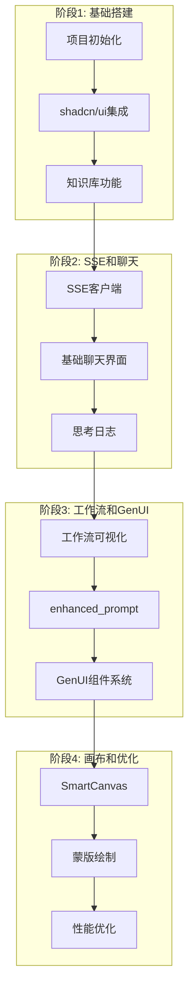

# 前端实施路线图 (Implementation Roadmap)

## 1. 概述

本文档规划 AiVista Web 前端项目的分阶段实施步骤，每个阶段都可以独立验证效果，便于前后端联调和问题调整。

**实施原则：**
- 每个阶段可独立运行和测试
- 每个阶段都有明确的验收标准
- 每个阶段完成后可以暂停，便于调试和调整
- 优先实现核心功能，逐步完善

## 2. 总体架构



## 3. 阶段1：基础搭建和知识库功能

### 3.1 阶段目标

建立项目基础架构，实现知识库管理功能。此阶段不依赖 SSE，可以独立测试，验证前后端 API 连接。

### 3.2 具体任务

#### 任务1.1：项目初始化

**步骤：**
1. 创建 Next.js 项目
2. 配置 TypeScript
3. 配置 TailwindCSS
4. 配置路径别名 `@/`
5. 创建基础目录结构

**文件清单：**
```
main/web/
├── app/
│   ├── layout.tsx
│   ├── page.tsx
│   └── globals.css
├── components/
│   └── ui/          # shadcn/ui 组件
├── lib/
│   ├── api/
│   │   └── client.ts
│   └── utils/
│       └── cn.ts
├── next.config.js
├── tailwind.config.js
├── tsconfig.json
└── package.json
```

**验收标准：**
- [ ] 项目可以正常启动（`npm run dev`）
- [ ] 页面可以正常访问
- [ ] TypeScript 编译无错误
- [ ] TailwindCSS 样式生效

#### 任务1.2：shadcn/ui 集成

**步骤：**
1. 初始化 shadcn/ui
2. 配置主题系统（深色/浅色模式）
3. 添加基础组件（Button, Card, Input, Textarea, Select）
4. 配置自定义颜色（黑色、白色、灰色、绿色、蓝色）

**文件清单：**
```
components/ui/
├── button.tsx
├── card.tsx
├── input.tsx
├── textarea.tsx
├── select.tsx
└── theme-provider.tsx

lib/utils/
└── cn.ts
```

**验收标准：**
- [ ] shadcn/ui 组件可以正常使用
- [ ] 主题切换功能正常（深色/浅色）
- [ ] 配色方案符合设计（黑色、白色为主）
- [ ] 组件样式大方简洁

#### 任务1.3：知识库 API 集成

**步骤：**
1. 创建 API 客户端（`lib/api/client.ts`）
2. 实现知识库 API 封装（`lib/api/knowledge.ts`）
3. 定义类型（`lib/types/knowledge.ts`）
4. 实现错误处理

**文件清单：**
```
lib/api/
├── client.ts
└── knowledge.ts

lib/types/
└── knowledge.ts
```

**验收标准：**
- [ ] 可以调用 GET /api/knowledge/styles
- [ ] 可以调用 GET /api/knowledge/search
- [ ] 可以调用 GET /api/knowledge/stats
- [ ] 错误处理正常

#### 任务1.4：知识库管理界面

**步骤：**
1. 创建知识库页面（`app/knowledge/page.tsx`）
2. 实现风格列表组件
3. 实现搜索功能
4. 实现风格详情页面
5. 实现添加风格表单

**文件清单：**
```
app/knowledge/
└── page.tsx

components/features/KnowledgeBase/
├── StyleList.tsx
├── StyleCard.tsx
├── StyleSearch.tsx
├── StyleDetail.tsx
├── StyleForm.tsx
└── KnowledgeStats.tsx

hooks/
└── useKnowledge.ts
```

**验收标准：**
- [ ] 可以查看知识库风格列表
- [ ] 可以搜索风格（实时搜索）
- [ ] 可以查看风格详情
- [ ] 可以添加新风格
- [ ] UI 风格符合设计（黑色、白色为主，灰色辅助）
- [ ] 响应式设计正常（PC 端和移动端）

### 3.3 前后端联调检查点

**检查点1.1：API 连接**
```bash
# 测试后端 API 是否可访问
curl http://localhost:3000/api/knowledge/styles
```

**检查点1.2：知识库列表**
- 前端调用 GET /api/knowledge/styles
- 验证返回数据格式正确
- 验证列表渲染正常

**检查点1.3：风格搜索**
- 前端调用 GET /api/knowledge/search?query=赛博朋克
- 验证搜索结果正确
- 验证搜索 UI 交互正常

**检查点1.4：添加风格**
- 前端调用 POST /api/knowledge/styles
- 验证新风格成功添加
- 验证列表自动更新

### 3.4 测试方法

**手动测试：**
1. 启动后端服务（`npm run dev` 在 server 目录）
2. 启动前端服务（`npm run dev` 在 web 目录）
3. 访问 `http://localhost:3001/knowledge`
4. 测试各项功能

**自动化测试（可选）：**
```typescript
// tests/api/knowledge.test.ts
describe('Knowledge API', () => {
  it('should fetch styles', async () => {
    const styles = await getStyles();
    expect(styles).toBeArray();
  });
});
```

### 3.5 常见问题

**问题1：CORS 错误**
- **解决方案**：在 `next.config.js` 中配置 rewrites 代理

**问题2：API 连接失败**
- **检查**：后端服务是否启动
- **检查**：API URL 配置是否正确

**问题3：shadcn/ui 组件样式异常**
- **检查**：CSS 变量是否正确配置
- **检查**：TailwindCSS 配置是否正确

### 3.6 阶段完成标志

- [ ] 知识库功能完整可用
- [ ] UI 风格符合设计要求
- [ ] 前后端 API 连接正常
- [ ] 响应式设计正常

**完成后可以：**
- 暂停开发，测试和调整知识库功能
- 验证 UI 风格是否符合预期
- 确认前后端 API 对接无误

---

## 4. 阶段2：SSE 客户端和基础聊天

### 4.1 阶段目标

实现 SSE 客户端，建立与后端的流式连接，实现基础聊天界面和思考日志展示。

### 4.2 具体任务

#### 任务2.1：SSE 客户端实现

**步骤：**
1. 实现 SSE 客户端类（支持 POST 请求）
2. 实现事件解析（手动解析 SSE 格式）
3. 实现重连机制（指数退避）
4. 实现错误处理

**文件清单：**
```
lib/sse/
├── sse-client.ts
└── event-handler.ts

lib/types/
└── sse.ts
```

**验收标准：**
- [ ] 可以建立 SSE 连接（POST 请求）
- [ ] 可以正确解析 SSE 事件
- [ ] 连接断开后自动重连（最多3次）
- [ ] 错误处理正常

#### 任务2.2：useSSE Hook

**步骤：**
1. 创建 useSSE Hook
2. 实现连接管理
3. 实现事件分发
4. 实现状态管理

**文件清单：**
```
hooks/
└── useSSE.ts
```

**验收标准：**
- [ ] Hook 可以正常使用
- [ ] 连接状态正确管理
- [ ] 事件可以正确分发

#### 任务2.3：基础聊天界面

**步骤：**
1. 创建聊天页面（`app/chat/page.tsx`）
2. 实现消息列表
3. 实现输入框
4. 实现发送功能

**文件清单：**
```
app/chat/
└── page.tsx

components/features/TextToImage/
├── ChatInterface.tsx
├── MessageList.tsx
└── TextInput.tsx
```

**验收标准：**
- [ ] 可以输入文本
- [ ] 可以发送消息
- [ ] 消息列表正常显示
- [ ] UI 风格符合设计

#### 任务2.4：思考日志展示

**步骤：**
1. 实现 useAgentChat Hook
2. 处理 connection 事件
3. 处理 thought_log 事件
4. 实现思考日志组件

**文件清单：**
```
hooks/
└── useAgentChat.ts

components/features/AgentWorkflow/
└── ThoughtLog.tsx
```

**验收标准：**
- [ ] 可以接收 connection 事件
- [ ] 可以接收 thought_log 事件
- [ ] 思考日志正确显示
- [ ] 节点信息正确展示

### 4.3 前后端联调检查点

**检查点2.1：SSE 连接建立**
- 前端发送 POST /api/agent/chat
- 后端返回 connection 事件
- 前端正确接收并显示连接状态

**检查点2.2：思考日志事件**
- 后端推送 thought_log 事件（planner 节点）
- 前端正确解析并显示
- 验证节点名称、消息内容正确

**检查点2.3：事件序列**
- 验证事件接收顺序正确
- 验证 stream_end 事件正确接收
- 验证连接正确关闭

**检查点2.4：错误处理**
- 测试网络断开情况
- 测试后端错误响应
- 验证重连机制

### 4.4 测试方法

**手动测试：**
1. 打开浏览器开发者工具（Network 标签）
2. 发送一条消息
3. 观察 SSE 连接建立
4. 观察事件流接收
5. 测试断开网络后的重连

**调试工具：**
```typescript
// 在 useSSE 中添加调试日志
console.log('SSE Event:', event.type, event.data);
```

### 4.5 常见问题

**问题1：EventSource 不支持 POST**
- **解决方案**：使用 fetch + ReadableStream 实现

**问题2：SSE 事件解析错误**
- **检查**：事件格式是否符合 SSE 标准
- **检查**：JSON 解析是否正确

**问题3：连接频繁断开**
- **检查**：后端是否正常推送心跳
- **检查**：网络是否稳定

### 4.6 阶段完成标志

- [ ] SSE 连接正常建立
- [ ] 可以接收所有基础事件（connection, thought_log, stream_end）
- [ ] 思考日志正确显示
- [ ] 错误处理和重连正常

**完成后可以：**
- 暂停开发，测试 SSE 连接稳定性
- 验证事件接收是否正确
- 调整思考日志展示样式

---

## 5. 阶段3：Agent 工作流完整展示和 GenUI 基础组件

### 5.1 阶段目标

完整展示 Agent 工作流执行过程，实现 GenUI 组件系统，可以动态渲染后端下发的 UI 组件。

### 5.2 具体任务

#### 任务3.1：工作流可视化

**步骤：**
1. 实现 WorkflowViewer 组件
2. 实现节点状态管理
3. 实现节点状态组件
4. 实现工作流时间线

**文件清单：**
```
components/features/AgentWorkflow/
├── WorkflowViewer.tsx
├── NodeStatus.tsx
├── WorkflowTimeline.tsx
└── ProgressBar.tsx
```

**验收标准：**
- [ ] 可以显示所有节点状态
- [ ] 节点状态正确更新（pending → running → completed）
- [ ] 工作流时间线正确显示
- [ ] 进度条正确显示

#### 任务3.2：enhanced_prompt 事件处理

**步骤：**
1. 在 useAgentChat 中处理 enhanced_prompt 事件
2. 实现 EnhancedPromptView 组件
3. 在聊天界面中展示检索结果

**文件清单：**
```
components/features/AgentWorkflow/
└── EnhancedPromptView.tsx
```

**验收标准：**
- [ ] 可以接收 enhanced_prompt 事件
- [ ] 可以显示原始 Prompt
- [ ] 可以显示检索到的风格列表
- [ ] 可以显示增强后的 Prompt
- [ ] 相似度正确显示

#### 任务3.3：GenUI 组件系统

**步骤：**
1. 实现 GenUIRenderer 组件
2. 实现组件类型守卫
3. 实现组件更新机制

**文件清单：**
```
components/genui/
├── GenUIRenderer.tsx
└── index.ts
```

**验收标准：**
- [ ] 可以正确识别组件类型
- [ ] 可以正确渲染对应组件
- [ ] 组件更新机制正常（append/replace/update）

#### 任务3.4：GenUI 基础组件

**步骤：**
1. 实现 AgentMessage 组件
2. 实现 ImageView 组件
3. 实现 ActionPanel 组件

**文件清单：**
```
components/genui/
├── AgentMessage.tsx
├── ImageView.tsx
└── ActionPanel.tsx
```

**验收标准：**
- [ ] AgentMessage 可以显示消息和状态
- [ ] ImageView 可以正确显示图片
- [ ] ActionPanel 可以渲染按钮、滑块、选择器
- [ ] 组件交互正常（按钮点击、滑块拖动等）

### 5.3 前后端联调检查点

**检查点3.1：enhanced_prompt 事件**
- 后端推送 enhanced_prompt 事件
- 前端正确接收并展示
- 验证检索结果正确显示

**检查点3.2：gen_ui_component 事件**
- 后端推送 AgentMessage 组件
- 前端正确渲染
- 后端推送 ImageView 组件
- 前端正确显示图片
- 后端推送 ActionPanel 组件
- 前端正确渲染操作面板

**检查点3.3：完整工作流**
- 发送一条消息
- 验证完整事件序列：
  1. connection
  2. thought_log (planner)
  3. thought_log (rag)
  4. enhanced_prompt
  5. thought_log (executor)
  6. gen_ui_component (AgentMessage)
  7. gen_ui_component (ImageView)
  8. gen_ui_component (ActionPanel)
  9. thought_log (critic)
  10. stream_end

**检查点3.4：组件更新模式**
- 测试 append 模式（追加组件）
- 测试 replace 模式（替换组件）
- 测试 update 模式（更新组件）

### 5.4 测试方法

**手动测试：**
1. 发送消息："生成一只赛博朋克风格的猫"
2. 观察工作流执行过程
3. 验证 enhanced_prompt 正确显示
4. 验证 GenUI 组件正确渲染
5. 测试 ActionPanel 交互

**组件测试：**
```typescript
// 测试 GenUIRenderer
const component: GenUIComponent = {
  widgetType: 'AgentMessage',
  props: { text: '测试', state: 'success' },
};
render(<GenUIRenderer component={component} />);
```

### 5.5 常见问题

**问题1：enhanced_prompt 事件未显示**
- **检查**：事件处理是否正确
- **检查**：组件是否正确渲染

**问题2：GenUI 组件渲染错误**
- **检查**：组件类型是否正确
- **检查**：props 格式是否匹配

**问题3：ActionPanel 交互不响应**
- **检查**：事件处理是否正确
- **检查**：组件事件绑定是否正确

### 5.6 阶段完成标志

- [ ] 工作流完整可视化
- [ ] enhanced_prompt 正确展示
- [ ] 所有 GenUI 基础组件正常渲染
- [ ] 组件交互正常

**完成后可以：**
- 暂停开发，测试完整工作流
- 验证 GenUI 组件渲染效果
- 调整工作流展示样式

---

## 6. 阶段4：智能画布和性能优化

### 6.1 阶段目标

实现 SmartCanvas 智能画布功能，支持蒙版绘制和局部重绘，完成性能优化。

### 6.2 具体任务

#### 任务4.1：SmartCanvas 组件

**步骤：**
1. 实现图片展示功能
2. 实现画布绘制功能
3. 实现蒙版绘制（画笔工具）
4. 实现坐标系统转换

**文件清单：**
```
components/genui/
└── SmartCanvas.tsx

lib/utils/
└── canvas.ts  # 画布工具函数
```

**验收标准：**
- [ ] 可以正确显示图片
- [ ] 可以在画布上绘制蒙版
- [ ] 蒙版绘制流畅（触摸和鼠标都支持）
- [ ] 坐标转换正确

#### 任务4.2：蒙版数据导出

**步骤：**
1. 实现蒙版数据导出（Base64）
2. 实现坐标数据收集
3. 实现蒙版数据验证
4. 实现蒙版数据发送

**文件清单：**
```
lib/utils/
└── mask.ts  # 蒙版处理工具
```

**验收标准：**
- [ ] 可以导出 Base64 格式的蒙版
- [ ] 蒙版数据格式正确
- [ ] 蒙版大小符合限制（10MB）
- [ ] 可以正确发送到后端

#### 任务4.3：局部重绘流程

**步骤：**
1. 实现蒙版确认功能
2. 实现带蒙版数据的请求发送
3. 实现重绘结果展示

**验收标准：**
- [ ] 可以确认蒙版并发送请求
- [ ] 后端正确接收蒙版数据
- [ ] 重绘结果正确显示
- [ ] 完整流程正常

#### 任务4.4：虚拟滚动

**步骤：**
1. 在消息列表中使用虚拟滚动
2. 在知识库列表中使用虚拟滚动
3. 在思考日志中使用虚拟滚动

**文件清单：**
```
components/shared/
└── VirtualList.tsx

hooks/
└── useVirtualScroll.ts
```

**验收标准：**
- [ ] 大量消息时性能良好
- [ ] 滚动流畅
- [ ] 内存占用合理

#### 任务4.5：性能优化

**步骤：**
1. 实现代码分割（路由级别）
2. 实现组件懒加载
3. 实现图片优化（Next.js Image）
4. 实现缓存策略

**验收标准：**
- [ ] 首屏加载时间 < 3秒
- [ ] 代码分割正常
- [ ] 图片懒加载正常
- [ ] 性能指标符合要求

### 6.3 前后端联调检查点

**检查点4.1：蒙版绘制**
- 在画布上绘制蒙版
- 验证蒙版数据正确生成
- 验证坐标转换正确

**检查点4.2：蒙版数据发送**
- 发送带蒙版数据的请求
- 后端正确接收蒙版数据
- 验证 Base64 格式正确

**检查点4.3：局部重绘**
- 完整测试局部重绘流程：
  1. 显示图片
  2. 绘制蒙版
  3. 输入修改指令
  4. 发送请求
  5. 接收重绘结果
  6. 显示新图片

**检查点4.4：性能测试**
- 测试大量消息时的性能
- 测试大量图片加载的性能
- 验证虚拟滚动效果

### 6.4 测试方法

**手动测试：**
1. 生成一张图片
2. 进入画布编辑模式
3. 绘制蒙版区域
4. 输入修改指令
5. 发送请求
6. 验证重绘结果

**性能测试：**
```typescript
// 使用 React DevTools Profiler
// 测试组件渲染性能
// 测试虚拟滚动性能
```

### 6.5 常见问题

**问题1：蒙版绘制不流畅**
- **优化**：使用 requestAnimationFrame
- **优化**：减少重绘频率

**问题2：坐标转换错误**
- **检查**：画布尺寸和图片尺寸
- **检查**：缩放比例计算

**问题3：蒙版数据过大**
- **优化**：压缩蒙版数据
- **优化**：简化坐标点

### 6.6 阶段完成标志

- [ ] SmartCanvas 功能完整
- [ ] 蒙版绘制和导出正常
- [ ] 局部重绘流程完整
- [ ] 性能优化完成
- [ ] 虚拟滚动正常

**完成后可以：**
- 完整测试所有功能
- 性能优化和调优
- 准备上线

---

## 7. 实施时间估算

### 阶段1：基础搭建和知识库功能
- **预计时间**：2-3天
- **难度**：低-中
- **依赖**：无

### 阶段2：SSE 客户端和基础聊天
- **预计时间**：2-3天
- **难度**：中
- **依赖**：阶段1完成

### 阶段3：Agent 工作流完整展示和 GenUI 基础组件
- **预计时间**：3-4天
- **难度**：中-高
- **依赖**：阶段2完成

### 阶段4：智能画布和性能优化
- **预计时间**：3-4天
- **难度**：高
- **依赖**：阶段3完成

**总计预计时间**：10-14天

## 8. 每个阶段的验收清单

### 阶段1验收清单
- [ ] 项目可以正常启动
- [ ] shadcn/ui 组件正常使用
- [ ] 主题切换功能正常
- [ ] 知识库列表正常显示
- [ ] 知识库搜索功能正常
- [ ] 知识库详情页面正常
- [ ] 添加风格功能正常
- [ ] 前后端 API 连接正常
- [ ] UI 风格符合设计

### 阶段2验收清单
- [ ] SSE 连接可以正常建立
- [ ] connection 事件正确接收
- [ ] thought_log 事件正确接收和显示
- [ ] stream_end 事件正确接收
- [ ] 思考日志正确展示
- [ ] 连接错误处理正常
- [ ] 自动重连机制正常
- [ ] 基础聊天界面正常

### 阶段3验收清单
- [ ] 工作流可视化正常
- [ ] 节点状态正确更新
- [ ] enhanced_prompt 正确展示
- [ ] GenUIRenderer 正常工作
- [ ] AgentMessage 组件正常渲染
- [ ] ImageView 组件正常渲染
- [ ] ActionPanel 组件正常渲染
- [ ] 组件交互正常
- [ ] 完整工作流事件序列正常

### 阶段4验收清单
- [ ] SmartCanvas 图片展示正常
- [ ] 蒙版绘制功能正常
- [ ] 蒙版数据导出正确
- [ ] 局部重绘流程完整
- [ ] 虚拟滚动正常
- [ ] 性能优化完成
- [ ] 所有功能正常

## 9. 前后端联调指南

### 9.1 联调准备

**前端准备：**
1. 确保后端服务运行在 `http://localhost:3000`
2. 配置环境变量 `NEXT_PUBLIC_API_URL=http://localhost:3000`
3. 启动前端开发服务器

**后端准备：**
1. 确保后端服务正常运行
2. 确保知识库已初始化
3. 确保 API 文档可访问（`http://localhost:3000/api-docs`）

### 9.2 联调步骤

**步骤1：验证 API 连接**
```bash
# 测试后端健康检查
curl http://localhost:3000/api/agent

# 测试知识库 API
curl http://localhost:3000/api/knowledge/styles
```

**步骤2：测试 SSE 连接**
```bash
# 使用 curl 测试 SSE
curl -N -X POST http://localhost:3000/api/agent/chat \
  -H "Content-Type: application/json" \
  -H "Accept: text/event-stream" \
  -d '{"text":"生成一只猫"}'
```

**步骤3：前端测试**
1. 打开浏览器开发者工具
2. 查看 Network 标签
3. 查看 Console 日志
4. 测试各项功能

### 9.3 常见联调问题

**问题1：CORS 错误**
- **前端解决**：使用 Next.js rewrites 代理
- **后端解决**：配置 CORS 中间件

**问题2：SSE 连接失败**
- **检查**：后端是否支持 POST SSE
- **检查**：请求头是否正确

**问题3：事件格式不匹配**
- **检查**：前后端事件数据结构是否一致
- **检查**：类型定义是否同步

## 10. 下一步行动

### 开始阶段1

1. **创建项目**
   ```bash
   cd main/web
   npx create-next-app@latest . --typescript --tailwind --app
   ```

2. **安装依赖**
   ```bash
   npm install zustand class-variance-authority clsx tailwind-merge tailwindcss-animate
   npm install next-themes
   ```

3. **初始化 shadcn/ui**
   ```bash
   npx shadcn-ui@latest init
   ```

4. **按照任务清单逐步实施**

### 阶段间暂停点

每个阶段完成后，建议：
1. 完整测试当前阶段功能
2. 修复发现的问题
3. 调整 UI 样式（如需要）
4. 确认前后端对接无误
5. 提交代码（如使用版本控制）

## 11. 相关文档

- [项目初始化](./SETUP.md)
- [架构设计](../architecture/ARCHITECTURE.md)
- [API 集成指南](../api/API_INTEGRATION.md)
- [SSE 客户端实现](../api/SSE_CLIENT.md)
- [Agent 工作流前端实现](../features/AGENT_WORKFLOW.md)
- [GenUI 组件系统](../components/GENUI_COMPONENTS.md)
- [后端 API 参考](../../../main/server/docs/api/API_REFERENCE.md)
