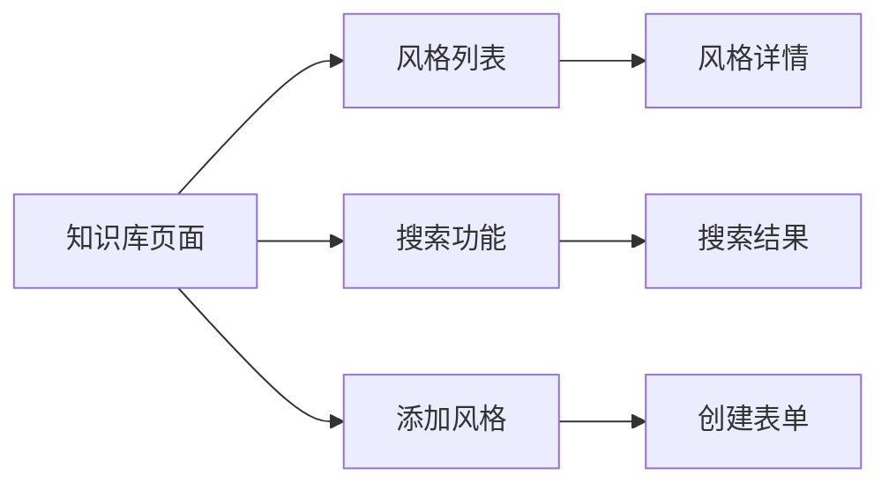

# 知识库管理功能 (Knowledge Base Management)

## 1. 概述

本文档详细说明知识库管理功能的前端实现，包括风格列表展示、搜索、添加风格等操作。

## 2. 功能列表

### 2.1 核心功能

- **风格列表**: 展示所有风格数据
- **风格搜索**: 根据关键词搜索相关风格
- **风格详情**: 查看单个风格的详细信息
- **添加风格**: 向知识库添加新风格
- **统计信息**: 查看知识库统计信息

### 2.2 功能流程



## 3. API 集成

### 3.1 API 方法

```typescript
// lib/api/knowledge.ts
import { fetchAPI } from './client';

// 获取所有风格
export async function getStyles(): Promise<StyleData[]>

// 获取单个风格
export async function getStyleById(id: string): Promise<StyleData>

// 搜索风格
export async function searchStyles(options: SearchOptions): Promise<SearchResult[]>

// 获取统计信息
export async function getKnowledgeStats(): Promise<KnowledgeStats>

// 添加风格
export async function createStyle(data: CreateStyleRequest): Promise<CreateStyleResponse>
```

详见 [API 集成指南](../api/API_INTEGRATION.md#knowledge-api-集成)。

## 4. 组件设计

### 4.1 组件结构

```
KnowledgeBase/
├── KnowledgeBasePage.tsx    # 主页面
├── StyleList.tsx            # 风格列表
├── StyleCard.tsx            # 风格卡片
├── StyleSearch.tsx          # 搜索组件
├── StyleForm.tsx           # 添加风格表单
├── StyleDetail.tsx          # 风格详情
└── KnowledgeStats.tsx       # 统计信息
```

### 4.2 主页面组件

```typescript
// components/features/KnowledgeBase/KnowledgeBasePage.tsx
'use client';

import { useState } from 'react';
import { StyleList } from './StyleList';
import { StyleSearch } from './StyleSearch';
import { StyleForm } from './StyleForm';
import { KnowledgeStats } from './KnowledgeStats';

export function KnowledgeBasePage() {
  const [searchQuery, setSearchQuery] = useState('');
  const [showForm, setShowForm] = useState(false);

  return (
    <div className="container mx-auto p-4">
      <div className="mb-6">
        <h1 className="text-2xl font-bold mb-4">知识库管理</h1>
        
        {/* 统计信息 */}
        <KnowledgeStats />
      </div>

      {/* 搜索和操作栏 */}
      <div className="flex gap-4 mb-6">
        <div className="flex-1">
          <StyleSearch
            query={searchQuery}
            onQueryChange={setSearchQuery}
          />
        </div>
        <button
          onClick={() => setShowForm(!showForm)}
          className="px-4 py-2 bg-blue-500 text-white rounded-lg hover:bg-blue-600"
        >
          {showForm ? '取消' : '添加风格'}
        </button>
      </div>

      {/* 添加表单 */}
      {showForm && (
        <div className="mb-6">
          <StyleForm
            onSuccess={() => {
              setShowForm(false);
              // 刷新列表
            }}
            onCancel={() => setShowForm(false)}
          />
        </div>
      )}

      {/* 风格列表 */}
      <StyleList searchQuery={searchQuery} />
    </div>
  );
}
```

### 4.3 风格列表组件

```typescript
// components/features/KnowledgeBase/StyleList.tsx
'use client';

import { useEffect, useState } from 'react';
import { getStyles, searchStyles, StyleData } from '@/lib/api/knowledge';
import { StyleCard } from './StyleCard';
import { useVirtualScroll } from '@/hooks/useVirtualScroll';

interface StyleListProps {
  searchQuery?: string;
}

export function StyleList({ searchQuery }: StyleListProps) {
  const [styles, setStyles] = useState<StyleData[]>([]);
  const [loading, setLoading] = useState(true);
  const [error, setError] = useState<Error | null>(null);

  useEffect(() => {
    async function loadStyles() {
      try {
        setLoading(true);
        setError(null);

        let data: StyleData[];
        if (searchQuery) {
          const results = await searchStyles({ query: searchQuery });
          // 将搜索结果转换为 StyleData 格式
          data = results.map((r) => ({
            id: r.style.toLowerCase().replace(/\s+/g, '_'),
            style: r.style,
            prompt: r.prompt,
            metadata: r.metadata,
          }));
        } else {
          data = await getStyles();
        }

        setStyles(data);
      } catch (err) {
        setError(err instanceof Error ? err : new Error('加载失败'));
      } finally {
        setLoading(false);
      }
    }

    loadStyles();
  }, [searchQuery]);

  if (loading) {
    return <div className="text-center py-8">加载中...</div>;
  }

  if (error) {
    return (
      <div className="text-center py-8 text-red-500">
        错误: {error.message}
      </div>
    );
  }

  if (styles.length === 0) {
    return (
      <div className="text-center py-8 text-gray-500">
        {searchQuery ? '未找到相关风格' : '暂无风格数据'}
      </div>
    );
  }

  return (
    <div className="grid grid-cols-1 md:grid-cols-2 lg:grid-cols-3 gap-4">
      {styles.map((style) => (
        <StyleCard key={style.id} style={style} />
      ))}
    </div>
  );
}
```

### 4.4 风格卡片组件

```typescript
// components/features/KnowledgeBase/StyleCard.tsx
'use client';

import { StyleData } from '@/lib/api/knowledge';
import Link from 'next/link';

interface StyleCardProps {
  style: StyleData;
}

export function StyleCard({ style }: StyleCardProps) {
  return (
    <Link href={`/knowledge/${style.id}`}>
      <div className="border rounded-lg p-4 hover:shadow-lg transition-shadow cursor-pointer">
        <h3 className="text-lg font-semibold mb-2">{style.style}</h3>
        
        {style.description && (
          <p className="text-sm text-gray-600 mb-2">{style.description}</p>
        )}
        
        <div className="text-xs text-gray-500 mb-2 line-clamp-2">
          {style.prompt}
        </div>
        
        {style.tags && style.tags.length > 0 && (
          <div className="flex flex-wrap gap-1 mt-2">
            {style.tags.slice(0, 3).map((tag) => (
              <span
                key={tag}
                className="px-2 py-1 bg-gray-100 text-gray-600 text-xs rounded"
              >
                {tag}
              </span>
            ))}
          </div>
        )}
        
        {style.metadata?.popularity && (
          <div className="mt-2 text-xs text-gray-500">
            流行度: {style.metadata.popularity}
          </div>
        )}
      </div>
    </Link>
  );
}
```

### 4.5 搜索组件

```typescript
// components/features/KnowledgeBase/StyleSearch.tsx
'use client';

import { useState, useEffect } from 'react';
import { useDebounce } from '@/hooks/useDebounce';

interface StyleSearchProps {
  query: string;
  onQueryChange: (query: string) => void;
}

export function StyleSearch({ query, onQueryChange }: StyleSearchProps) {
  const [input, setInput] = useState(query);
  const debouncedQuery = useDebounce(input, 300);

  useEffect(() => {
    onQueryChange(debouncedQuery);
  }, [debouncedQuery, onQueryChange]);

  return (
    <div className="relative">
      <input
        type="text"
        value={input}
        onChange={(e) => setInput(e.target.value)}
        placeholder="搜索风格..."
        className="w-full px-4 py-2 border rounded-lg focus:outline-none focus:ring-2 focus:ring-blue-500"
      />
      {input && (
        <button
          onClick={() => {
            setInput('');
            onQueryChange('');
          }}
          className="absolute right-2 top-1/2 -translate-y-1/2 text-gray-400 hover:text-gray-600"
        >
          ✕
        </button>
      )}
    </div>
  );
}
```

### 4.6 添加风格表单

```typescript
// components/features/KnowledgeBase/StyleForm.tsx
'use client';

import { useState } from 'react';
import { createStyle, CreateStyleRequest } from '@/lib/api/knowledge';

interface StyleFormProps {
  onSuccess: () => void;
  onCancel: () => void;
}

export function StyleForm({ onSuccess, onCancel }: StyleFormProps) {
  const [formData, setFormData] = useState<CreateStyleRequest>({
    id: '',
    style: '',
    prompt: '',
    description: '',
    tags: [],
    metadata: {
      category: 'digital',
      popularity: 50,
    },
  });
  const [loading, setLoading] = useState(false);
  const [error, setError] = useState<string | null>(null);

  const handleSubmit = async (e: React.FormEvent) => {
    e.preventDefault();
    
    if (!formData.id || !formData.style || !formData.prompt) {
      setError('请填写必填字段');
      return;
    }

    try {
      setLoading(true);
      setError(null);
      
      await createStyle(formData);
      onSuccess();
    } catch (err) {
      setError(err instanceof Error ? err.message : '创建失败');
    } finally {
      setLoading(false);
    }
  };

  return (
    <form onSubmit={handleSubmit} className="border rounded-lg p-6 space-y-4">
      <h2 className="text-xl font-semibold mb-4">添加新风格</h2>
      
      {error && (
        <div className="bg-red-50 border border-red-200 text-red-800 rounded p-3">
          {error}
        </div>
      )}

      <div>
        <label className="block text-sm font-medium mb-1">
          ID <span className="text-red-500">*</span>
        </label>
        <input
          type="text"
          value={formData.id}
          onChange={(e) => setFormData({ ...formData, id: e.target.value })}
          className="w-full px-3 py-2 border rounded-lg"
          placeholder="style_006"
          required
        />
      </div>

      <div>
        <label className="block text-sm font-medium mb-1">
          风格名称 <span className="text-red-500">*</span>
        </label>
        <input
          type="text"
          value={formData.style}
          onChange={(e) => setFormData({ ...formData, style: e.target.value })}
          className="w-full px-3 py-2 border rounded-lg"
          placeholder="Impressionist"
          required
        />
      </div>

      <div>
        <label className="block text-sm font-medium mb-1">
          提示词 <span className="text-red-500">*</span>
        </label>
        <textarea
          value={formData.prompt}
          onChange={(e) => setFormData({ ...formData, prompt: e.target.value })}
          className="w-full px-3 py-2 border rounded-lg"
          rows={3}
          placeholder="impressionist painting, soft brushstrokes..."
          required
        />
      </div>

      <div>
        <label className="block text-sm font-medium mb-1">描述</label>
        <textarea
          value={formData.description}
          onChange={(e) => setFormData({ ...formData, description: e.target.value })}
          className="w-full px-3 py-2 border rounded-lg"
          rows={2}
          placeholder="印象派风格：柔和的笔触、光影和色彩"
        />
      </div>

      <div>
        <label className="block text-sm font-medium mb-1">标签（逗号分隔）</label>
        <input
          type="text"
          value={formData.tags?.join(', ') || ''}
          onChange={(e) =>
            setFormData({
              ...formData,
              tags: e.target.value.split(',').map((t) => t.trim()).filter(Boolean),
            })
          }
          className="w-full px-3 py-2 border rounded-lg"
          placeholder="impressionist, artistic, painting"
        />
      </div>

      <div className="flex gap-2">
        <button
          type="submit"
          disabled={loading}
          className="flex-1 px-4 py-2 bg-blue-500 text-white rounded-lg hover:bg-blue-600 disabled:opacity-50"
        >
          {loading ? '创建中...' : '创建'}
        </button>
        <button
          type="button"
          onClick={onCancel}
          className="px-4 py-2 border rounded-lg hover:bg-gray-50"
        >
          取消
        </button>
      </div>
    </form>
  );
}
```

### 4.7 统计信息组件

```typescript
// components/features/KnowledgeBase/KnowledgeStats.tsx
'use client';

import { useEffect, useState } from 'react';
import { getKnowledgeStats, KnowledgeStats } from '@/lib/api/knowledge';

export function KnowledgeStats() {
  const [stats, setStats] = useState<KnowledgeStats | null>(null);
  const [loading, setLoading] = useState(true);

  useEffect(() => {
    async function loadStats() {
      try {
        const data = await getKnowledgeStats();
        setStats(data);
      } catch (err) {
        console.error('加载统计信息失败:', err);
      } finally {
        setLoading(false);
      }
    }

    loadStats();
  }, []);

  if (loading) {
    return <div className="text-sm text-gray-500">加载统计信息...</div>;
  }

  if (!stats) {
    return null;
  }

  return (
    <div className="grid grid-cols-2 md:grid-cols-4 gap-4 mb-4">
      <div className="border rounded-lg p-3">
        <div className="text-sm text-gray-500">风格总数</div>
        <div className="text-2xl font-bold">{stats.count}</div>
      </div>
      <div className="border rounded-lg p-3">
        <div className="text-sm text-gray-500">向量维度</div>
        <div className="text-2xl font-bold">{stats.dimension}</div>
      </div>
      <div className="border rounded-lg p-3">
        <div className="text-sm text-gray-500">初始化状态</div>
        <div className="text-lg font-semibold">
          {stats.initialized ? '✓ 已初始化' : '✗ 未初始化'}
        </div>
      </div>
      <div className="border rounded-lg p-3">
        <div className="text-sm text-gray-500">数据库状态</div>
        <div className="text-lg font-semibold">
          {stats.dbExists ? '✓ 存在' : '✗ 不存在'}
        </div>
      </div>
    </div>
  );
}
```

## 5. 虚拟滚动（可选）

对于大量风格数据，使用虚拟滚动优化性能：

```typescript
import { FixedSizeGrid } from 'react-window';

<FixedSizeGrid
  columnCount={3}
  columnWidth={300}
  height={600}
  rowCount={Math.ceil(styles.length / 3)}
  rowHeight={200}
  width="100%"
>
  {({ columnIndex, rowIndex, style }) => {
    const index = rowIndex * 3 + columnIndex;
    if (index >= styles.length) return null;
    
    return (
      <div style={style}>
        <StyleCard style={styles[index]} />
      </div>
    );
  }}
</FixedSizeGrid>
```

详见 [虚拟滚动实现](../performance/VIRTUAL_SCROLL.md)。

## 6. 响应式设计

### 6.1 网格布局

```typescript
// 响应式网格
<div className="grid grid-cols-1 md:grid-cols-2 lg:grid-cols-3 xl:grid-cols-4 gap-4">
  {/* 风格卡片 */}
</div>
```

### 6.2 移动端优化

```typescript
// 移动端：单列，桌面端：多列
<div className="flex flex-col md:grid md:grid-cols-2 lg:grid-cols-3 gap-4">
  {/* 风格卡片 */}
</div>
```

## 7. 相关文档

- [API 集成指南](../api/API_INTEGRATION.md)
- [虚拟滚动实现](../performance/VIRTUAL_SCROLL.md)
- [响应式设计](../styling/RESPONSIVE_DESIGN.md)
- [后端 API 参考](../../../main/server/docs/api/API_REFERENCE.md)
