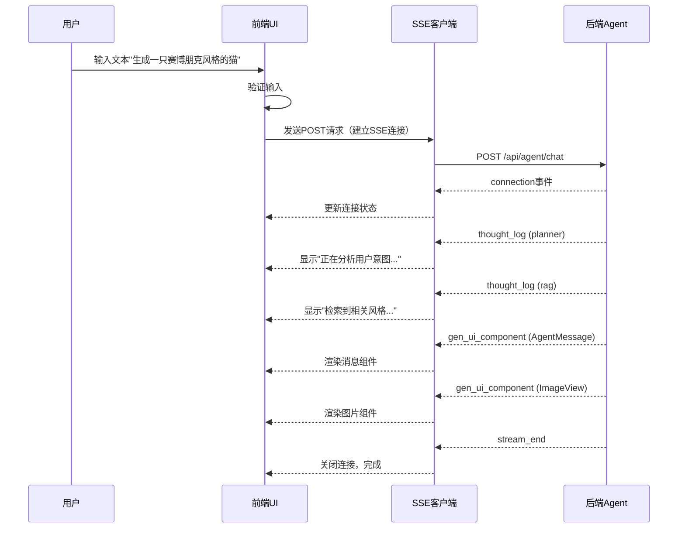

# 文生图功能设计 (Text-to-Image Feature)

## 1. 概述

本文档详细说明文生图功能的前端实现，包括用户输入处理、SSE 流式响应展示、GenUI 组件渲染等。

## 2. 功能流程

### 2.1 用户交互流程



### 2.2 状态管理

```typescript
// 文生图功能的状态
interface TextToImageState {
  // 输入状态
  input: string;
  isInputValid: boolean;
  
  // 连接状态
  isConnecting: boolean;
  isConnected: boolean;
  sessionId: string | null;
  
  // 消息历史
  messages: ChatMessage[];
  
  // 当前生成的图片
  currentImage: {
    url: string;
    metadata?: any;
  } | null;
  
  // 错误状态
  error: Error | null;
}
```

## 3. 组件设计

### 3.1 主组件结构

```
TextToImage/
├── TextToImagePage.tsx      # 主页面组件
├── TextInput.tsx            # 文本输入组件
├── ImageDisplay.tsx         # 图片展示组件
├── MessageList.tsx          # 消息列表组件
└── ThinkingIndicator.tsx   # 思考动画组件
```

### 3.2 主页面组件

```typescript
// components/features/TextToImage/TextToImagePage.tsx
'use client';

import { useState } from 'react';
import { useAgentChat } from '@/hooks/useAgentChat';
import { TextInput } from './TextInput';
import { MessageList } from './MessageList';
import { ThinkingIndicator } from './ThinkingIndicator';

export function TextToImagePage() {
  const {
    messages,
    sendMessage,
    isConnected,
    isConnecting,
    error,
  } = useAgentChat();

  const handleSend = async (text: string) => {
    if (!text.trim()) return;

    await sendMessage({
      text,
      sessionId: undefined, // 自动生成
    });
  };

  return (
    <div className="flex flex-col h-screen">
      {/* 消息列表区域 */}
      <div className="flex-1 overflow-y-auto">
        <MessageList messages={messages} />
        
        {/* 思考指示器 */}
        {isConnecting && <ThinkingIndicator />}
      </div>

      {/* 输入区域 */}
      <div className="border-t p-4">
        <TextInput
          onSend={handleSend}
          disabled={isConnecting || !isConnected}
          error={error}
        />
      </div>
    </div>
  );
}
```

### 3.3 文本输入组件

```typescript
// components/features/TextToImage/TextInput.tsx
'use client';

import { useState, KeyboardEvent } from 'react';

interface TextInputProps {
  onSend: (text: string) => void;
  disabled?: boolean;
  error?: Error | null;
}

export function TextInput({ onSend, disabled, error }: TextInputProps) {
  const [input, setInput] = useState('');

  const handleSend = () => {
    if (!input.trim() || disabled) return;
    
    onSend(input);
    setInput('');
  };

  const handleKeyPress = (e: KeyboardEvent<HTMLTextAreaElement>) => {
    if (e.key === 'Enter' && !e.shiftKey) {
      e.preventDefault();
      handleSend();
    }
  };

  return (
    <div className="space-y-2">
      <div className="flex gap-2">
        <textarea
          value={input}
          onChange={(e) => setInput(e.target.value)}
          onKeyPress={handleKeyPress}
          placeholder="输入您想要生成的图片描述..."
          disabled={disabled}
          className="flex-1 px-4 py-2 border rounded-lg resize-none focus:outline-none focus:ring-2 focus:ring-blue-500 disabled:opacity-50"
          rows={3}
        />
        <button
          onClick={handleSend}
          disabled={disabled || !input.trim()}
          className="px-6 py-2 bg-blue-500 text-white rounded-lg hover:bg-blue-600 disabled:opacity-50 disabled:cursor-not-allowed"
        >
          生成
        </button>
      </div>
      
      {error && (
        <div className="text-red-500 text-sm">
          错误: {error.message}
        </div>
      )}
    </div>
  );
}
```

### 3.4 消息列表组件

```typescript
// components/features/TextToImage/MessageList.tsx
'use client';

import { ChatMessage } from '@/hooks/useAgentChat';
import { GenUIRenderer } from '@/components/genui/GenUIRenderer';
import { EnhancedPromptView } from '@/components/features/AgentWorkflow/EnhancedPromptView';

interface MessageListProps {
  messages: ChatMessage[];
}

export function MessageList({ messages }: MessageListProps) {
  return (
    <div className="space-y-4 p-4">
      {messages.map((message) => (
        <div
          key={message.id}
          className={`flex ${
            message.type === 'user' ? 'justify-end' : 'justify-start'
          }`}
        >
          <div
            className={`max-w-[80%] rounded-lg p-4 ${
              message.type === 'user'
                ? 'bg-blue-500 text-white'
                : 'bg-gray-100 text-gray-900'
            }`}
          >
            {message.type === 'user' && (
              <div>{message.content}</div>
            )}
            
            {message.type === 'assistant' && (
              <div>
                {message.content && <div>{message.content}</div>}
                {message.enhancedPrompt && (
                  <EnhancedPromptView
                    event={{
                      type: 'enhanced_prompt',
                      timestamp: message.timestamp,
                      data: message.enhancedPrompt,
                    }}
                  />
                )}
                {message.components?.map((component, index) => (
                  <GenUIRenderer key={index} component={component} />
                ))}
              </div>
            )}
            
            {message.type === 'system' && (
              <div className="text-sm text-gray-600">{message.content}</div>
            )}
          </div>
        </div>
      ))}
    </div>
  );
}
```

### 3.5 思考指示器组件

```typescript
// components/features/TextToImage/ThinkingIndicator.tsx
'use client';

export function ThinkingIndicator() {
  return (
    <div className="flex items-center gap-2 p-4 text-gray-500">
      <div className="flex gap-1">
        <div className="w-2 h-2 bg-gray-400 rounded-full animate-bounce" style={{ animationDelay: '0ms' }} />
        <div className="w-2 h-2 bg-gray-400 rounded-full animate-bounce" style={{ animationDelay: '150ms' }} />
        <div className="w-2 h-2 bg-gray-400 rounded-full animate-bounce" style={{ animationDelay: '300ms' }} />
      </div>
      <span className="text-sm">AI 正在思考...</span>
    </div>
  );
}
```

## 4. Hook 实现

### 4.1 useAgentChat Hook

详见 [SSE 客户端实现](../api/SSE_CLIENT.md#agent-聊天-hook)。

### 4.2 使用示例

```typescript
// 在组件中使用
const {
  messages,        // 消息列表
  sendMessage,     // 发送消息
  isConnected,     // 连接状态
  isConnecting,    // 连接中状态
  error,           // 错误信息
  clearMessages,   // 清空消息
} = useAgentChat();
```

## 5. GenUI 组件渲染

### 5.1 组件类型处理

当收到 `gen_ui_component` 事件时，根据 `widgetType` 渲染对应组件：

- `SmartCanvas`: 智能画布（图片展示、蒙版绘制）
- `ImageView`: 图片展示
- `AgentMessage`: Agent 消息
- `ActionPanel`: 操作面板

详见 [GenUI 组件系统](../components/GENUI_COMPONENTS.md)。

### 5.2 组件更新模式

根据 `updateMode` 处理组件更新：

- `append`: 追加到消息列表末尾
- `replace`: 替换最后一个组件
- `update`: 更新指定 ID 的组件

```typescript
// 处理组件更新
function handleGenUIComponent(component: GenUIComponent) {
  switch (component.updateMode) {
    case 'append':
      setMessages((prev) => [...prev, { component }]);
      break;
    case 'replace':
      setMessages((prev) => {
        const newMessages = [...prev];
        newMessages[newMessages.length - 1] = { component };
        return newMessages;
      });
      break;
    case 'update':
      if (component.targetId) {
        setMessages((prev) =>
          prev.map((msg) =>
            msg.components?.some((c) => c.id === component.targetId)
              ? { ...msg, components: updateComponent(msg.components, component) }
              : msg
          )
        );
      }
      break;
  }
}
```

## 6. 思考日志展示

### 6.1 思考日志组件

```typescript
// components/features/AgentWorkflow/ThoughtLog.tsx
'use client';

import { ThoughtLogEvent } from '@/lib/types/sse';

interface ThoughtLogProps {
  log: ThoughtLogEvent;
}

export function ThoughtLog({ log }: ThoughtLogProps) {
  const { node, message, progress } = log.data;

  return (
    <div className="flex items-center gap-2 p-2 text-sm text-gray-600">
      <span className="font-medium">{node}:</span>
      <span>{message}</span>
      {progress !== undefined && (
        <div className="flex-1 max-w-xs">
          <div className="w-full bg-gray-200 rounded-full h-1.5">
            <div
              className="bg-blue-500 h-1.5 rounded-full transition-all"
              style={{ width: `${progress}%` }}
            />
          </div>
        </div>
      )}
    </div>
  );
}
```

### 6.2 节点状态展示

```typescript
// components/features/AgentWorkflow/NodeStatus.tsx
'use client';

const NODE_LABELS: Record<string, string> = {
  planner: '意图识别',
  rag: '风格检索',
  executor: '任务执行',
  critic: '质量审查',
  genui: '生成界面',
};

export function NodeStatus({ node }: { node: string }) {
  return (
    <div className="flex items-center gap-2">
      <div className="w-2 h-2 bg-blue-500 rounded-full animate-pulse" />
      <span className="text-sm font-medium">{NODE_LABELS[node] || node}</span>
    </div>
  );
}
```

## 7. 错误处理

### 7.1 错误展示

```typescript
// 在 MessageList 中展示错误
{message.type === 'system' && message.content.includes('错误') && (
  <div className="bg-red-50 border border-red-200 rounded-lg p-3">
    <div className="text-red-800">{message.content}</div>
  </div>
)}
```

### 7.2 重试机制

```typescript
// 提供重试按钮
{error && (
  <button
    onClick={() => {
      // 重新发送最后一条用户消息
      const lastUserMessage = messages
        .filter((m) => m.type === 'user')
        .pop();
      if (lastUserMessage) {
        sendMessage({ text: lastUserMessage.content });
      }
    }}
    className="px-4 py-2 bg-red-500 text-white rounded-lg hover:bg-red-600"
  >
    重试
  </button>
)}
```

## 8. 性能优化

### 8.1 虚拟滚动

对于大量消息，使用虚拟滚动：

```typescript
import { FixedSizeList } from 'react-window';

<FixedSizeList
  height={600}
  itemCount={messages.length}
  itemSize={100}
  width="100%"
>
  {({ index, style }) => (
    <div style={style}>
      <MessageItem message={messages[index]} />
    </div>
  )}
</FixedSizeList>
```

### 8.2 图片懒加载

使用 Next.js Image 组件实现图片懒加载：

```typescript
import Image from 'next/image';

<Image
  src={imageUrl}
  alt="Generated image"
  width={800}
  height={600}
  loading="lazy"
  placeholder="blur"
/>
```

## 9. 响应式设计

### 9.1 移动端适配

```typescript
// 移动端：全屏布局
<div className="flex flex-col h-screen md:h-auto">
  {/* 消息列表 */}
  <div className="flex-1 overflow-y-auto p-2 md:p-4">
    {/* ... */}
  </div>
  
  {/* 输入区域：移动端固定在底部 */}
  <div className="sticky bottom-0 border-t bg-white p-2 md:p-4">
    {/* ... */}
  </div>
</div>
```

## 10. 相关文档

- [SSE 客户端实现](../api/SSE_CLIENT.md)
- [GenUI 组件系统](../components/GENUI_COMPONENTS.md)
- [Agent 工作流展示](./AGENT_WORKFLOW.md)
- [后端 API 参考](../../../main/server/docs/api/API_REFERENCE.md)
