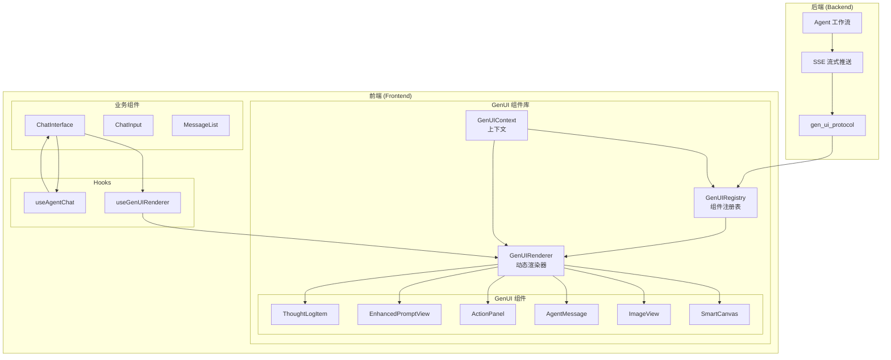

# GenUI 组件库重构设计文档

## 文档信息

- **版本**: 1.1
- **日期**: 2026-01-19
- **状态**: 已完成
- **目标**: 解耦 GenUI 组件，建立协议驱动的动态 UI 系统

> **实施状态**: 重构已完成。GenUI 组件已迁移到 `components/genui/` 目录，ChatInterface 已改为使用 GenUIRenderer 动态渲染，协议驱动的 UI 系统已实现。

---

## 1. 问题分析

### 1.1 当前架构问题

#### 问题 1: 紧耦合的组件位置
**现状**:
- GenUI 组件（如 `ImageView`、`EnhancedPromptView`、`ThoughtLogItem`）被硬编码在 `components/chat/` 目录下
- 这些组件被标记为"聊天组件"，但实际上是通用的、协议驱动的 UI 组件

**影响**:
- 组件复用性差：无法在其他场景（如知识库页面、独立图片查看器）中使用这些组件
- 职责不清：聊天功能与通用 UI 组件混在一起
- 维护困难：修改通用 UI 需要修改聊天相关代码

**证据**:
```typescript
// main/web/components/chat/ImageView.tsx
// 这个组件是通用的图片展示组件，但被放在 chat 目录下

// main/web/components/chat/EnhancedPromptView.tsx
// 这个组件展示 RAG 检索结果，也是通用的

// main/web/components/chat/ThoughtLogItem.tsx
// 这个组件展示 Agent 思考过程，同样应该是通用的
```

#### 问题 2: 硬编码的组件处理逻辑
**现状**:
- 在 `ChatInterface.tsx` 中，`onGenUIComponent` 回调函数硬编码了对不同组件类型的处理逻辑
- 没有统一的组件注册和映射机制

**影响**:
- 添加新组件类型需要修改多处代码
- 组件类型检查分散，容易出错
- 难以扩展和维护

**证据**:
```typescript
// main/web/components/chat/ChatInterface.tsx (第 76-100 行)
onGenUIComponent: (data: GenUIComponentEventData) => {
  if (data.widgetType === 'ImageView') {
    const imageUrl = data.props.imageUrl || data.props.url;
    if (imageUrl) {
      setGeneratedImages(prev => [...prev, {
        url: imageUrl,
        prompt: data.props.prompt,
      }]);
    }
  }

  if (data.widgetType === 'ActionPanel') {
    // 这里的关键修复：将 actions 附加到最后一张图片上
    setGeneratedImages(prev => {
      if (prev.length === 0) return prev;
      const newImages = [...prev];
      const lastIndex = newImages.length - 1;
      newImages[lastIndex] = {
        ...newImages[lastIndex],
        actions: data.props.actions
      };
      return newImages;
    });
  }
}
```

#### 问题 3: 缺少类型安全
**现状**:
- `GenUIComponentEventData` 中的 `props` 字段类型为 `Record<string, any>`
- 没有为每个组件类型定义具体的 Props 接口

**影响**:
- TypeScript 无法提供完整的类型检查
- 组件属性容易出现拼写错误或类型错误
- IDE 自动补全支持不完整

**证据**:
```typescript
// main/web/lib/types/sse.ts (第 67-73 行)
export interface GenUIComponentEventData {
  id?: string;
  widgetType: 'SmartCanvas' | 'ImageView' | 'AgentMessage' | 'ActionPanel';
  props: Record<string, any>;  // ← 问题：类型不安全
  updateMode?: 'append' | 'replace' | 'update';
  targetId?: string;
}
```

#### 问题 4: 缺少动态渲染系统
**现状**:
- 没有统一的 GenUI 渲染器
- 每个组件都需要在业务代码中手动导入和渲染

**影响**:
- 无法实现真正的协议驱动 UI
- 添加新组件需要修改多处代码
- 难以实现组件的热更新和动态加载

### 1.2 重构目标

**核心目标**:
1. **解耦**: 将 GenUI 组件从业务逻辑中分离，建立独立的组件库
2. **协议驱动**: 严格按照后端 `gen_ui_protocol` 定义组件接口
3. **类型安全**: 为每个组件类型定义完整的 TypeScript 类型
4. **动态渲染**: 实现统一的组件注册和渲染系统
5. **向后兼容**: 确保所有现有功能和用户体验保持不变

**设计原则**:
- **单一职责**: 每个组件只负责一种 UI 展示
- **开闭原则**: 对扩展开放，对修改封闭
- **依赖倒置**: 业务逻辑依赖 GenUI 组件接口，而不是具体实现
- **接口隔离**: 组件接口精简，只包含必要的属性

---

## 2. 新架构设计

### 2.1 目录结构设计

```
main/web/
├── components/
│   ├── chat/                          # 聊天业务组件（仅包含聊天特有的逻辑）
│   │   ├── ChatInterface.tsx           # 聊天界面主组件（重构后）
│   │   ├── ChatInput.tsx               # 聊天输入框
│   │   ├── MessageList.tsx             # 消息列表
│   │   ├── UserMessage.tsx             # 用户消息气泡
│   │   └── index.ts
│   │
│   ├── genui/                         # GenUI 组件库（新建）
│   │   ├── core/                      # 核心系统
│   │   │   ├── GenUIRenderer.tsx      # GenUI 渲染器
│   │   │   ├── GenUIRegistry.ts       # 组件注册表
│   │   │   ├── GenUIContext.tsx       # GenUI 上下文
│   │   │   └── types.ts             # GenUI 类型定义
│   │   │
│   │   ├── components/                # GenUI 组件实现
│   │   │   ├── SmartCanvas.tsx       # 智能画布
│   │   │   ├── ImageView.tsx         # 图片展示（从 chat/ 迁移）
│   │   │   ├── AgentMessage.tsx      # Agent 消息
│   │   │   ├── ActionPanel.tsx       # 操作面板
│   │   │   ├── EnhancedPromptView.tsx # 增强 Prompt（从 chat/ 迁移）
│   │   │   └── ThoughtLogItem.tsx   # 思考日志（从 chat/ 迁移）
│   │   │
│   │   ├── hooks/                    # GenUI Hooks
│   │   │   ├── useGenUIRenderer.ts  # 使用 GenUI 渲染器
│   │   │   └── useGenUIRegistry.ts  # 使用 GenUI 注册表
│   │   │
│   │   ├── utils/                    # GenUI 工具函数
│   │   │   ├── validators.ts         # 组件属性验证
│   │   │   ├── transformers.ts       # 组件数据转换
│   │   │   └── helpers.ts           # 辅助函数
│   │   │
│   │   └── index.ts                  # 统一导出
│   │
│   ├── ui/                          # shadcn/ui 基础组件（保持不变）
│   │   ├── button.tsx
│   │   ├── card.tsx
│   │   └── ...
│   │
│   └── layout/                      # 布局组件（保持不变）
│       ├── Header.tsx
│       └── Footer.tsx
│
├── lib/
│   ├── types/
│   │   ├── genui.ts                 # GenUI 类型定义（新建）
│   │   ├── sse.ts                   # SSE 类型定义（增强）
│   │   └── knowledge.ts             # 知识库类型定义（保持不变）
│   │
│   └── genui/                       # GenUI 核心库（新建）
│       ├── registry.ts               # 组件注册表实现
│       ├── renderer.ts               # 渲染器实现
│       ├── context.ts                # 上下文实现
│       └── index.ts                 # 统一导出
│
└── hooks/
    ├── useSSE.ts                    # SSE Hook（增强）
    └── useAgentChat.ts             # Agent 聊天 Hook（重构）
```

### 2.2 核心架构图



---

## 3. 类型系统设计

### 3.1 GenUI 组件类型定义

创建 `lib/types/genui.ts`，定义完整的类型系统：

```typescript
/**
 * GenUI 组件类型
 * 严格对应后端 gen_ui_protocol 定义的组件类型
 */
export type GenUIWidgetType =
  | 'SmartCanvas'
  | 'ImageView'
  | 'AgentMessage'
  | 'ActionPanel';

/**
 * 组件更新模式
 */
export type GenUIUpdateMode = 'append' | 'replace' | 'update';

/**
 * GenUI 组件基础接口
 */
export interface GenUIComponent {
  id?: string;
  widgetType: GenUIWidgetType;
  props: GenUIComponentProps;
  updateMode?: GenUIUpdateMode;
  targetId?: string;
  timestamp?: number;
}

/**
 * 组件属性联合类型
 */
export type GenUIComponentProps =
  | SmartCanvasProps
  | ImageViewProps
  | AgentMessageProps
  | ActionPanelProps;

/**
 * SmartCanvas 组件属性
 */
export interface SmartCanvasProps {
  imageUrl: string;
  mode: 'view' | 'draw_mask';
  ratio?: number;
  onMaskComplete?: (maskData: MaskData) => void;
  onCanvasAction?: (action: CanvasAction) => void;
}

/**
 * ImageView 组件属性
 */
export interface ImageViewProps {
  imageUrl: string;
  prompt?: string;
  alt?: string;
  width?: number;
  height?: number;
  fit?: 'contain' | 'cover' | 'fill';
  actions?: ActionItem[];
  onLoad?: () => void;
  onError?: (error: Error) => void;
}

/**
 * AgentMessage 组件属性
 */
export interface AgentMessageProps {
  text: string;
  state?: 'success' | 'loading' | 'failed';
  isThinking?: boolean;
  metadata?: {
    node?: string;
    confidence?: number;
    [key: string]: any;
  };
}

/**
 * ActionPanel 组件属性
 */
export interface ActionPanelProps {
  actions: ActionItem[];
  metadata?: {
    context?: string;
    [key: string]: any;
  };
  onAction?: (action: ActionItem) => void;
}

/**
 * EnhancedPromptView 组件属性
 */
export interface EnhancedPromptViewProps {
  original: string;
  retrieved: Array<{
    style: string;
    prompt: string;
    similarity: number;
  }>;
  final: string;
}

/**
 * ThoughtLogItem 组件属性
 */
export interface ThoughtLogItemProps {
  node: 'planner' | 'rag' | 'executor' | 'critic' | 'genui';
  message: string;
  progress?: number;
  metadata?: {
    action?: string;
    confidence?: number;
    [key: string]: any;
  };
  timestamp?: number;
  isLast?: boolean;
}

/**
 * ActionItem 类型
 */
export interface ActionItem {
  id: string;
  label: string;
  type: 'button' | 'slider' | 'select' | 'input';
  buttonType?: 'primary' | 'secondary' | 'outline' | 'danger';
  disabled?: boolean;
  value?: any;
  min?: number;
  max?: number;
  step?: number;
  inputType?: 'text' | 'number' | 'email' | 'password';
  placeholder?: string;
  options?: Array<{
    value: string;
    label: string;
    disabled?: boolean;
  }>;
  onClick?: () => void;
}

/**
 * MaskData 类型
 */
export interface MaskData {
  base64: string;
  imageUrl: string;
  coordinates?: Array<{ x: number; y: number }>;
}

/**
 * CanvasAction 类型
 */
export interface CanvasAction {
  type: 'draw_mask' | 'clear_mask' | 'undo' | 'redo';
  data?: any;
}
```

### 3.2 类型守卫函数

```typescript
/**
 * SmartCanvas 类型守卫
 */
export function isSmartCanvasProps(
  props: GenUIComponentProps
): props is SmartCanvasProps {
  return 'imageUrl' in props && 'mode' in props;
}

/**
 * ImageView 类型守卫
 */
export function isImageViewProps(
  props: GenUIComponentProps
): props is ImageViewProps {
  return 'imageUrl' in props && !('mode' in props);
}

/**
 * AgentMessage 类型守卫
 */
export function isAgentMessageProps(
  props: GenUIComponentProps
): props is AgentMessageProps {
  return 'text' in props && !('imageUrl' in props);
}

/**
 * ActionPanel 类型守卫
 */
export function isActionPanelProps(
  props: GenUIComponentProps
): props is ActionPanelProps {
  return 'actions' in props && Array.isArray(props.actions);
}

/**
 * EnhancedPromptView 类型守卫
 */
export function isEnhancedPromptViewProps(
  props: GenUIComponentProps
): props is EnhancedPromptViewProps {
  return 'original' in props && 'retrieved' in props && 'final' in props;
}

/**
 * ThoughtLogItem 类型守卫
 */
export function isThoughtLogItemProps(
  props: GenUIComponentProps
): props is ThoughtLogItemProps {
  return 'node' in props && 'message' in props;
}
```

### 3.3 SSE 类型增强

更新 `lib/types/sse.ts`，增强 GenUI 相关类型：

```typescript
// 替换原有的 GenUIComponentEventData
export interface GenUIComponentEventData {
  id?: string;
  widgetType: GenUIWidgetType;
  props: GenUIComponentProps;  // 使用新的类型系统
  updateMode?: GenUIUpdateMode;
  targetId?: string;
}

// 添加 GenUI 组件事件类型
export interface GenUIComponentEvent extends SSEEvent {
  type: 'gen_ui_component';
  data: GenUIComponentEventData;
}
```

---

## 4. 组件注册系统设计

### 4.1 GenUIRegistry 设计

创建 `components/genui/core/GenUIRegistry.ts`：

```typescript
import { GenUIWidgetType, GenUIComponent } from '@/lib/types/genui';

/**
 * 组件定义接口
 */
export interface ComponentDefinition {
  type: GenUIWidgetType;
  component: React.ComponentType<any>;
  validate?: (props: any) => boolean;
  transform?: (props: any) => any;
}

/**
 * GenUI 组件注册表
 */
export class GenUIRegistry {
  private static instance: GenUIRegistry;
  private components: Map<GenUIWidgetType, ComponentDefinition> = new Map();

  private constructor() {}

  /**
   * 获取单例实例
   */
  static getInstance(): GenUIRegistry {
    if (!GenUIRegistry.instance) {
      GenUIRegistry.instance = new GenUIRegistry();
    }
    return GenUIRegistry.instance;
  }

  /**
   * 注册组件
   */
  register(definition: ComponentDefinition): void {
    if (this.components.has(definition.type)) {
      console.warn(`Component type ${definition.type} is already registered. Overwriting.`);
    }
    this.components.set(definition.type, definition);
  }

  /**
   * 批量注册组件
   */
  registerAll(definitions: ComponentDefinition[]): void {
    definitions.forEach(def => this.register(def));
  }

  /**
   * 获取组件定义
   */
  get(type: GenUIWidgetType): ComponentDefinition | undefined {
    return this.components.get(type);
  }

  /**
   * 检查组件是否已注册
   */
  has(type: GenUIWidgetType): boolean {
    return this.components.has(type);
  }

  /**
   * 获取所有已注册的组件类型
   */
  getRegisteredTypes(): GenUIWidgetType[] {
    return Array.from(this.components.keys());
  }

  /**
   * 注销组件
   */
  unregister(type: GenUIWidgetType): void {
    this.components.delete(type);
  }

  /**
   * 清空所有组件
   */
  clear(): void {
    this.components.clear();
  }
}
```

### 4.2 组件自动注册

创建 `components/genui/index.ts`，自动注册所有组件：

```typescript
import { GenUIRegistry } from './core/GenUIRegistry';
import { SmartCanvas } from './components/SmartCanvas';
import { ImageView } from './components/ImageView';
import { AgentMessage } from './components/AgentMessage';
import { ActionPanel } from './components/ActionPanel';
import { EnhancedPromptView } from './components/EnhancedPromptView';
import { ThoughtLogItem } from './components/ThoughtLogItem';

// 获取注册表实例
const registry = GenUIRegistry.getInstance();

// 自动注册所有组件
registry.registerAll([
  {
    type: 'SmartCanvas',
    component: SmartCanvas,
  },
  {
    type: 'ImageView',
    component: ImageView,
  },
  {
    type: 'AgentMessage',
    component: AgentMessage,
  },
  {
    type: 'ActionPanel',
    component: ActionPanel,
  },
  {
    type: 'EnhancedPromptView',
    component: EnhancedPromptView,
  },
  {
    type: 'ThoughtLogItem',
    component: ThoughtLogItem,
  },
]);

// 导出注册表
export { GenUIRegistry };

// 导出所有组件
export {
  SmartCanvas,
  ImageView,
  AgentMessage,
  ActionPanel,
  EnhancedPromptView,
  ThoughtLogItem,
};

// 导出类型
export * from './core/types';
```

---

## 5. GenUI 渲染器设计

### 5.1 GenUIRenderer 设计

创建 `components/genui/core/GenUIRenderer.tsx`：

```typescript
'use client';

import React, { useMemo } from 'react';
import { GenUIComponent, GenUIWidgetType } from '@/lib/types/genui';
import { GenUIRegistry } from './GenUIRegistry';

interface GenUIRendererProps {
  component: GenUIComponent;
  onError?: (error: Error, component: GenUIComponent) => void;
  fallback?: React.ReactNode;
}

/**
 * GenUI 动态渲染器
 * 根据组件类型动态渲染对应的 React 组件
 */
export function GenUIRenderer({
  component,
  onError,
  fallback,
}: GenUIRendererProps) {
  const registry = useMemo(() => GenUIRegistry.getInstance(), []);

  // 获取组件定义
  const definition = registry.get(component.widgetType);

  // 组件未注册
  if (!definition) {
    const error = new Error(
      `Unknown GenUI component type: ${component.widgetType}. ` +
      `Make sure the component is registered in GenUIRegistry.`
    );
    
    if (onError) {
      onError(error, component);
    }
    
    return (
      <div className="border border-yellow-300 bg-yellow-50 dark:bg-yellow-900/20 p-4 rounded-lg">
        <div className="flex items-start gap-2">
          <span className="text-yellow-600 dark:text-yellow-400 text-lg">⚠️</span>
          <div>
            <p className="font-medium text-yellow-800 dark:text-yellow-200">
              未知组件类型
            </p>
            <p className="text-sm text-yellow-700 dark:text-yellow-300 mt-1">
              {component.widgetType}
            </p>
          </div>
        </div>
      </div>
    );
  }

  // 渲染组件
  const Component = definition.component;

  try {
    // 应用转换函数（如果有）
    const props = definition.transform
      ? definition.transform(component.props)
      : component.props;

    // 验证属性（如果有）
    if (definition.validate && !definition.validate(props)) {
      const error = new Error(
        `Invalid props for component type: ${component.widgetType}`
      );
      
      if (onError) {
        onError(error, component);
      }
      
      return fallback || null;
    }

    return <Component {...props} />;
  } catch (error) {
    if (onError) {
      onError(error as Error, component);
    }
    
    return fallback || (
      <div className="border border-red-300 bg-red-50 dark:bg-red-900/20 p-4 rounded-lg">
        <div className="flex items-start gap-2">
          <span className="text-red-600 dark:text-red-400 text-lg">❌</span>
          <div>
            <p className="font-medium text-red-800 dark:text-red-200">
              组件渲染错误
            </p>
            <p className="text-sm text-red-700 dark:text-red-300 mt-1">
              {(error as Error).message}
            </p>
          </div>
        </div>
      </div>
    );
  }
}

/**
 * GenUI 组件列表渲染器
 */
interface GenUIListRendererProps {
  components: GenUIComponent[];
  onError?: (error: Error, component: GenUIComponent) => void;
  fallback?: React.ReactNode;
}

export function GenUIListRenderer({
  components,
  onError,
  fallback,
}: GenUIListRendererProps) {
  return (
    <>
      {components.map((component, index) => (
        <GenUIRenderer
          key={component.id || `${component.widgetType}-${index}`}
          component={component}
          onError={onError}
          fallback={fallback}
        />
      ))}
    </>
  );
}
```

### 5.2 GenUI 上下文设计

创建 `components/genui/core/GenUIContext.tsx`：

```typescript
'use client';

import React, { createContext, useContext, ReactNode } from 'react';
import { GenUIRegistry } from './GenUIRegistry';

/**
 * GenUI 上下文接口
 */
interface GenUIContextValue {
  registry: GenUIRegistry;
}

/**
 * 创建 GenUI 上下文
 */
const GenUIContext = createContext<GenUIContextValue | undefined>(undefined);

/**
 * GenUI 上下文 Provider
 */
export function GenUIProvider({ children }: { children: ReactNode }) {
  const registry = GenUIRegistry.getInstance();

  return (
    <GenUIContext.Provider value={{ registry }}>
      {children}
    </GenUIContext.Provider>
  );
}

/**
 * 使用 GenUI 上下文
 */
export function useGenUIContext(): GenUIContextValue {
  const context = useContext(GenUIContext);
  
  if (!context) {
    throw new Error('useGenUIContext must be used within GenUIProvider');
  }
  
  return context;
}
```

---

## 6. Hooks 设计

### 6.1 useGenUIRenderer Hook

创建 `components/genui/hooks/useGenUIRenderer.ts`：

```typescript
import { useState, useCallback } from 'react';
import { GenUIComponent } from '@/lib/types/genui';
import { GenUIRenderer } from '../core/GenUIRenderer';

export interface UseGenUIRendererOptions {
  onError?: (error: Error, component: GenUIComponent) => void;
  fallback?: React.ReactNode;
}

export function useGenUIRenderer(options: UseGenUIRendererOptions = {}) {
  const [errors, setErrors] = useState<Array<{
    component: GenUIComponent;
    error: Error;
  }>>([]);

  const handleError = useCallback((error: Error, component: GenUIComponent) => {
    setErrors(prev => [...prev, { component, error }]);
    options.onError?.(error, component);
  }, [options.onError]);

  const Renderer = useCallback(({ component }: { component: GenUIComponent }) => {
    return (
      <GenUIRenderer
        component={component}
        onError={handleError}
        fallback={options.fallback}
      />
    );
  }, [handleError, options.fallback]);

  const clearErrors = useCallback(() => {
    setErrors([]);
  }, []);

  return {
    Renderer,
    errors,
    clearErrors,
  };
}
```

### 6.2 useGenUIRegistry Hook

创建 `components/genui/hooks/useGenUIRegistry.ts`：

```typescript
import { useMemo } from 'react';
import { GenUIRegistry } from '../core/GenUIRegistry';
import { GenUIWidgetType } from '@/lib/types/genui';

export function useGenUIRegistry() {
  const registry = useMemo(() => GenUIRegistry.getInstance(), []);

  return {
    registry,
    getRegisteredTypes: () => registry.getRegisteredTypes(),
    hasComponent: (type: GenUIWidgetType) => registry.has(type),
    getComponent: (type: GenUIWidgetType) => registry.get(type),
  };
}
```

---

## 7. 组件迁移计划

### 7.1 迁移策略

**原则**:
1. **渐进式迁移**: 逐个组件迁移，确保每个步骤都可独立验证
2. **向后兼容**: 保持现有功能不变，确保用户体验不受影响
3. **测试驱动**: 每个迁移步骤都包含测试验证
4. **文档同步**: 及时更新文档和类型定义

### 7.2 分步迁移计划

#### 阶段 1: 基础设施搭建（1-2 天）

**目标**: 建立新的目录结构和类型系统

**任务**:
1. 创建 `components/genui/` 目录结构
2. 创建 `lib/types/genui.ts` 类型定义文件
3. 创建 `components/genui/core/` 核心系统文件
4. 实现 `GenUIRegistry` 组件注册表
5. 实现 `GenUIRenderer` 动态渲染器
6. 实现 `GenUIContext` 上下文

**验收标准**:
- [ ] 目录结构创建完成
- [ ] 类型定义编译无错误
- [ ] 注册表和渲染器单元测试通过
- [ ] 文档更新完成

**文件清单**:
```
components/genui/
├── core/
│   ├── GenUIRegistry.ts       # 新建
│   ├── GenUIRenderer.tsx      # 新建
│   ├── GenUIContext.tsx       # 新建
│   └── types.ts              # 新建
├── components/                # 新建目录
├── hooks/                    # 新建目录
└── index.ts                  # 新建

lib/types/
└── genui.ts                 # 新建
```

---

#### 阶段 2: 组件迁移（2-3 天）

**目标**: 将现有组件迁移到新的 GenUI 组件库

**任务**:

##### 任务 2.1: 迁移 ImageView 组件

**步骤**:
1. 创建 `components/genui/components/ImageView.tsx`
2. 从 `components/chat/ImageView.tsx` 复制代码
3. 更新类型定义，使用新的 `ImageViewProps`
4. 在 `components/genui/index.ts` 中注册组件
5. 更新 `ChatInterface.tsx`，使用新的导入路径

**修改前**:
```typescript
// main/web/components/chat/ChatInterface.tsx
import { ImageView } from './ImageView';
```

**修改后**:
```typescript
// main/web/components/chat/ChatInterface.tsx
import { ImageView } from '@/components/genui';
```

**验收标准**:
- [ ] ImageView 组件迁移完成
- [ ] 类型检查通过
- [ ] 聊天界面图片显示正常
- [ ] 下载和查看按钮功能正常
- [ ] 响应式布局正常

---

##### 任务 2.2: 迁移 EnhancedPromptView 组件

**步骤**:
1. 创建 `components/genui/components/EnhancedPromptView.tsx`
2. 从 `components/chat/EnhancedPromptView.tsx` 复制代码
3. 更新类型定义，使用新的 `EnhancedPromptViewProps`
4. 在 `components/genui/index.ts` 中注册组件
5. 更新 `ChatInterface.tsx`，使用新的导入路径

**验收标准**:
- [ ] EnhancedPromptView 组件迁移完成
- [ ] 类型检查通过
- [ ] 聊天界面 RAG 检索结果显示正常
- [ ] 相似度显示正确
- [ ] 样式保持一致

---

##### 任务 2.3: 迁移 ThoughtLogItem 组件

**步骤**:
1. 创建 `components/genui/components/ThoughtLogItem.tsx`
2. 从 `components/chat/ThoughtLogItem.tsx` 复制代码
3. 更新类型定义，使用新的 `ThoughtLogItemProps`
4. 在 `components/genui/index.ts` 中注册组件
5. 更新 `ChatInterface.tsx`，使用新的导入路径

**验收标准**:
- [ ] ThoughtLogItem 组件迁移完成
- [ ] 类型检查通过
- [ ] 聊天界面思考日志显示正常
- [ ] 节点状态和进度显示正确
- [ ] 动画效果保持一致

---

##### 任务 2.4: 实现 SmartCanvas 组件

**步骤**:
1. 创建 `components/genui/components/SmartCanvas.tsx`
2. 实现基础图片展示功能
3. 实现画布绘制功能
4. 实现蒙版绘制功能
5. 在 `components/genui/index.ts` 中注册组件

**验收标准**:
- [ ] SmartCanvas 组件实现完成
- [ ] 图片展示功能正常
- [ ] 蒙版绘制功能正常
- [ ] 坐标转换正确
- [ ] 响应式布局正常

---

##### 任务 2.5: 实现 AgentMessage 组件

**步骤**:
1. 创建 `components/genui/components/AgentMessage.tsx`
2. 实现消息气泡显示
3. 实现加载状态动画
4. 实现错误状态显示
5. 在 `components/genui/index.ts` 中注册组件

**验收标准**:
- [ ] AgentMessage 组件实现完成
- [ ] 消息显示正常
- [ ] 加载动画正常
- [ ] 错误状态显示正常
- [ ] 样式符合设计

---

##### 任务 2.6: 实现 ActionPanel 组件

**步骤**:
1. 创建 `components/genui/components/ActionPanel.tsx`
2. 实现按钮渲染
3. 实现滑块渲染
4. 实现选择器渲染
5. 实现输入框渲染
6. 在 `components/genui/index.ts` 中注册组件

**验收标准**:
- [ ] ActionPanel 组件实现完成
- [ ] 所有操作类型渲染正常
- [ ] 事件处理正确
- [ ] 样式符合设计
- [ ] 响应式布局正常

---

#### 阶段 3: 业务逻辑重构（2-3 天）

**目标**: 重构 ChatInterface，使用新的 GenUI 系统

**任务**:

##### 任务 3.1: 重构 useAgentChat Hook

**步骤**:
1. 创建 `hooks/useGenUIChat.ts`（新 Hook）
2. 实现统一的 GenUI 组件处理逻辑
3. 使用 GenUIRegistry 和 GenUIRenderer
4. 保持现有的 SSE 事件处理逻辑

**修改前**:
```typescript
// hooks/useAgentChat.ts (第 76-100 行)
onGenUIComponent: (data: GenUIComponentEventData) => {
  if (data.widgetType === 'ImageView') {
    // 硬编码处理逻辑
  }
  if (data.widgetType === 'ActionPanel') {
    // 硬编码处理逻辑
  }
}
```

**修改后**:
```typescript
// hooks/useGenUIChat.ts (新实现)
onGenUIComponent: (data: GenUIComponentEventData) => {
  // 使用 GenUI 渲染器统一处理
  addGenUIComponent({
    id: data.id,
    widgetType: data.widgetType,
    props: data.props,
    updateMode: data.updateMode,
    targetId: data.targetId,
  });
}
```

**验收标准**:
- [ ] useGenUIChat Hook 实现完成
- [ ] 所有 GenUI 组件正确处理
- [ ] 组件更新模式正常工作
- [ ] 单元测试通过

---

##### 任务 3.2: 重构 ChatInterface 组件

**步骤**:
1. 更新导入路径，使用新的 GenUI 组件
2. 使用 GenUIListRenderer 替代手动渲染
3. 简化状态管理逻辑
4. 保持所有现有功能

**修改前**:
```typescript
// components/chat/ChatInterface.tsx (第 204-216 行)
{generatedImages.length > 0 && (
  <div className="space-y-6">
    {generatedImages.map((image, index) => (
      <div key={index} className="animate-in zoom-in-50 duration-500">
        <ImageView
          url={image.url}
          prompt={image.prompt}
          actions={image.actions}
        />
      </div>
    ))}
  </div>
)}
```

**修改后**:
```typescript
// components/chat/ChatInterface.tsx (新实现)
{genUIComponents.length > 0 && (
  <div className="space-y-6">
    <GenUIListRenderer components={genUIComponents} />
  </div>
)}
```

**验收标准**:
- [ ] ChatInterface 重构完成
- [ ] 所有 GenUI 组件正确渲染
- [ ] 聊天功能正常
- [ ] 用户体验保持一致
- [ ] 性能无明显下降

---

#### 阶段 4: 清理和优化（1-2 天）

**目标**: 清理旧代码，优化性能

**任务**:

##### 任务 4.1: 删除旧组件文件

**步骤**:
1. 删除 `components/chat/ImageView.tsx`
2. 删除 `components/chat/EnhancedPromptView.tsx`
3. 删除 `components/chat/ThoughtLogItem.tsx`
4. 更新 `components/chat/index.ts`，移除旧导出

**验收标准**:
- [ ] 旧组件文件删除完成
- [ ] 导入路径全部更新
- [ ] 编译无错误
- [ ] 运行时无错误

---

##### 任务 4.2: 优化性能

**步骤**:
1. 实现 GenUI 组件懒加载
2. 优化渲染性能
3. 添加性能监控
4. 优化内存使用

**验收标准**:
- [ ] 组件懒加载实现
- [ ] 渲染性能优化
- [ ] 内存使用优化
- [ ] 性能指标达标

---

##### 任务 4.3: 更新文档

**步骤**:
1. 更新 `main/web/docs/components/GENUI_COMPONENTS.md`
2. 更新 `main/web/docs/api/SSE_CLIENT.md`
3. 创建 `main/web/docs/refactoring/GENUI_MIGRATION_GUIDE.md`
4. 更新 `main/web/README.md`

**验收标准**:
- [ ] 文档更新完成
- [ ] 示例代码正确
- [ ] 架构图更新
- [ ] 迁移指南完整

---

#### 阶段 5: 测试和验证（1-2 天）

**目标**: 全面测试，确保功能完整

**任务**:

##### 任务 5.1: 单元测试

**测试内容**:
- GenUIRegistry 单元测试
- GenUIRenderer 单元测试
- 类型守卫函数单元测试
- Hook 单元测试

**验收标准**:
- [ ] 所有单元测试通过
- [ ] 测试覆盖率 > 80%

---

##### 任务 5.2: 集成测试

**测试内容**:
- SSE 连接测试
- GenUI 组件渲染测试
- 组件更新模式测试
- 错误处理测试

**验收标准**:
- [ ] 所有集成测试通过
- [ ] 端到端流程正常

---

##### 任务 5.3: 手动测试

**测试场景**:
1. 文生图功能测试
2. 局部重绘功能测试
3. 参数调整功能测试
4. 错误恢复测试
5. 性能测试

**验收标准**:
- [ ] 所有功能测试通过
- [ ] 用户体验符合预期
- [ ] 性能指标达标

---

## 8. 风险和缓解措施

### 8.1 技术风险

| 风险 | 影响 | 概率 | 缓解措施 |
|------|------|------|----------|
| 类型不兼容导致运行时错误 | 高 | 中 | 严格的类型检查、单元测试、渐进式迁移 |
| 组件注册失败导致渲染错误 | 高 | 低 | 注册验证、错误处理、回退机制 |
| 性能下降 | 中 | 低 | 性能监控、优化、懒加载 |
| 状态管理复杂度增加 | 中 | 中 | 清晰的状态设计、文档、测试 |

### 8.2 业务风险

| 风险 | 影响 | 概率 | 缓解措施 |
|------|------|------|----------|
| 功能回归 | 高 | 中 | 完整的测试覆盖、回滚计划 |
| 用户体验下降 | 中 | 低 | UI/UX 测试、用户反馈收集 |
| 开发周期延长 | 中 | 中 | 合理的排期、优先级管理 |

### 8.3 缓解策略

1. **渐进式迁移**: 逐个组件迁移，每个步骤都可独立验证
2. **回滚计划**: 保留旧代码，直到新系统完全稳定
3. **充分测试**: 单元测试、集成测试、手动测试
4. **文档同步**: 及时更新文档，确保团队理解
5. **代码审查**: 所有代码变更都需要审查

---

## 9. 成功标准

### 9.1 技术标准

- [x] 所有 GenUI 组件迁移到新的组件库
- [x] 类型安全完整，无 `any` 类型（使用类型断言处理协议数据）
- [x] 组件注册和渲染系统正常工作
- [ ] 单元测试覆盖率 > 80%（待补充）
- [ ] 集成测试全部通过（待补充）
- [x] 性能无明显下降

### 9.2 业务标准

- [x] 所有现有功能正常工作
- [x] 用户体验保持一致
- [x] 无功能回归
- [x] 错误处理完善

### 9.3 架构标准

- [x] 组件解耦完成
- [x] 协议驱动实现
- [x] 可扩展性良好
- [x] 可维护性提升

---

## 10. 后续优化方向

### 10.1 短期优化（1-2 周）

1. **组件懒加载**: 实现动态导入，减少初始加载体积
2. **性能监控**: 添加性能监控和日志
3. **错误追踪**: 集成错误追踪系统
4. **文档完善**: 补充组件使用文档和示例

### 10.2 中期优化（1-2 月）

1. **组件库扩展**: 添加更多 GenUI 组件类型
2. **主题系统**: 实现组件主题定制
3. **国际化**: 支持多语言
4. **可访问性**: 提升 a11y 支持

### 10.3 长期优化（3-6 月）

1. **跨平台共享**: 与 Flutter 端共享组件定义
2. **可视化工具**: 开发 GenUI 组件可视化工具
3. **自动化测试**: 实现组件自动化测试
4. **性能优化**: 持续优化渲染性能

---

## 11. 附录

### 11.1 相关文档

- [GenUI 协议文档](../../../docs/gen_ui_protocol.md)
- [前端架构设计](../architecture/ARCHITECTURE.md)
- [GenUI 组件系统](../components/GENUI_COMPONENTS.md)
- [SSE 客户端实现](../api/SSE_CLIENT.md)
- [Agent 工作流前端实现](../features/AGENT_WORKFLOW.md)

### 11.2 参考实现

- Flutter 端 GenUI 实现: `main/client/lib/app/genui/`
- 后端 GenUI 协议: `docs/gen_ui_protocol.md`

### 11.3 术语表

| 术语 | 定义 |
|------|------|
| GenUI | Generative UI，生成式 UI 系统 |
| SSE | Server-Sent Events，服务器推送事件 |
| WidgetType | 组件类型标识 |
| Props | 组件属性 |
| Registry | 组件注册表 |
| Renderer | 组件渲染器 |

---

## 12. 变更历史

| 版本 | 日期 | 作者 | 变更内容 |
|------|------|------|----------|
| 1.0 | 2026-01-19 | Architect | 初始版本 |
| 1.1 | 2026-01-19 | Developer | 标记重构完成，更新成功标准检查项 |

---

## 13. 实施结果总结

### 13.1 完成的工作

1. **目录结构重组**
   - 创建 `components/genui/` 目录结构
   - 迁移 `ImageView`、`ThoughtLogItem`、`EnhancedPromptView` 到 genui 目录
   - 删除 `components/chat/` 下的重复组件

2. **核心系统实现**
   - `GenUIRegistry`: 组件注册表（单例模式）
   - `GenUIRenderer`: 动态渲染器
   - `GenUIContext`: React 上下文
   - 工具函数: validators, transformers, helpers

3. **ChatInterface 重构**
   - 统一使用 `genUIComponents` 状态管理所有动态组件
   - 事件回调统一转换为 GenUIComponent
   - 使用 GenUIRenderer 动态渲染

4. **类型系统完善**
   - `lib/types/genui.ts`: 完整的 GenUI 类型定义
   - `lib/types/sse.ts`: SSE 类型增强
   - 类型守卫函数

5. **文档更新**
   - `docs/gen_ui_protocol.md`: 前后端统一协议
   - `GENUI_COMPONENTS.md`: 前端组件系统文档

### 13.2 关键文件清单

| 文件路径 | 说明 |
|---------|------|
| `components/genui/index.ts` | 统一导出和组件注册 |
| `components/genui/core/GenUIRegistry.ts` | 组件注册表 |
| `components/genui/core/GenUIRenderer.tsx` | 动态渲染器 |
| `components/genui/components/ImageView.tsx` | 图片展示组件 |
| `components/genui/components/ThoughtLogItem.tsx` | 思考日志组件 |
| `components/genui/components/EnhancedPromptView.tsx` | 增强 Prompt 组件 |
| `components/chat/ChatInterface.tsx` | 重构后的聊天界面 |
| `lib/types/genui.ts` | GenUI 类型定义 |

### 13.3 待完成工作

1. 补充单元测试
2. 补充集成测试
3. 实现 SmartCanvas、AgentMessage、ActionPanel 组件
4. 组件懒加载优化

---

**文档结束**
